# Kubernetes January 2026 Cohort

Welcome to the official repository for the **Kubernetes January 2026 Cohort** by Emagetech. This repo contains all class materials, recordings, resources, projects, and foundational tutorials you need throughout the program.

---

## 📁 Repository Structure

```
├── k8s-prereqs/              # Pre-requisite phase — Linux, Cloud Computing, foundational sessions
│   └── recordings.md         # All Zoom links and recordings from the pre-req phase
│
├── class-materials/          # Main Kubernetes class content (slides, labs, assignments)
│
├── study-ahead-materials/    # Self-study topics to get ahead — core K8s concepts
│
├── network-fundamentals/     # Beginner networking → Kubernetes networking (8 tutorials)
│
├── git-fundamentals/         # Beginner Git → GitOps with ArgoCD (8 tutorials)
│
├── projects/                 # 15 hands-on projects across 3 phases (Beginner → Real World)
│
└── TUTORIALS.md              # Curated tutorials and external learning resources
```

---

## 🚀 Getting Started

1. **Brand new to tech?** Start with [`network-fundamentals/`](./network-fundamentals/) and [`git-fundamentals/`](./git-fundamentals/) — no background required
2. **New to the cohort?** Check `k8s-prereqs/recordings.md` to catch up on pre-req sessions
3. **Kubernetes class started?** Head to `class-materials/` for slides, labs, and assignments
4. **Want to get ahead?** Browse `study-ahead-materials/` for self-paced deep dives
5. **Ready to build?** Dive into [`projects/`](./projects/) — 15 real-world projects from beginner to capstone

---

## 📚 Sections

### [network-fundamentals/](./network-fundamentals/)
A beginner-friendly, zero-assumption path through networking — from "what is a network?" all the way to Kubernetes Pod networking, Network Policies, and Ingress. If you have never set up a server before, start here.

| # | Tutorial | Topic |
|---|----------|-------|
| 01 | [What Is a Network?](./network-fundamentals/01-what-is-a-network.md) | Networks, packets, LAN vs WAN |
| 02 | [IP Addresses](./network-fundamentals/02-ip-addresses.md) | IPv4, public vs private, subnets, DHCP |
| 03 | [Ports & Protocols](./network-fundamentals/03-ports-and-protocols.md) | TCP vs UDP, HTTP/HTTPS, common ports |
| 04 | [DNS](./network-fundamentals/04-dns.md) | Name resolution, record types, /etc/hosts |
| 05 | [How the Internet Works](./network-fundamentals/05-how-the-internet-works.md) | Full request journey, firewalls, load balancers |
| 06 | [Kubernetes Pod Networking](./network-fundamentals/06-kubernetes-pod-networking.md) | Pod IPs, Services, CoreDNS |
| 07 | [Network Policies](./network-fundamentals/07-network-policies-k8s.md) | Pod firewalls, default-deny, ingress/egress rules |
| 08 | [Ingress & Gateway API](./network-fundamentals/08-ingress-k8s.md) | Exposing apps, TLS termination, Ingress controllers |

---

### [git-fundamentals/](./git-fundamentals/)
Start with zero Git knowledge and finish understanding GitOps, ArgoCD, and the branching strategies used by real engineering teams. Every tutorial maps Git concepts directly to how they are used in Kubernetes.

| # | Tutorial | Topic |
|---|----------|-------|
| 01 | [What Is Git?](./git-fundamentals/01-what-is-git.md) | Version control, Git vs GitHub |
| 02 | [Your First Repo](./git-fundamentals/02-your-first-repo.md) | init, add, commit, log, .gitignore |
| 03 | [Branching](./git-fundamentals/03-branching.md) | Branches, merging, conflict resolution |
| 04 | [GitHub Collaboration](./git-fundamentals/04-github-collaboration.md) | Remotes, push/pull, pull requests, forks |
| 05 | [Git in Practice](./git-fundamentals/05-git-in-practice.md) | Real workflows, good commit messages, aliases |
| 06 | [Git + Kubernetes](./git-fundamentals/06-git-and-kubernetes.md) | YAML in Git, kubectl apply from Git, rollbacks |
| 07 | [GitOps with ArgoCD](./git-fundamentals/07-gitops.md) | GitOps principles, ArgoCD setup, environment promotion |
| 08 | [Branching Strategies](./git-fundamentals/08-branching-strategies.md) | Feature Branch, Git Flow, Trunk-Based, CI/CD |

---

### [projects/](./projects/)
15 hands-on projects that mirror what engineers actually build on the job. Work through them in order — each phase builds on the last.

#### 🟢 Phase 1 — Beginner (Individual)
| # | Project | What You Build |
|---|---------|---------------|
| 01 | [Containerize a Multi-Tier App](./projects/01-containerize-multi-tier-app/) | Node.js + PostgreSQL → Docker → raw K8s YAML |
| 02 | [YAML Template Library](./projects/02-yaml-library/) | Annotated reusable templates for every workload type |
| 03 | [Namespace Isolation & RBAC](./projects/03-namespace-rbac/) | Multi-tenant cluster with 3 teams, full access control |
| 04 | [Self-Healing & Autoscaling](./projects/04-self-healing-autoscaling/) | Break things intentionally, watch K8s recover, configure HPA |

#### 🟡 Phase 2 — Advanced (Pairs)
| # | Project | What You Build |
|---|---------|---------------|
| 05 | [GitOps Pipeline with ArgoCD](./projects/05-gitops-argocd/) | App of Apps, PR-driven deploys, sync waves |
| 06 | [Helm Chart Authoring](./projects/06-helm-chart-authoring/) | Full parameterized Helm chart, multi-env values, OCI publish |
| 07 | [Secrets & Supply Chain Security](./projects/07-secrets-supply-chain/) | Sealed Secrets, Cosign image signing, Kyverno enforcement |
| 08 | [Observability Stack](./projects/08-observability-stack/) | Prometheus + Grafana + Loki + AlertManager from scratch |
| 09 | [Zero-Downtime Deployments](./projects/09-zero-downtime-deployments/) | Rolling, Blue/Green, Canary — measure real downtime |
| 10 | [Policy-as-Code with Kyverno](./projects/10-policy-as-code-kyverno/) | Policy library: labels, limits, registries — audit then enforce |

#### 🔴 Phase 3 — Real World (Teams of 2–3)
| # | Project | What You Build |
|---|---------|---------------|
| 11 | [NeuVector Security Hardening](./projects/11-neuvector-security/) | Push cluster security posture from ~35% to 90%+ |
| 12 | [Internal Developer Platform](./projects/12-internal-developer-platform/) | Self-service deploy platform without kubectl access |
| 13 | [Cluster Failure Runbooks](./projects/13-failure-runbook/) | 5 outage simulations, RCA docs, SRE-ready runbooks |
| 14 | [AI Workload on Kubernetes](./projects/14-ai-workload-kubernetes/) | Ollama LLM + Open WebUI on K8s with GPU support |
| 15 | [Full Stack Capstone](./projects/15-capstone-platform/) | Everything wired together — your portfolio piece |

---


#### 🔴 Senior Track — Cluster Infrastructure
| # | Project | What You Build |
|---|---------|---------------|
| 16 | [Cluster Provisioning with Terraform](./projects/16-cluster-provisioning-terraform/) | GKE/EKS/AKS from scratch: VPC, IAM, node pools, spot instances |
| 17 | [Cluster Upgrades & Node Management](./projects/17-cluster-upgrades/) | Zero-downtime K8s version upgrade, cordon/drain/uncordon, node recovery |
| 18 | [Multi-Cluster Management with ArgoCD](./projects/18-multi-cluster-argocd/) | Register 3 clusters, ApplicationSet fleet management, promotion flow |

#### 🔴 Senior Track — Service Mesh & Custom Extensions
| # | Project | What You Build |
|---|---------|---------------|
| 19 | [Istio Service Mesh Deep Dive](./projects/19-istio-service-mesh/) | mTLS, traffic splitting, circuit breakers, fault injection, Kiali |
| 20 | [Write a Kubernetes Operator](./projects/20-kubernetes-operator/) | CRD + reconciliation loop + auto-provisioning StatefulSet via kopf |
| 21 | [Build a Custom Admission Webhook](./projects/21-admission-webhook/) | Mutating + validating webhooks, sidecar injection, policy enforcement |

#### 🔴 Senior Track — FinOps & Performance
| # | Project | What You Build |
|---|---------|---------------|
| 22 | [Kubernetes Cost Optimization](./projects/22-finops-cost-optimization/) | Kubecost, VPA right-sizing, spot nodes, FinOps report with savings |
| 23 | [Performance Engineering & Load Testing](./projects/23-performance-load-testing/) | k6 at 10k+ RPS, bottleneck profiling, before/after p95 latency tuning |

#### 🔴 Senior Track — Advanced Security
| # | Project | What You Build |
|---|---------|---------------|
| 24 | [Backup, Restore & Disaster Recovery](./projects/24-backup-disaster-recovery/) | Velero, full namespace DR drill, measured RTO/RPO, runbook |
| 25 | [CIS Benchmark Hardening](./projects/25-cis-benchmark-hardening/) | kube-bench, API server/etcd/kubelet hardening, audit logging |
| 26 | [eBPF Networking with Cilium](./projects/26-ebpf-cilium/) | Replace CNI, L7 NetworkPolicies, Hubble observability, WireGuard encryption |

#### 🔴 Senior Track — Platform Maturity
| # | Project | What You Build |
|---|---------|---------------|
| 27 | [SLOs, Error Budgets & Toil Reduction](./projects/27-slo-error-budgets/) | SLI/SLO definitions, burn rate alerts, error budget dashboard, deployment freeze |
| 28 | [vCluster: Virtual Kubernetes Clusters](./projects/28-vcluster/) | 3 isolated virtual clusters in one host, per-tenant isolation without cost of real clusters |

---

## 🗺️ Seniority Path

The projects are designed to build on each other. Follow this path based on where you are:

```
🟢 JUNIOR (Projects 1–4)
   Solid fundamentals: containers, raw YAML, RBAC, self-healing
   Can deploy and manage a basic Kubernetes application

🟡 MID-LEVEL (Projects 5–10)
   Production patterns: GitOps, Helm, secrets, observability, zero-downtime deploys, policy
   Can operate a production Kubernetes platform

🔴 SENIOR — Phase 1 (Projects 11–15)
   Real-world complexity: security hardening, IDPs, failure runbooks, AI workloads, capstone
   Can build and own a full-stack platform

🔴 SENIOR — Phase 2 (Projects 16–21)
   Infrastructure ownership: Terraform provisioning, upgrades, multi-cluster, Istio, Operators, Webhooks
   Can build the platform tools others use

🔴 SENIOR — Phase 3 (Projects 22–28)
   Business-level skills: FinOps, performance at scale, DR, CIS hardening, eBPF, SLOs, multi-tenancy
   Can speak at the level of a Staff/Principal engineer
```

**You do not need to complete all 28 projects.** The first 15 make you job-ready. Projects 16–28 make you dangerous.


---

### [k8s-prereqs/](./k8s-prereqs/recordings.md)
All Zoom recordings and meeting links from the pre-requisite phase of the cohort — Linux fundamentals, cloud computing, and intro sessions (Jan–Mar 2026).

### [class-materials/](./class-materials/)
Main Kubernetes class content. Slides, lab guides, assignments, and session recordings added as the course progresses. **Class kicked off April 16, 2026.**

### [study-ahead-materials/](./study-ahead-materials/)
Self-study guides covering core Kubernetes topics — pods, networking, storage, security, Helm, observability, Argo CD, Istio, and more.

### [TUTORIALS.md](./TUTORIALS.md)
Curated list of external tutorials, YouTube videos, and resources recommended by instructors and TAs.

---

## 📅 Class Schedule

| Phase | Dates | Location |
|-------|-------|----------|
| Pre-Requisites (Linux & Cloud) | Jan–Mar 2026 | Zoom (see k8s-prereqs/) |
| Kubernetes Kickoff | Apr 16, 2026 @ 6PM CST | Zoom |
| Kubernetes Main Class | Apr 2026 onwards | Zoom |

---


---

## 🎓 The Complete Student Journey

This is your roadmap from Day 1 to Day 1 of your new job. Every step is supported.

```mermaid
flowchart TD
    A([🚀 Student Joins Cohort]) --> B

    subgraph FOUNDATION ["📚 Phase 0 — Foundation  (Weeks 1–2)"]
        B[Network Fundamentals
Tutorials 01–08] --> C[Git Fundamentals
Tutorials 01–08]
        C --> D[Pre-Req Recordings
Linux · Cloud · CLI tools]
        D --> E[Run setup.sh
Install all tooling]
    end

    E --> F

    subgraph CLASS ["🖥️ Phase 1 — The Class  (Sessions 11–30)"]
        F[Kickoff Session
Intros + Curriculum Overview] --> G
        G[Sessions 11–20
Pods · RBAC · Networking
Storage · Controllers · Helm] --> H
        H[Sessions 21–30
ArgoCD · Istio · Kyverno
Observability · CI/CD · Day 2 Ops] --> I
        I[Weekly Labs
20 Hands-On Labs
One per session]
    end

    I --> J

    subgraph PROJECTS ["🔨 Phase 2 — Projects  (Ongoing during + after class)"]
        J[🟢 Junior 1–4
Individual
Containerize · YAML · RBAC · HPA] --> K
        K[🟡 Mid-Level 5–10
Pairs
GitOps · Helm · Secrets · Observability
Zero-Downtime · Policy] --> L
        L[🔴 Senior Phase 1 — 11–15
Teams of 2–3
NeuVector · IDP · Runbooks · AI · Capstone] --> M
        M[🔴 Senior Phase 2 — 16–21
Terraform · Upgrades · Multi-Cluster
Istio · Operator · Webhook] --> N
        N[🔴 Senior Phase 3 — 22–28
FinOps · Load Testing · DR
CIS · Cilium · SLOs · vCluster]
    end

    N --> O

    subgraph CAREER ["💼 Phase 3 — Career Prep  (Final 4 weeks)"]
        O[Resume Workshop
career/resume-guide.md
Bullet points · Projects section
GitHub profile] --> P
        P[Interview Prep
career/interview-questions.md
Questions with model answers
Technical + Behavioral] --> Q
        Q[Portfolio Polish
career/portfolio-guide.md
Pin repos · Write READMEs
Practice the 3-min walkthrough] --> R
        R[Offer & Negotiation Help
career/job-search-strategy.md
Counter-offer strategy
Equity · Remote · Start date]
    end

    R --> S

    subgraph HUNT ["🔍 Phase 4 — Job Search"]
        S[Apply & Network
career/job-search-strategy.md
CNCF job board · LinkedIn
Cohort referrals] --> T
        T[Recruiter Screens
30-min phone calls
Tech stack questions
Salary range discussion] --> U
        U[Technical Interviews
Live K8s debugging
System design
Behavioral STAR answers] --> V
        V[Offer & Negotiation
Salary · Equity · Remote
Always counter-offer]
    end

    V --> W

    subgraph PLACEMENT ["🏆 Phase 5 — Job Placement"]
        W([✅ Offer Accepted!
Kubernetes Engineer Role]) --> X
        X[Emagetech Reference
Kenna + TAs as references
LinkedIn endorsements] --> Y
        Y[Alumni Network
Connect classmates
Refer each other
Share job openings]
    end

    Y --> Z

    subgraph ONGOING ["🔄 Phase 6 — Ongoing Support"]
        Z[Slack Channel
Forever access
Questions · Resources
Job postings] --> AA
        AA[CKA Study Support
Certification prep
Exam tips from alumni
Study groups] --> BB
        BB[Alumni Hall of Fame
Share your win
Inspire next cohort
Build your brand]
    end

    BB --> CC([🎯 Senior Engineer
Continue Projects 16–28
Build. Grow. Mentor.])

    style A fill:#2ea44f,color:#fff
    style FOUNDATION fill:#f0f9ff,stroke:#0284c7
    style CLASS fill:#fefce8,stroke:#ca8a04
    style PROJECTS fill:#fff7ed,stroke:#ea580c
    style CAREER fill:#fdf4ff,stroke:#9333ea
    style HUNT fill:#f0fdf4,stroke:#16a34a
    style PLACEMENT fill:#eff6ff,stroke:#2563eb
    style ONGOING fill:#fef2f2,stroke:#dc2626
    style CC fill:#7c3aed,color:#fff
```



---

## 📍 Where Are You Right Now?

Use this to find your entry point:

| Your Situation | Start Here |
|----------------|-----------|
| 🆕 Brand new to tech | [network-fundamentals/01](./network-fundamentals/01-what-is-a-network.md) |
| Know basic Linux, new to K8s | [k8s-prereqs/recordings.md](./k8s-prereqs/recordings.md) |
| Watched pre-req sessions | [class-materials/](./class-materials/) |
| In the class, want to get ahead | [projects/01](./projects/01-containerize-multi-tier-app/) |
| Finished class, job hunting | [career/resume-guide.md](./career/resume-guide.md) |
| Placed, want senior level | [projects/16](./projects/16-cluster-provisioning-terraform/) |

---

## ⏱️ Time Expectations

| Phase | Duration | Commitment |
|-------|----------|-----------|
| Foundation (Phase 0) | 1–2 weeks | 2–3 hrs/day |
| The Class (Phase 1) | 10 weeks | 2 sessions/week + labs |
| Junior Projects 1–4 | 2 weeks | 1 project every 3–4 days |
| Mid-Level Projects 5–10 | 3 weeks | 1 project every 3–5 days |
| Senior Projects 11–15 | 3 weeks | 1 project per week (team) |
| Senior Projects 16–28 | Ongoing | 1 project/week at your pace |
| Career Prep | 2–4 weeks | 2–3 hrs/day |
| Job Search | 4–8 weeks | Applications + interviews |
| **Total: Job-Ready** | **~5–6 months** | |

---

## 🤝 Need Help?

- Drop a message in the `#kubernetes-january-2026-cohort` Slack channel
- Reach out to your Teaching Assistants
- Contact Kenna directly at admin@emagegroup.net

---

*Last updated: 2026-04-15 | Emagetech*
