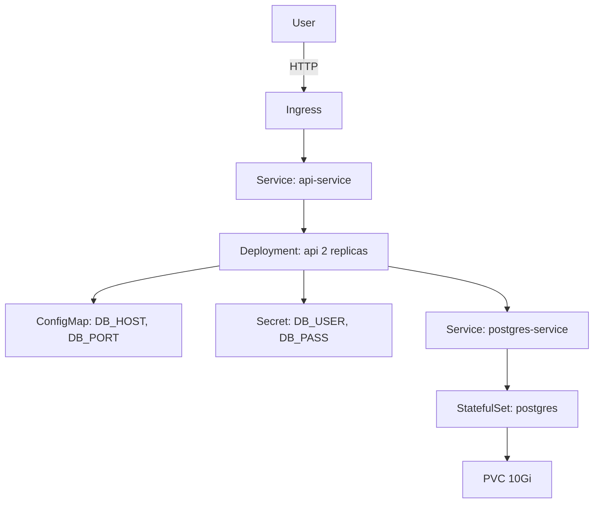

# Project 1 — Containerize & Deploy a Multi-Tier App

> 🟢 **Phase 1 — Beginner** | 👤 Individual | ⏱ 4–6 hours

## Overview

Take a **Node.js API** + **PostgreSQL** app, write Dockerfiles for each, push images to a registry, and deploy to Kubernetes using raw YAML only. No Helm, no shortcuts. You'll touch every primitive: Pod, Deployment, StatefulSet, Service, ConfigMap, Secret, Ingress.

**Why this matters:** Every K8s tool (Helm, ArgoCD, Operators) generates raw YAML under the hood. If you can't read and write it, you're debugging blind.

## Architecture



## Learning Objectives
- Write production Dockerfiles with multi-stage builds and non-root users
- Understand Deployment (stateless) vs StatefulSet (stateful)
- Use ConfigMaps for config and Secrets for credentials
- Wire services with Kubernetes DNS
- Expose apps externally via Ingress

## Prerequisites
- [ ] `setup.sh` run — all tools installed
- [ ] Kubernetes cluster access (GKE, EKS, AKS, kind, or k3d)
- [ ] Docker installed and logged into a registry

## Step 1 — Write the Dockerfiles

```dockerfile
# api/Dockerfile
FROM node:20-alpine AS deps
WORKDIR /app
COPY package*.json ./
RUN npm ci --only=production

FROM node:20-alpine AS runtime
WORKDIR /app
RUN addgroup -S appgroup && adduser -S appuser -G appgroup
COPY --from=deps /app/node_modules ./node_modules
COPY app.js .
USER appuser
EXPOSE 3000
HEALTHCHECK --interval=30s CMD wget -qO- http://localhost:3000/health || exit 1
CMD ["node", "app.js"]
```

```dockerfile
# db/Dockerfile  
FROM postgres:15-alpine
COPY init.sql /docker-entrypoint-initdb.d/
```

```sql
-- db/init.sql
CREATE TABLE items (id SERIAL PRIMARY KEY, name VARCHAR(100), created_at TIMESTAMP DEFAULT NOW());
INSERT INTO items(name) VALUES ('apple'),('banana'),('cherry');
```

## Step 2 — Build & Push

```bash
REGISTRY=docker.io/yourusername
docker build -t $REGISTRY/cohort-api:1.0.0 ./api
docker build -t $REGISTRY/cohort-db:1.0.0 ./db
docker push $REGISTRY/cohort-api:1.0.0
docker push $REGISTRY/cohort-db:1.0.0
```

## Step 3 — Namespace

```bash
kubectl create namespace project-01
```

## Step 4 — ConfigMap and Secret

```yaml
# configmap.yaml
apiVersion: v1
kind: ConfigMap
metadata:
  name: app-config
  namespace: project-01
data:
  DB_HOST: "postgres-service"
  DB_PORT: "5432"
  DB_NAME: "appdb"
```

```bash
kubectl create secret generic db-credentials \
  --namespace project-01 \
  --from-literal=DB_USER=postgres \
  --from-literal=DB_PASS=supersecret123
```

## Step 5 — PostgreSQL StatefulSet

```yaml
# postgres.yaml
apiVersion: v1
kind: Service
metadata:
  name: postgres-service
  namespace: project-01
spec:
  selector:
    app: postgres
  ports:
    - port: 5432
  clusterIP: None
---
apiVersion: apps/v1
kind: StatefulSet
metadata:
  name: postgres
  namespace: project-01
spec:
  serviceName: postgres-service
  replicas: 1
  selector:
    matchLabels:
      app: postgres
  template:
    metadata:
      labels:
        app: postgres
    spec:
      containers:
        - name: postgres
          image: docker.io/yourusername/cohort-db:1.0.0
          ports:
            - containerPort: 5432
          env:
            - name: POSTGRES_DB
              valueFrom:
                configMapKeyRef: {name: app-config, key: DB_NAME}
            - name: POSTGRES_USER
              valueFrom:
                secretKeyRef: {name: db-credentials, key: DB_USER}
            - name: POSTGRES_PASSWORD
              valueFrom:
                secretKeyRef: {name: db-credentials, key: DB_PASS}
            - name: PGDATA
              value: /var/lib/postgresql/data/pgdata
          resources:
            requests: {cpu: 250m, memory: 256Mi}
            limits: {cpu: 500m, memory: 512Mi}
          volumeMounts:
            - name: postgres-data
              mountPath: /var/lib/postgresql/data
  volumeClaimTemplates:
    - metadata:
        name: postgres-data
      spec:
        accessModes: [ReadWriteOnce]
        resources:
          requests:
            storage: 10Gi
```

## Step 6 — API Deployment

```yaml
# api.yaml
apiVersion: apps/v1
kind: Deployment
metadata:
  name: api
  namespace: project-01
spec:
  replicas: 2
  selector:
    matchLabels:
      app: api
  strategy:
    type: RollingUpdate
    rollingUpdate: {maxUnavailable: 0, maxSurge: 1}
  template:
    metadata:
      labels:
        app: api
    spec:
      containers:
        - name: api
          image: docker.io/yourusername/cohort-api:1.0.0
          ports:
            - containerPort: 3000
          envFrom:
            - configMapRef:
                name: app-config
          env:
            - name: DB_USER
              valueFrom:
                secretKeyRef: {name: db-credentials, key: DB_USER}
            - name: DB_PASS
              valueFrom:
                secretKeyRef: {name: db-credentials, key: DB_PASS}
          resources:
            requests: {cpu: 100m, memory: 128Mi}
            limits: {cpu: 500m, memory: 256Mi}
          readinessProbe:
            httpGet: {path: /health, port: 3000}
            initialDelaySeconds: 5
            periodSeconds: 10
          livenessProbe:
            httpGet: {path: /health, port: 3000}
            initialDelaySeconds: 15
            periodSeconds: 20
---
apiVersion: v1
kind: Service
metadata:
  name: api-service
  namespace: project-01
spec:
  selector:
    app: api
  ports:
    - port: 3000
      targetPort: 3000
```

```bash
kubectl apply -f postgres.yaml
kubectl apply -f api.yaml
kubectl get pods -n project-01
```

> 📸 **Expected:** `postgres-0` Running 1/1. Two `api-*` pods Running 2/2.

## Step 7 — Ingress

```yaml
# ingress.yaml
apiVersion: networking.k8s.io/v1
kind: Ingress
metadata:
  name: api-ingress
  namespace: project-01
  annotations:
    nginx.ingress.kubernetes.io/rewrite-target: /
spec:
  ingressClassName: nginx
  rules:
    - host: api.project01.local
      http:
        paths:
          - path: /
            pathType: Prefix
            backend:
              service:
                name: api-service
                port:
                  number: 3000
```

```bash
kubectl apply -f ingress.yaml
# Add to /etc/hosts: <INGRESS-IP> api.project01.local
curl http://api.project01.local/items
```

> 📸 **Expected:** JSON array with items from the database.

## Validation Checklist
- [ ] Both API pods Running and 2/2 ready
- [ ] postgres-0 Running and 1/1 ready
- [ ] `/health` returns `{"status":"ok"}`
- [ ] `/items` returns JSON array
- [ ] Deleting a pod causes automatic recreation

## Troubleshooting

**ImagePullBackOff** — Registry auth issue. `kubectl describe pod <name> -n project-01` for details.

**CrashLoopBackOff** — Check `kubectl logs <pod> --previous -n project-01`. Usually a wrong env var name.

**PVC Pending** — No StorageClass. `kubectl get storageclass`.

## Extension Challenges
1. Add a POST `/items` endpoint and do a rolling update with zero downtime
2. Configure a NetworkPolicy so only API pods can reach PostgreSQL
3. Add a ResourceQuota to the namespace

## Resources
- [Deployments](https://kubernetes.io/docs/concepts/workloads/controllers/deployment/)
- [StatefulSets](https://kubernetes.io/docs/concepts/workloads/controllers/statefulset/)
- [Secrets](https://kubernetes.io/docs/concepts/configuration/secret/)
