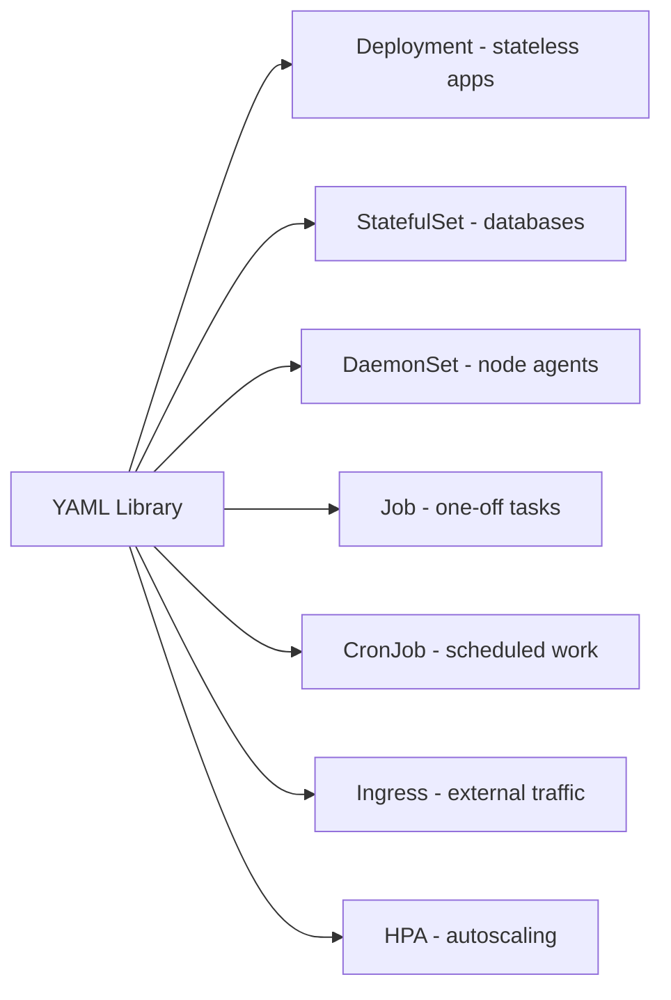

# Project 2 — Build a Production-Ready YAML Library

> 🟢 **Phase 1 — Beginner** | 👤 Individual | ⏱ 3–4 hours

## Overview

Design and document a **reusable, annotated YAML template library** covering every major Kubernetes workload type. Every field explained, every default noted, every trade-off called out. This becomes your personal reference for the rest of the cohort and your career.

**Why this matters:** Senior engineers don't write YAML from scratch. They have a library of well-understood templates. This project is yours.

## Architecture



## Learning Objectives
- Understand when to use each workload type
- Learn every field in Deployment, StatefulSet, DaemonSet, Job, CronJob, Ingress, HPA
- Build a personal reference library

## File Structure

```
projects/02-yaml-library/
├── README.md
└── templates/
    ├── deployment.yaml
    ├── statefulset.yaml
    ├── daemonset.yaml
    ├── job.yaml
    ├── cronjob.yaml
    ├── ingress.yaml
    └── hpa.yaml
```

## Deployment Template (Stateless Apps)

**Use when:** Multiple identical replicas can run. No local state. Examples: APIs, web servers.

```yaml
# templates/deployment.yaml
apiVersion: apps/v1
kind: Deployment
metadata:
  name: my-app
  namespace: default
  labels:
    app: my-app
    version: "1.0.0"
spec:
  replicas: 2
  selector:
    matchLabels:
      app: my-app
  strategy:
    type: RollingUpdate
    rollingUpdate:
      maxUnavailable: 0    # Never fewer pods than desired
      maxSurge: 1          # Allow 1 extra during rollout
  revisionHistoryLimit: 3  # Keep 3 old ReplicaSets for rollback
  template:
    metadata:
      labels:
        app: my-app
    spec:
      terminationGracePeriodSeconds: 30
      containers:
        - name: my-app
          image: nginx:1.25.4         # Always pin — never :latest
          imagePullPolicy: IfNotPresent
          ports:
            - containerPort: 80
          resources:
            requests:
              cpu: 100m               # Guaranteed CPU (affects scheduling)
              memory: 128Mi           # Guaranteed memory
            limits:
              cpu: 500m               # Hard cap (throttled if exceeded)
              memory: 256Mi           # Hard cap (OOMKilled if exceeded)
          readinessProbe:             # Traffic sent only when this passes
            httpGet: {path: /health, port: 80}
            initialDelaySeconds: 5
            periodSeconds: 10
          livenessProbe:              # Container restarted if this fails
            httpGet: {path: /health, port: 80}
            initialDelaySeconds: 15
            periodSeconds: 20
```

## StatefulSet Template (Databases & Stateful Apps)

**Use when:** Each pod needs stable name, ordered startup, own persistent storage. Examples: PostgreSQL, Redis, Kafka.

```yaml
# templates/statefulset.yaml
apiVersion: v1
kind: Service
metadata:
  name: my-db          # Headless service required for StatefulSet DNS
spec:
  clusterIP: None      # Makes it headless — DNS returns pod IPs directly
  selector:
    app: my-db
  ports:
    - port: 5432
---
apiVersion: apps/v1
kind: StatefulSet
metadata:
  name: my-db
spec:
  serviceName: my-db   # Must match headless Service name
  replicas: 1
  podManagementPolicy: OrderedReady  # Start pods in order: 0, then 1, then 2
  selector:
    matchLabels:
      app: my-db
  template:
    metadata:
      labels:
        app: my-db
    spec:
      terminationGracePeriodSeconds: 60  # DBs need time to flush writes
      containers:
        - name: postgres
          image: postgres:15-alpine
          env:
            - name: POSTGRES_PASSWORD
              valueFrom:
                secretKeyRef: {name: db-secret, key: password}
            - name: PGDATA
              value: /var/lib/postgresql/data/pgdata
          resources:
            requests: {cpu: 250m, memory: 256Mi}
            limits: {cpu: "1", memory: 1Gi}
          volumeMounts:
            - name: data
              mountPath: /var/lib/postgresql/data
  volumeClaimTemplates:              # Each pod gets its own PVC
    - metadata:
        name: data
      spec:
        accessModes: [ReadWriteOnce]
        resources:
          requests:
            storage: 10Gi
```

## DaemonSet Template (Node-Level Agents)

**Use when:** Exactly one pod per node. Examples: log collectors (Fluentd), monitoring agents (node-exporter), security agents (Falco).

```yaml
# templates/daemonset.yaml
apiVersion: apps/v1
kind: DaemonSet
metadata:
  name: log-collector
  namespace: monitoring
spec:
  selector:
    matchLabels:
      app: log-collector
  updateStrategy:
    type: RollingUpdate
    rollingUpdate:
      maxUnavailable: 1  # Update 1 node at a time
  template:
    metadata:
      labels:
        app: log-collector
    spec:
      tolerations:
        - key: node-role.kubernetes.io/control-plane
          operator: Exists
          effect: NoSchedule          # Allow scheduling on control-plane nodes
      containers:
        - name: collector
          image: fluent/fluentd:v1.16-1
          resources:
            requests: {cpu: 100m, memory: 200Mi}
            limits: {cpu: 200m, memory: 500Mi}
          volumeMounts:
            - name: varlog
              mountPath: /var/log
              readOnly: true
      volumes:
        - name: varlog
          hostPath:
            path: /var/log            # Read from the actual node filesystem
```

## Job Template (One-Off Tasks)

**Use when:** Run to completion once. Examples: DB migrations, batch processing, report generation.

```yaml
# templates/job.yaml
apiVersion: batch/v1
kind: Job
metadata:
  name: db-migration
spec:
  completions: 1
  parallelism: 1
  backoffLimit: 3              # Retry up to 3 times on failure
  activeDeadlineSeconds: 600   # Kill after 10 minutes regardless
  ttlSecondsAfterFinished: 300 # Auto-delete pod 5 min after completion
  template:
    spec:
      restartPolicy: OnFailure # NEVER use Always for Jobs
      containers:
        - name: migrate
          image: flyway/flyway:9-alpine
          args: [migrate]
          env:
            - name: FLYWAY_URL
              value: jdbc:postgresql://postgres-service:5432/myapp
          resources:
            requests: {cpu: 100m, memory: 256Mi}
            limits: {cpu: 500m, memory: 512Mi}
```

## CronJob Template (Scheduled Tasks)

**Use when:** Recurring scheduled work. Examples: nightly backups, hourly reports.

```yaml
# templates/cronjob.yaml
apiVersion: batch/v1
kind: CronJob
metadata:
  name: nightly-backup
spec:
  schedule: "0 2 * * *"          # 2 AM daily
  timeZone: "America/Chicago"
  concurrencyPolicy: Forbid       # Skip if previous run still going
  successfulJobsHistoryLimit: 3
  failedJobsHistoryLimit: 1
  jobTemplate:
    spec:
      backoffLimit: 2
      template:
        spec:
          restartPolicy: OnFailure
          containers:
            - name: backup
              image: postgres:15-alpine
              command: ["/bin/sh", "-c", "pg_dump -h $DB_HOST -U $DB_USER $DB_NAME > /backups/backup_$(date +%Y%m%d).sql"]
              resources:
                requests: {cpu: 100m, memory: 128Mi}
                limits: {cpu: 200m, memory: 256Mi}
```

## HPA Template

```yaml
# templates/hpa.yaml
apiVersion: autoscaling/v2
kind: HorizontalPodAutoscaler
metadata:
  name: my-app-hpa
spec:
  scaleTargetRef:
    apiVersion: apps/v1
    kind: Deployment
    name: my-app
  minReplicas: 2
  maxReplicas: 10
  metrics:
    - type: Resource
      resource:
        name: cpu
        target:
          type: Utilization
          averageUtilization: 70
  behavior:
    scaleUp:
      stabilizationWindowSeconds: 60
    scaleDown:
      stabilizationWindowSeconds: 300   # Wait 5 min before scaling down
```

## Validation Checklist
- [ ] All templates pass `kubectl apply --dry-run=client -f templates/`
- [ ] Every template has resource requests AND limits
- [ ] No `:latest` image tags in any template
- [ ] StatefulSet has a matching headless Service
- [ ] Job and CronJob use `restartPolicy: OnFailure`

## Extension Challenges
1. Add a NetworkPolicy template with default-deny + allow rules
2. Validate all templates with `kubeconform -kubernetes-version 1.29.0`
3. Write a bash script that prompts for values and generates a filled-in Deployment

## Resources
- [Workload Types](https://kubernetes.io/docs/concepts/workloads/)
- [API Reference](https://kubernetes.io/docs/reference/kubernetes-api/)
