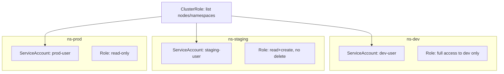

# Project 3 — Namespace Isolation & RBAC Enforcement

> 🟢 **Phase 1 — Beginner** | 👤 Individual | ⏱ 3–4 hours

## Overview

Set up a **multi-tenant cluster** with 3 teams (dev, staging, prod). Configure RBAC so each team can only touch their own namespace. Verify isolation using `kubectl auth can-i`.

**Why this matters:** Multi-tenancy and RBAC are the first things auditors check and one of the most common CKA exam topics.

## Architecture



## Step 1 — Create Namespaces and ServiceAccounts

```bash
kubectl create namespace dev
kubectl create namespace staging
kubectl create namespace prod

kubectl create serviceaccount dev-user -n dev
kubectl create serviceaccount staging-user -n staging
kubectl create serviceaccount prod-user -n prod
```

## Step 2 — Define Roles

```yaml
# roles.yaml
apiVersion: rbac.authorization.k8s.io/v1
kind: Role
metadata:
  name: dev-role
  namespace: dev
rules:
  - apiGroups: ["", "apps"]
    resources: ["pods", "deployments", "services", "configmaps", "secrets"]
    verbs: ["get", "list", "watch", "create", "update", "patch", "delete"]
  - apiGroups: [""]
    resources: ["pods/log", "pods/exec"]
    verbs: ["get", "create"]
---
apiVersion: rbac.authorization.k8s.io/v1
kind: Role
metadata:
  name: staging-role
  namespace: staging
rules:
  - apiGroups: ["", "apps"]
    resources: ["pods", "deployments", "services", "configmaps"]
    verbs: ["get", "list", "watch", "create", "update"]
  # No delete, no secrets
---
apiVersion: rbac.authorization.k8s.io/v1
kind: Role
metadata:
  name: prod-readonly-role
  namespace: prod
rules:
  - apiGroups: ["", "apps"]
    resources: ["pods", "deployments", "services"]
    verbs: ["get", "list", "watch"]
  - apiGroups: [""]
    resources: ["pods/log"]
    verbs: ["get"]
```

## Step 3 — Bind Roles

```yaml
# rolebindings.yaml
apiVersion: rbac.authorization.k8s.io/v1
kind: RoleBinding
metadata:
  name: dev-binding
  namespace: dev
subjects:
  - kind: ServiceAccount
    name: dev-user
    namespace: dev
roleRef:
  kind: Role
  name: dev-role
  apiGroup: rbac.authorization.k8s.io
---
apiVersion: rbac.authorization.k8s.io/v1
kind: RoleBinding
metadata:
  name: staging-binding
  namespace: staging
subjects:
  - kind: ServiceAccount
    name: staging-user
    namespace: staging
roleRef:
  kind: Role
  name: staging-role
  apiGroup: rbac.authorization.k8s.io
---
apiVersion: rbac.authorization.k8s.io/v1
kind: RoleBinding
metadata:
  name: prod-binding
  namespace: prod
subjects:
  - kind: ServiceAccount
    name: prod-user
    namespace: prod
roleRef:
  kind: Role
  name: prod-readonly-role
  apiGroup: rbac.authorization.k8s.io
```

## Step 4 — ClusterRole for Cross-Namespace Read

```yaml
# clusterrole.yaml
apiVersion: rbac.authorization.k8s.io/v1
kind: ClusterRole
metadata:
  name: cluster-viewer
rules:
  - apiGroups: [""]
    resources: ["namespaces", "nodes"]
    verbs: ["get", "list", "watch"]
---
apiVersion: rbac.authorization.k8s.io/v1
kind: ClusterRoleBinding
metadata:
  name: all-teams-viewer
subjects:
  - kind: ServiceAccount
    name: dev-user
    namespace: dev
  - kind: ServiceAccount
    name: staging-user
    namespace: staging
  - kind: ServiceAccount
    name: prod-user
    namespace: prod
roleRef:
  kind: ClusterRole
  name: cluster-viewer
  apiGroup: rbac.authorization.k8s.io
```

## Step 5 — Verify Isolation

```bash
# dev-user CAN create pods in dev
kubectl auth can-i create pods -n dev --as system:serviceaccount:dev:dev-user
# yes ✅

# dev-user CANNOT touch prod
kubectl auth can-i create pods -n prod --as system:serviceaccount:dev:dev-user
# no ✅

# staging-user CANNOT delete
kubectl auth can-i delete deployments -n staging --as system:serviceaccount:staging:staging-user
# no ✅

# prod-user is read-only
kubectl auth can-i create pods -n prod --as system:serviceaccount:prod:prod-user
# no ✅

# All teams can list nodes (ClusterRole)
kubectl auth can-i list nodes --as system:serviceaccount:dev:dev-user
# yes ✅
```

> 📸 **Expected:** Every check returns the result shown. Any unexpected result = misconfigured RBAC.

## Validation Checklist
- [ ] dev-user: create pods in dev ✅, create pods in prod ❌
- [ ] staging-user: create deployments ✅, delete deployments ❌, get secrets ❌
- [ ] prod-user: get pods ✅, create pods ❌
- [ ] All 3 accounts: list nodes ✅

## Troubleshooting

**`auth can-i` always returns yes** — You're running as cluster-admin. The `--as` flag should still work. Check ServiceAccount namespace spelling carefully.

**RoleBinding not working** — `kubectl describe rolebinding -n dev`. Verify `subjects[].namespace` matches the ServiceAccount's actual namespace.

## Extension Challenges
1. Add a CI/CD ServiceAccount with create/update Deployments but no delete or Secrets access
2. Add ResourceQuotas to each namespace limiting total CPU and memory
3. Write a test script that runs all `auth can-i` checks and prints pass/fail

## Resources
- [RBAC](https://kubernetes.io/docs/reference/access-authn-authz/rbac/)
- [ServiceAccounts](https://kubernetes.io/docs/concepts/security/service-accounts/)
