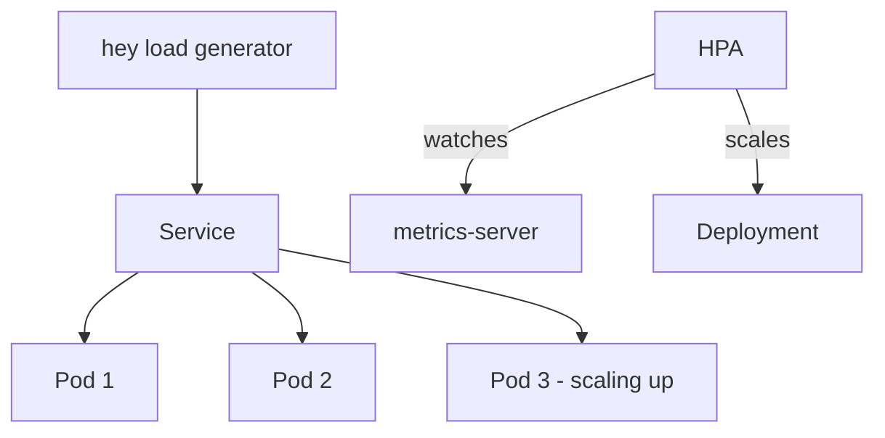

# Project 4 — Self-Healing & Auto-Scaling Lab

> 🟢 **Phase 1 — Beginner** | 👤 Individual | ⏱ 3–5 hours

## Overview

**Deliberately break a Kubernetes application** — kill pods, crash containers, exhaust memory — and observe exactly what happens. Then configure HPA and simulate real traffic to watch the cluster scale up and down automatically.

**Why this matters:** Self-healing and autoscaling are the most cited K8s benefits in every job description. Being able to demo them, not just describe them, is what gets interviews.

## Architecture



## Step 0 — Install metrics-server

```bash
kubectl apply -f https://github.com/kubernetes-sigs/metrics-server/releases/latest/download/components.yaml

# For local clusters (kind/k3d) with self-signed certs:
kubectl patch deployment metrics-server -n kube-system \
  --type='json' \
  -p='[{"op":"add","path":"/spec/template/spec/containers/0/args/-","value":"--kubelet-insecure-tls"}]'

kubectl rollout status deployment/metrics-server -n kube-system
kubectl top nodes  # Should show CPU/memory
```

## Step 1 — Deploy Test App

```yaml
# app.yaml
apiVersion: apps/v1
kind: Deployment
metadata:
  name: php-apache
spec:
  replicas: 1
  selector:
    matchLabels:
      run: php-apache
  template:
    metadata:
      labels:
        run: php-apache
    spec:
      containers:
        - name: php-apache
          image: registry.k8s.io/hpa-example
          ports:
            - containerPort: 80
          resources:
            requests:
              cpu: 200m
            limits:
              cpu: 500m
---
apiVersion: v1
kind: Service
metadata:
  name: php-apache
spec:
  selector:
    run: php-apache
  ports:
    - port: 80
```

```bash
kubectl apply -f app.yaml
```

---

## Part A — Self-Healing Experiments

### Experiment 1: Kill a Pod

```bash
kubectl delete pod -l run=php-apache
kubectl get pods -w
# Watch it get recreated automatically within seconds
```

> 📸 **Expected:** Old pod enters Terminating. New pod created immediately. Deployment always maintains 1 replica.

### Experiment 2: CrashLoopBackOff

```yaml
# crashloop.yaml
apiVersion: v1
kind: Pod
metadata:
  name: crashloop-demo
spec:
  containers:
    - name: crash
      image: busybox
      command: ["/bin/sh", "-c", "echo starting; sleep 5; exit 1"]
```

```bash
kubectl apply -f crashloop.yaml
kubectl get pod crashloop-demo -w
```

> 📸 **Expected:** Pod cycles Running → Error → CrashLoopBackOff. Restart count increases. Backoff delay grows: 10s → 20s → 40s → 80s → 160s → 300s max. **This is exponential backoff — Kubernetes keeps trying, but backs off to avoid hammering a broken container.**

```bash
kubectl logs crashloop-demo --previous   # Logs from the last crashed container
kubectl describe pod crashloop-demo      # See restart count and last state
```

### Experiment 3: OOMKill

```yaml
# oom.yaml
apiVersion: v1
kind: Pod
metadata:
  name: oom-demo
spec:
  containers:
    - name: hog
      image: polinux/stress
      command: ["stress"]
      args: ["--vm", "1", "--vm-bytes", "200M"]
      resources:
        limits:
          memory: 100Mi   # Tries to use 200MB but limit is 100MB
```

```bash
kubectl apply -f oom.yaml
kubectl get pod oom-demo -w
kubectl describe pod oom-demo
# Look for: OOMKilled: true, Exit Code: 137
```

> 📸 **Expected:** Pod shows `OOMKilled` reason. Exit code 137 = killed by SIGKILL. Kubernetes restarts it and it OOMKills again.

### Experiment 4: Failing Liveness Probe

```yaml
# liveness-fail.yaml
apiVersion: v1
kind: Pod
metadata:
  name: liveness-fail
spec:
  containers:
    - name: app
      image: busybox
      command: ["/bin/sh", "-c"]
      args:
        - |
          touch /tmp/healthy
          sleep 20
          rm /tmp/healthy
          sleep 999
      livenessProbe:
        exec:
          command: [cat, /tmp/healthy]
        initialDelaySeconds: 5
        periodSeconds: 5
        failureThreshold: 3
```

```bash
kubectl apply -f liveness-fail.yaml
kubectl get pod liveness-fail -w
```

> 📸 **Expected:** After ~40s, liveness fails 3 times. Container restarts. Pod stays in Running state — it just restarts the container, not the pod itself.

---

## Part B — HPA

### Configure HPA

```bash
kubectl autoscale deployment php-apache \
  --cpu-percent=50 \
  --min=1 \
  --max=10

kubectl get hpa php-apache -w
# Wait ~60s for TARGETS to show real numbers (not <unknown>)
```

### Generate Load

```bash
# In a separate terminal
kubectl run load-gen --image=busybox --restart=Never -it --rm -- \
  /bin/sh -c "while true; do wget -q -O- http://php-apache; done"

# In main terminal — watch HPA react
kubectl get hpa php-apache -w
kubectl get pods -l run=php-apache -w
```

> 📸 **Expected:** CPU climbs above 50%. HPA adds replicas (up to 10). CPU per pod drops as load distributes.

### Watch Scale-Down

```bash
# Stop the load generator (Ctrl+C)
kubectl get hpa php-apache -w
# After ~5 minutes, replicas scale back to 1
```

> 📸 **Expected:** Scale-down is deliberate slow — 5 min stabilization window prevents thrashing.

---

## Validation Checklist
- [ ] Deleted pod recreated within 30 seconds
- [ ] CrashLoopBackOff shows exponential backoff in describe output
- [ ] OOMKilled pod shows exit code 137
- [ ] Liveness failure caused container restart (not pod deletion)
- [ ] HPA scaled UP when CPU > 50%
- [ ] HPA scaled DOWN after load removed
- [ ] `kubectl top pods` shows real metrics

## Troubleshooting

**HPA shows `<unknown>` for 5+ minutes** — metrics-server isn't working. Check `kubectl get pods -n kube-system | grep metrics`.

**HPA not scaling up** — Deployment must have CPU `requests` set. Without requests, HPA can't calculate utilization.

**OOMKill not happening** — Increase stress allocation or decrease memory limit.

## Extension Challenges
1. Add a PodDisruptionBudget ensuring at least 1 replica always available during node drains
2. Configure VPA in recommendation mode and review its memory/CPU suggestions
3. Combine HPA with custom metrics from Prometheus (requires KEDA or Prometheus Adapter)

## Resources
- [HPA](https://kubernetes.io/docs/tasks/run-application/horizontal-pod-autoscale/)
- [Liveness Probes](https://kubernetes.io/docs/tasks/configure-pod-container/configure-liveness-readiness-startup-probes/)
- [Pod Disruption Budgets](https://kubernetes.io/docs/concepts/workloads/pods/disruptions/)
