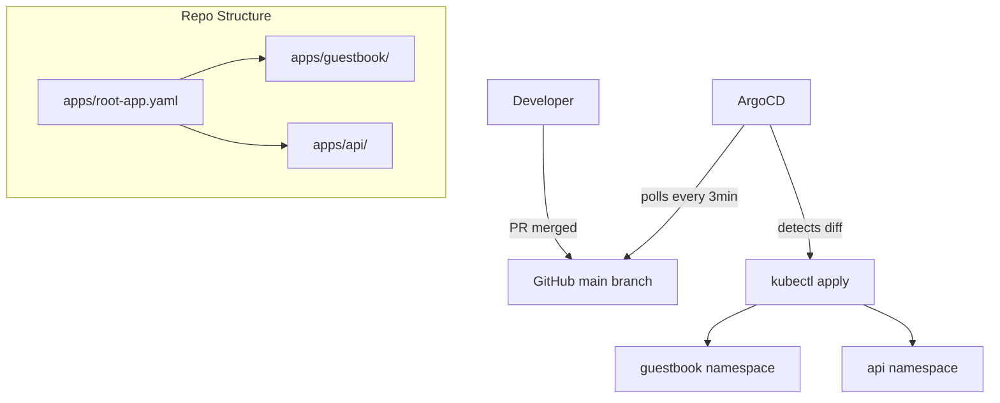

# Project 5 — Full GitOps Pipeline with ArgoCD

> 🟡 **Phase 2 — Advanced** | 👥 Pairs | ⏱ 5–7 hours

## Overview

Build a complete **App of Apps** GitOps structure from scratch. All manifests live in GitHub. Changes happen via pull requests. ArgoCD continuously reconciles. You'll experience the full GitOps loop — PR merge to live cluster update.

**Why this matters:** GitOps is the current standard for production Kubernetes. The App of Apps pattern is used by platform teams managing dozens of apps. This mirrors your first week at a cloud-native company.

## Architecture



## Step 1 — Install ArgoCD

```bash
kubectl create namespace argocd
kubectl apply -n argocd -f \
  https://raw.githubusercontent.com/argoproj/argo-cd/stable/manifests/install.yaml
kubectl rollout status deployment/argocd-server -n argocd

# Get initial password
kubectl get secret argocd-initial-admin-secret -n argocd \
  -o jsonpath="{.data.password}" | base64 -d && echo

# Port-forward UI
kubectl port-forward svc/argocd-server -n argocd 8080:443 &

# Login CLI
argocd login localhost:8080 --username admin --password <password> --insecure
```

> 📸 **Expected:** ArgoCD UI at `https://localhost:8080`. No apps yet — clean slate.

## Step 2 — Repo Structure

Create in your GitHub fork:
```
gitops/
├── apps/
│   ├── root-app.yaml
│   └── guestbook/
│       ├── deployment.yaml
│       └── service.yaml
└── infrastructure/
    └── namespaces.yaml
```

```yaml
# gitops/apps/guestbook/deployment.yaml
apiVersion: apps/v1
kind: Deployment
metadata:
  name: guestbook-ui
  namespace: guestbook
  annotations:
    argocd.argoproj.io/sync-wave: "2"
spec:
  replicas: 2
  selector:
    matchLabels:
      app: guestbook-ui
  template:
    metadata:
      labels:
        app: guestbook-ui
    spec:
      containers:
        - name: guestbook-ui
          image: gcr.io/heptio-images/ks-guestbook-demo:0.2
          ports:
            - containerPort: 80
          resources:
            requests: {cpu: 100m, memory: 64Mi}
            limits: {cpu: 200m, memory: 128Mi}
```

## Step 3 — Root App (App of Apps)

```yaml
# gitops/apps/root-app.yaml
apiVersion: argoproj.io/v1alpha1
kind: Application
metadata:
  name: root-app
  namespace: argocd
  finalizers:
    - resources-finalizer.argocd.argoproj.io
spec:
  project: default
  source:
    repoURL: https://github.com/YOUR_USERNAME/kubernetes-january-2026-cohort.git
    targetRevision: main
    path: gitops/apps
  destination:
    server: https://kubernetes.default.svc
    namespace: argocd
  syncPolicy:
    automated:
      prune: true
      selfHeal: true
    syncOptions:
      - CreateNamespace=true
```

```bash
kubectl apply -f gitops/apps/root-app.yaml
argocd app list
argocd app sync root-app
```

> 📸 **Expected:** ArgoCD UI shows root-app. Child apps (guestbook) appear automatically. All show Synced + Healthy.

## Step 4 — Experience the GitOps Loop

```bash
# Make a change via PR
git checkout -b feat/scale-guestbook
# Edit: change replicas: 2 to replicas: 4 in guestbook/deployment.yaml
git add . && git commit -m "feat(guestbook): scale to 4 replicas"
git push origin feat/scale-guestbook
# Open PR → merge → watch ArgoCD sync
kubectl get pods -n guestbook   # 4 pods after merge
```

## Step 5 — Observe Drift + Self-Heal

```bash
# Manually scale (bypassing GitOps)
kubectl scale deployment guestbook-ui --replicas=1 -n guestbook

# With selfHeal: true, ArgoCD auto-corrects within 3 minutes
kubectl get pods -n guestbook -w  # Scales back to 4
```

> 📸 **Expected:** ArgoCD briefly shows OutOfSync, then self-heals back to 4 replicas. Git wins.

## Validation Checklist
- [ ] ArgoCD UI accessible
- [ ] root-app shows child apps in UI
- [ ] PR merge triggered a deploy
- [ ] Drift detected and self-healed
- [ ] `argocd app list` shows all apps Synced + Healthy

## Troubleshooting

**App stuck OutOfSync** — `argocd app diff <name>` to see exact difference. Often runtime-added labels/annotations differ from Git.

**selfHeal not working** — Check `syncPolicy.automated.selfHeal: true`. Also check for sync windows blocking automation.

**Namespace not created** — Add `CreateNamespace=true` to syncOptions.

## Extension Challenges
1. Add a sync window preventing auto-sync between 10 PM and 6 AM
2. Configure a GitHub webhook for instant sync on push (no 3-min poll)
3. Add ArgoCD Notifications to post sync results to the Slack cohort channel

## Resources
- [ArgoCD Docs](https://argo-cd.readthedocs.io/)
- [App of Apps](https://argo-cd.readthedocs.io/en/stable/operator-manual/cluster-bootstrapping/)
- [Sync Waves](https://argo-cd.readthedocs.io/en/stable/user-guide/sync-waves/)
