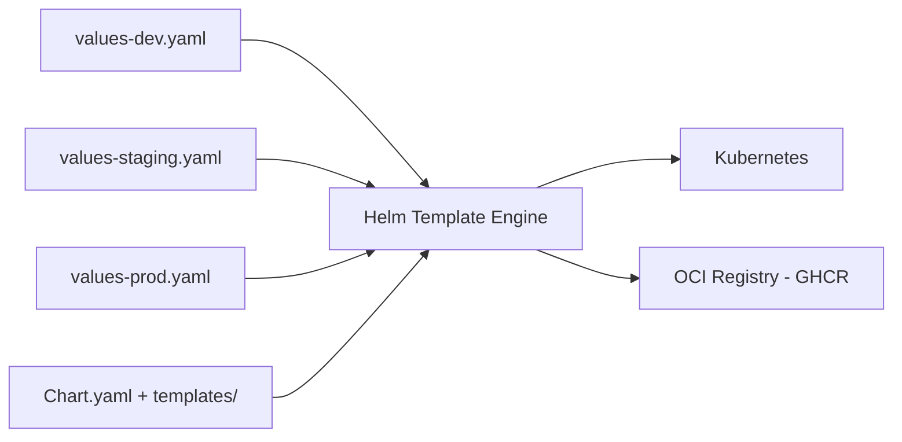

# Project 6 — Helm Chart Authoring

> 🟡 **Phase 2 — Advanced** | 👥 Pairs | ⏱ 4–6 hours

## Overview

Convert the Project 1 app into a **fully parameterized Helm chart** with dev, staging, and prod values files. Use Helm's templating engine — helpers, conditionals, loops. Publish the chart to an OCI registry.

**Why this matters:** Helm is the standard for packaging Kubernetes apps. Every tool you install (Prometheus, ArgoCD, cert-manager) is a Helm chart. Writing your own shows you understand what those tools are built on.

## Architecture



## Chart Structure

```
my-app/
├── Chart.yaml
├── values.yaml
├── values-dev.yaml
├── values-staging.yaml
├── values-prod.yaml
└── templates/
    ├── _helpers.tpl
    ├── deployment.yaml
    ├── service.yaml
    ├── configmap.yaml
    ├── ingress.yaml
    ├── hpa.yaml
    └── NOTES.txt
```

## Chart.yaml

```yaml
apiVersion: v2
name: my-app
description: Multi-tier Node.js + PostgreSQL application
type: application
version: 0.1.0
appVersion: "1.0.0"
maintainers:
  - name: Emagetech Cohort
    email: admin@emagegroup.net
```

## values.yaml (Defaults)

```yaml
api:
  image:
    repository: yourusername/cohort-api
    tag: "1.0.0"
    pullPolicy: IfNotPresent
  replicaCount: 2
  resources:
    requests: {cpu: 100m, memory: 128Mi}
    limits: {cpu: 500m, memory: 256Mi}
  service:
    type: ClusterIP
    port: 3000
  autoscaling:
    enabled: false
    minReplicas: 2
    maxReplicas: 10
    targetCPUUtilizationPercentage: 70

postgres:
  image: {repository: postgres, tag: "15-alpine"}
  database: appdb
  storageSize: 10Gi

ingress:
  enabled: false
  className: nginx
  host: ""
```

## _helpers.tpl

```
{{- define "my-app.fullname" -}}
{{- printf "%s-%s" .Release.Name .Chart.Name | trunc 63 | trimSuffix "-" }}
{{- end }}

{{- define "my-app.labels" -}}
helm.sh/chart: {{ .Chart.Name }}-{{ .Chart.Version }}
app.kubernetes.io/name: {{ .Chart.Name }}
app.kubernetes.io/instance: {{ .Release.Name }}
app.kubernetes.io/version: {{ .Chart.AppVersion | quote }}
app.kubernetes.io/managed-by: {{ .Release.Service }}
{{- end }}

{{- define "my-app.selectorLabels" -}}
app.kubernetes.io/name: {{ .Chart.Name }}
app.kubernetes.io/instance: {{ .Release.Name }}
{{- end }}
```

## deployment.yaml Template

```yaml
apiVersion: apps/v1
kind: Deployment
metadata:
  name: {{ include "my-app.fullname" . }}-api
  labels:
    {{- include "my-app.labels" . | nindent 4 }}
spec:
  {{- if not .Values.api.autoscaling.enabled }}
  replicas: {{ .Values.api.replicaCount }}
  {{- end }}
  selector:
    matchLabels:
      {{- include "my-app.selectorLabels" . | nindent 6 }}
  template:
    metadata:
      labels:
        {{- include "my-app.selectorLabels" . | nindent 8 }}
    spec:
      containers:
        - name: api
          image: "{{ .Values.api.image.repository }}:{{ .Values.api.image.tag }}"
          imagePullPolicy: {{ .Values.api.image.pullPolicy }}
          ports:
            - containerPort: 3000
          resources:
            {{- toYaml .Values.api.resources | nindent 12 }}
          readinessProbe:
            httpGet: {path: /health, port: 3000}
            initialDelaySeconds: 5
            periodSeconds: 10
```

## Conditional HPA

```yaml
# templates/hpa.yaml
{{- if .Values.api.autoscaling.enabled }}
apiVersion: autoscaling/v2
kind: HorizontalPodAutoscaler
metadata:
  name: {{ include "my-app.fullname" . }}-api
spec:
  scaleTargetRef:
    apiVersion: apps/v1
    kind: Deployment
    name: {{ include "my-app.fullname" . }}-api
  minReplicas: {{ .Values.api.autoscaling.minReplicas }}
  maxReplicas: {{ .Values.api.autoscaling.maxReplicas }}
  metrics:
    - type: Resource
      resource:
        name: cpu
        target:
          type: Utilization
          averageUtilization: {{ .Values.api.autoscaling.targetCPUUtilizationPercentage }}
{{- end }}
```

## Environment Values Files

```yaml
# values-dev.yaml
api:
  replicaCount: 1
  resources:
    requests: {cpu: 50m, memory: 64Mi}
    limits: {cpu: 200m, memory: 128Mi}
postgres:
  storageSize: 2Gi
ingress:
  enabled: true
  host: api.dev.local
```

```yaml
# values-prod.yaml
api:
  replicaCount: 3
  autoscaling:
    enabled: true
    minReplicas: 3
    maxReplicas: 20
postgres:
  storageSize: 100Gi
ingress:
  enabled: true
  host: api.production.example.com
```

## Install and Test

```bash
# Render without installing (dry run)
helm template my-app-dev ./my-app -f my-app/values-dev.yaml

# Validate the output
helm template my-app-dev ./my-app -f my-app/values-dev.yaml | kubectl apply --dry-run=client -f -

# Install dev
helm install my-app-dev ./my-app -n dev --create-namespace -f my-app/values-dev.yaml

# Check
helm list -n dev
kubectl get all -n dev

# Upgrade after changes
helm upgrade my-app-dev ./my-app -n dev -f my-app/values-dev.yaml

# Rollback
helm rollback my-app-dev 1 -n dev
```

## Publish to GHCR

```bash
echo $GITHUB_TOKEN | helm registry login ghcr.io -u YOUR_USERNAME --password-stdin
helm package ./my-app
helm push my-app-0.1.0.tgz oci://ghcr.io/YOUR_USERNAME/helm-charts

# Install from registry
helm install my-app oci://ghcr.io/YOUR_USERNAME/helm-charts/my-app --version 0.1.0
```

## Validation Checklist
- [ ] `helm template` renders valid YAML
- [ ] Dev values produce 1 replica, no HPA
- [ ] Prod values produce 3 replicas WITH HPA
- [ ] Ingress only rendered when `ingress.enabled: true`
- [ ] `helm rollback` reverts successfully
- [ ] Chart published and installable from OCI registry

## Troubleshooting

**`toYaml | nindent` producing wrong indentation** — Count spaces carefully. nindent adds N leading spaces to every line.

**HPA not rendered** — Check `{{- if .Values.api.autoscaling.enabled }}` matches `enabled: true` in values.

**OCI push fails** — Ensure Helm 3.8+ is installed (`helm version`). OCI support requires 3.8+.

## Extension Challenges
1. Add a Helm test (`templates/tests/`) that runs curl /health and verifies response
2. Create a subchart for PostgreSQL instead of embedding it
3. Add `values.schema.json` to validate input values at install time

## Resources
- [Helm Docs](https://helm.sh/docs/)
- [Chart Template Guide](https://helm.sh/docs/chart_template_guide/)
- [OCI Registries](https://helm.sh/docs/topics/registries/)
