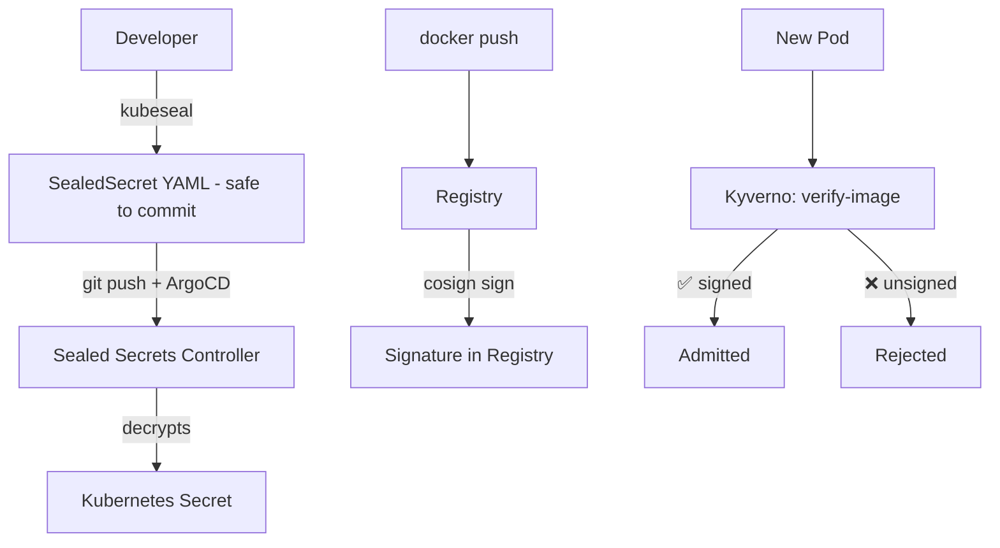

# Project 7 — Secrets Management & Supply Chain Security

> 🟡 **Phase 2 — Advanced** | 👥 Pairs | ⏱ 5–7 hours

## Overview

Integrate **Sealed Secrets** (encrypted secrets safe to commit to Git), sign container images with **Cosign/Sigstore**, and enforce image signature verification with a **Kyverno policy**. End result: no unsigned image can be deployed, and no plaintext secret exists in Git.

**Why this matters:** Supply chain security is required by DoD, FedRAMP, SOC2, and most enterprise compliance frameworks. This project directly mirrors those requirements.

## Architecture



## Part A — Sealed Secrets

### Install Controller

```bash
helm repo add sealed-secrets https://bitnami-labs.github.io/sealed-secrets
helm install sealed-secrets sealed-secrets/sealed-secrets \
  --namespace kube-system \
  --set-string fullnameOverride=sealed-secrets-controller
kubectl get pods -n kube-system | grep sealed
```

### Install kubeseal CLI

```bash
brew install kubeseal  # Mac
# Linux: download binary from https://github.com/bitnami-labs/sealed-secrets/releases
```

### Seal a Secret

```bash
# Create plain secret (DO NOT commit this)
kubectl create secret generic db-creds \
  --from-literal=DB_USER=postgres \
  --from-literal=DB_PASS=supersecret \
  --dry-run=client -o yaml > /tmp/plain-secret.yaml

# Seal it
kubeseal \
  --controller-name=sealed-secrets-controller \
  --controller-namespace=kube-system \
  --format yaml \
  < /tmp/plain-secret.yaml \
  > sealed-db-creds.yaml

rm /tmp/plain-secret.yaml

# NOW commit sealed-db-creds.yaml — it's safe
cat sealed-db-creds.yaml
# Values are RSA-encrypted ciphertext
```

### Apply and Verify

```bash
kubectl apply -f sealed-db-creds.yaml
# Controller auto-creates the plain Secret
kubectl get secret db-creds -o jsonpath='{.data.DB_USER}' | base64 -d
# Output: postgres
```

> 📸 **Expected:** SealedSecret resource exists. A regular Secret with decrypted values also exists. The YAML in Git looks like gibberish — unreadable without the controller's private key.

---

## Part B — Image Signing with Cosign

### Generate Key Pair

```bash
cosign generate-key-pair
# Creates: cosign.key (private — keep secret) and cosign.pub (public — commit this)
echo "cosign.key" >> .gitignore
git add cosign.pub
git commit -m "Add Cosign public key"
```

### Build, Push, Sign

```bash
IMAGE=docker.io/yourusername/cohort-api:signed-1.0.0
docker build -t $IMAGE ./api
docker push $IMAGE

# Sign — stores signature in registry alongside the image
cosign sign --key cosign.key $IMAGE

# Verify
cosign verify --key cosign.pub $IMAGE
```

> 📸 **Expected:** `cosign verify` prints verified claims and the image digest. Signature stored as a tag in the registry (e.g., `sha256-abc123.sig`).

---

## Part C — Kyverno Enforcement

### Install Kyverno

```bash
helm repo add kyverno https://kyverno.github.io/kyverno/
helm install kyverno kyverno/kyverno \
  --namespace kyverno --create-namespace
kubectl rollout status deployment/kyverno -n kyverno
```

### Audit Policy (Start Here)

```yaml
# policy-verify-image.yaml
apiVersion: kyverno.io/v1
kind: ClusterPolicy
metadata:
  name: verify-image-signature
spec:
  validationFailureAction: Audit   # Log violations, don't block yet
  background: true
  rules:
    - name: check-signature
      match:
        any:
          - resources:
              kinds: [Pod]
      verifyImages:
        - imageReferences:
            - "docker.io/yourusername/*"
          attestors:
            - count: 1
              entries:
                - keys:
                    publicKeys: |-
                      -----BEGIN PUBLIC KEY-----
                      (paste content of cosign.pub here)
                      -----END PUBLIC KEY-----
```

```bash
kubectl apply -f policy-verify-image.yaml

# Deploy an unsigned image — passes in audit mode but logs violation
kubectl run unsigned --image=nginx:latest
kubectl get policyreport -A   # See the violation logged
```

### Switch to Enforce

```bash
kubectl patch clusterpolicy verify-image-signature \
  --type='json' \
  -p='[{"op":"replace","path":"/spec/validationFailureAction","value":"Enforce"}]'

# Now unsigned images are BLOCKED
kubectl run unsigned2 --image=nginx:latest
# Error: admission webhook denied: signature verification failed

# Signed images still work
kubectl run signed --image=docker.io/yourusername/cohort-api:signed-1.0.0
# pod/signed created ✅
```

## Validation Checklist
- [ ] kubeseal sealed a secret and controller decrypted it automatically
- [ ] Sealed YAML is unreadable ciphertext
- [ ] cosign verify succeeds on signed image
- [ ] Audit mode logs violations for unsigned images
- [ ] Enforce mode BLOCKS unsigned images
- [ ] Signed images deploy successfully through enforce policy

## Troubleshooting

**kubeseal: cannot connect** — `kubectl get pods -n kube-system | grep sealed`. Check `--controller-name` matches exactly.

**cosign verify: no matching signatures** — Always sign AFTER pushing. Sign the exact tag you'll deploy.

**Kyverno webhook timeout** — All Kyverno pods down = webhook can block all pod creation. Add `failurePolicy: Ignore` for non-critical policies.

## Extension Challenges
1. Implement keyless Cosign signing in GitHub Actions using OIDC
2. Add a policy blocking images with no version tag (no `:latest` at all)
3. Integrate Sealed Secrets into the ArgoCD pipeline from Project 5

## Resources
- [Sealed Secrets](https://github.com/bitnami-labs/sealed-secrets)
- [Cosign / Sigstore](https://docs.sigstore.dev/)
- [Kyverno verifyImages](https://kyverno.io/docs/writing-policies/verify-images/)
