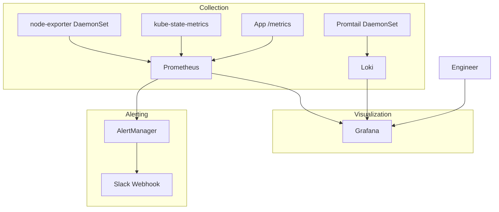

# Project 8 — Observability Stack Build-Out

> 🟡 **Phase 2 — Advanced** | 👥 Pairs | ⏱ 6–8 hours

## Overview

Deploy the full **Prometheus + AlertManager + Grafana + Loki** observability stack from scratch using Helm. Wire dashboards for CPU, memory, network, and pod restarts. Configure alerts that fire to Slack. By the end you'll understand every layer of the observability chain.

**Why this matters:** "We have no visibility" is one of the most common problems in engineering teams. Building and owning an observability stack is a core platform engineer responsibility. PromQL and log querying are frequent senior interview topics.

## Architecture



## Learning Objectives
- Deploy kube-prometheus-stack and Loki via Helm
- Understand Prometheus pull-based scraping model
- Write PromQL queries for CPU, memory, error rates, restarts
- Build Grafana dashboards from scratch
- Write AlertManager routing rules and Slack receivers
- Understand the difference between metrics (Prometheus) and logs (Loki)

## Prerequisites
- [ ] Helm 3 installed
- [ ] Cluster with at least 4GB RAM available
- [ ] Slack webhook URL (or use any webhook receiver)

## Step 1 — Add Helm Repos

```bash
helm repo add prometheus-community https://prometheus-community.github.io/helm-charts
helm repo add grafana https://grafana.github.io/helm-charts
helm repo update
```

## Step 2 — Install kube-prometheus-stack

```yaml
# prometheus-values.yaml
prometheus:
  prometheusSpec:
    retention: 15d
    storageSpec:
      volumeClaimTemplate:
        spec:
          accessModes: [ReadWriteOnce]
          resources:
            requests:
              storage: 20Gi

alertmanager:
  config:
    global:
      resolve_timeout: 5m
    route:
      group_by: [alertname, namespace]
      group_wait: 30s
      repeat_interval: 12h
      receiver: slack-alerts
      routes:
        - match:
            severity: critical
          receiver: slack-alerts
    receivers:
      - name: slack-alerts
        slack_configs:
          - api_url: "YOUR_SLACK_WEBHOOK_URL"
            channel: "#kubernetes-alerts"
            title: "{{ .GroupLabels.alertname }}"
            text: "{{ range .Alerts }}{{ .Annotations.description }}{{ end }}"

grafana:
  adminPassword: "changeme123"
  persistence:
    enabled: true
    size: 5Gi
```

```bash
kubectl create namespace monitoring

helm install kube-prometheus-stack prometheus-community/kube-prometheus-stack \
  --namespace monitoring \
  --values prometheus-values.yaml \
  --wait

kubectl get pods -n monitoring
```

> 📸 **Expected:** ~10 pods running in monitoring namespace — prometheus, alertmanager, grafana, kube-state-metrics, node-exporter (one per node).

## Step 3 — Access Grafana

```bash
kubectl port-forward svc/kube-prometheus-stack-grafana -n monitoring 3000:80 &
# Open http://localhost:3000  —  admin / changeme123
```

> 📸 **Expected:** Pre-installed dashboards visible: "Kubernetes / Cluster", "Kubernetes / Nodes", "Kubernetes / Pods". Real metrics showing immediately.

## Step 4 — Install Loki + Promtail

```yaml
# loki-values.yaml
loki:
  auth_enabled: false
  persistence:
    enabled: true
    size: 10Gi
```

```bash
helm install loki grafana/loki-stack \
  --namespace monitoring \
  --values loki-values.yaml \
  --set grafana.enabled=false

kubectl rollout status daemonset/loki-promtail -n monitoring
```

**Add Loki data source in Grafana:**
Configuration → Data Sources → Add → Loki → URL: `http://loki:3100` → Save & Test

## Step 5 — Custom Alert Rules

```yaml
# custom-alerts.yaml
apiVersion: monitoring.coreos.com/v1
kind: PrometheusRule
metadata:
  name: custom-rules
  namespace: monitoring
  labels:
    release: kube-prometheus-stack
spec:
  groups:
    - name: pod.rules
      rules:
        - alert: PodCrashLooping
          expr: rate(kube_pod_container_status_restarts_total[5m]) * 60 * 5 > 3
          for: 5m
          labels:
            severity: critical
          annotations:
            summary: "Pod {{ $labels.pod }} is crash looping"
            description: "Pod {{ $labels.namespace }}/{{ $labels.pod }} restarted 3+ times in 5 minutes."

        - alert: HighMemoryUsage
          expr: |
            container_memory_working_set_bytes{container!=""}
              / container_spec_memory_limit_bytes{container!=""} > 0.85
          for: 5m
          labels:
            severity: warning
          annotations:
            description: "Pod {{ $labels.namespace }}/{{ $labels.pod }} memory > 85% of limit."

        - alert: PVCAlmostFull
          expr: (kubelet_volume_stats_used_bytes / kubelet_volume_stats_capacity_bytes) > 0.85
          for: 5m
          labels:
            severity: warning
          annotations:
            description: "PVC {{ $labels.namespace }}/{{ $labels.persistentvolumeclaim }} is {{ $value | humanizePercentage }} full."
```

```bash
kubectl apply -f custom-alerts.yaml

# Verify rules loaded
kubectl port-forward svc/kube-prometheus-stack-prometheus -n monitoring 9090:9090 &
# Open http://localhost:9090/rules
```

## Step 6 — Build a Custom Dashboard

In Grafana → New Dashboard → Add panels:

**CPU by pod:**
```promql
sum(rate(container_cpu_usage_seconds_total{namespace="default",container!=""}[5m])) by (pod)
```

**Memory by pod:**
```promql
sum(container_memory_working_set_bytes{namespace="default",container!=""}) by (pod)
```

**Pod restart rate:**
```promql
rate(kube_pod_container_status_restarts_total{namespace="default"}[5m]) * 60
```

**Loki log panel — errors only:**
```logql
{namespace="default"} |= "error"
```

> 📸 **Expected:** Dashboard shows 4 live panels updating every 30s. Loki panel shows real error log lines from your pods.

## Step 7 — Trigger an Alert

```bash
# Create a crash-looping pod to fire the alert
kubectl run crasher --image=busybox --restart=Always -- /bin/sh -c "exit 1"

# Check AlertManager (after 5-10 min)
kubectl port-forward svc/kube-prometheus-stack-alertmanager -n monitoring 9093:9093 &
# Open http://localhost:9093  — should show PodCrashLooping firing

kubectl delete pod crasher
```

> 📸 **Expected:** AlertManager shows the alert in Firing state. Slack notification arrives within the group_wait window (30s).

## Validation Checklist
- [ ] `http://localhost:9090/targets` — all targets healthy
- [ ] Grafana pre-installed K8s dashboards show real data
- [ ] Loki data source connected in Grafana
- [ ] Log panel shows live pod logs
- [ ] Custom alert rules visible in Prometheus UI
- [ ] CrashLooping alert fires within 5 min
- [ ] AlertManager shows the alert
- [ ] Slack notification received

## Troubleshooting

**Prometheus targets DOWN** — Check ServiceMonitor exists and label selectors match. `kubectl describe servicemonitor -n monitoring`

**Grafana shows "No Data"** — Check time range (top right). Verify Prometheus is selected as data source for the panel.

**Alerts not reaching Slack** — Test webhook manually: `curl -X POST -H 'Content-type: application/json' --data '{"text":"test"}' YOUR_WEBHOOK_URL`

## Extension Challenges
1. Import community dashboard ID 15761 (Kubernetes API Server) and explore latency metrics
2. Add a recording rule that pre-computes a heavy PromQL query to speed up dashboard load
3. Configure Grafana OnCall for on-call rotation alerting

## Resources
- [kube-prometheus-stack](https://github.com/prometheus-community/helm-charts/tree/main/charts/kube-prometheus-stack)
- [PromQL Basics](https://prometheus.io/docs/prometheus/latest/querying/basics/)
- [Loki LogQL](https://grafana.com/docs/loki/latest/query/)
- [AlertManager Config](https://prometheus.io/docs/alerting/latest/configuration/)
