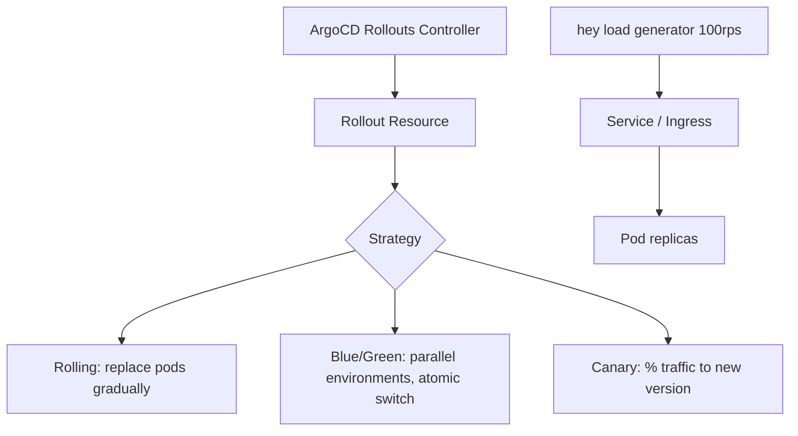

# Project 9 — Zero-Downtime Deployment Strategies

> 🟡 **Phase 2 — Advanced** | 👥 Pairs | ⏱ 4–6 hours

## Overview

Implement and compare **Rolling Update**, **Blue/Green**, and **Canary** deployments using ArgoCD Rollouts. Send real traffic during each rollout with `hey` and measure actual downtime and error rates.

**Why this matters at work:** Downtime costs money. Choosing the right deployment strategy depends on risk tolerance, rollback speed, and cost. Being able to demo all three — not just describe them — separates strong engineers from the rest.

## Architecture



## Learning Objectives
- Install ArgoCD Rollouts and use the kubectl plugin
- Implement Rolling, Blue/Green, and Canary strategies with real YAML
- Measure error rates during each rollout using `hey`
- Practice manual promotion and emergency rollback
- Understand when to use each strategy

## Prerequisites
- [ ] ArgoCD installed (Project 5)
- [ ] `hey` installed: `brew install hey`
- [ ] `kubectl argo rollouts` plugin installed

## Step 0 — Install ArgoCD Rollouts

```bash
kubectl create namespace argo-rollouts
kubectl apply -n argo-rollouts -f \
  https://github.com/argoproj/argo-rollouts/releases/latest/download/install.yaml

# kubectl plugin (Mac)
brew install argoproj/tap/kubectl-argo-rollouts

kubectl argo rollouts version
```

## The Test Application

```yaml
# version-app-v1.yaml — returns its version on every request
apiVersion: apps/v1
kind: Deployment
metadata:
  name: version-app-v1-base
spec:
  replicas: 1
  selector:
    matchLabels:
      app: version-app
  template:
    metadata:
      labels:
        app: version-app
    spec:
      containers:
        - name: app
          image: hashicorp/http-echo:0.2.3
          args: ["-text=v1", "-listen=:8080"]
          ports:
            - containerPort: 8080
          resources:
            requests: {cpu: 50m, memory: 32Mi}
            limits: {cpu: 100m, memory: 64Mi}
```

---

## Strategy 1 — Rolling Update

The default Kubernetes strategy. Old pods are replaced one at a time.

```yaml
# rollout-rolling.yaml
apiVersion: argoproj.io/v1alpha1
kind: Rollout
metadata:
  name: rolling-demo
spec:
  replicas: 4
  selector:
    matchLabels:
      app: rolling-demo
  template:
    metadata:
      labels:
        app: rolling-demo
    spec:
      containers:
        - name: app
          image: hashicorp/http-echo:0.2.3
          args: ["-text=VERSION_PLACEHOLDER", "-listen=:8080"]
          ports:
            - containerPort: 8080
          resources:
            requests: {cpu: 50m, memory: 32Mi}
            limits: {cpu: 100m, memory: 64Mi}
  strategy:
    canary:
      maxUnavailable: 0   # Never reduce below desired count
      maxSurge: 1         # Allow 1 extra pod during update
      steps: []           # No steps = instant rolling update
```

```bash
kubectl apply -f rollout-rolling.yaml

# Expose it
kubectl expose rollout rolling-demo --port=80 --target-port=8080

# Start traffic in background
hey -z 120s -c 10 http://$(kubectl get svc rolling-demo -o jsonpath='{.spec.clusterIP}')/ &

# Trigger update (change the version text)
kubectl argo rollouts set image rolling-demo app=hashicorp/http-echo:0.2.3
kubectl patch rollout rolling-demo --type='json' \
  -p='[{"op":"replace","path":"/spec/template/spec/containers/0/args/0","value":"-text=v2"}]'

# Watch the rollout
kubectl argo rollouts get rollout rolling-demo --watch
```

> 📸 **Expected:** `hey` output shows 0 errors or very brief 503s during pod replacement. Pods update one at a time. Total rollout time: ~30–60s for 4 replicas.

---

## Strategy 2 — Blue/Green

Two full environments run simultaneously. Traffic switches atomically.

```yaml
# rollout-bluegreen.yaml
apiVersion: argoproj.io/v1alpha1
kind: Rollout
metadata:
  name: bluegreen-demo
spec:
  replicas: 3
  selector:
    matchLabels:
      app: bluegreen-demo
  template:
    metadata:
      labels:
        app: bluegreen-demo
    spec:
      containers:
        - name: app
          image: hashicorp/http-echo:0.2.3
          args: ["-text=blue-v1", "-listen=:8080"]
          ports:
            - containerPort: 8080
          resources:
            requests: {cpu: 50m, memory: 32Mi}
            limits: {cpu: 100m, memory: 64Mi}
  strategy:
    blueGreen:
      activeService: bluegreen-active     # Production traffic
      previewService: bluegreen-preview   # New version (testable before switch)
      autoPromotionEnabled: false         # Manual promotion required
      scaleDownDelaySeconds: 30           # Keep old version running 30s after switch
```

```yaml
# bluegreen-services.yaml
apiVersion: v1
kind: Service
metadata:
  name: bluegreen-active
spec:
  selector:
    app: bluegreen-demo
  ports:
    - port: 80
      targetPort: 8080
---
apiVersion: v1
kind: Service
metadata:
  name: bluegreen-preview
spec:
  selector:
    app: bluegreen-demo
  ports:
    - port: 80
      targetPort: 8080
```

```bash
kubectl apply -f bluegreen-services.yaml
kubectl apply -f rollout-bluegreen.yaml

# Start traffic against active service
hey -z 120s -c 10 http://$(kubectl get svc bluegreen-active -o jsonpath='{.spec.clusterIP}')/ &

# Trigger update
kubectl patch rollout bluegreen-demo --type='json' \
  -p='[{"op":"replace","path":"/spec/template/spec/containers/0/args/0","value":"-text=green-v2"}]'

# Watch — new pods come up in preview, old pods still serve active traffic
kubectl argo rollouts get rollout bluegreen-demo --watch

# Test preview before promoting
curl http://$(kubectl get svc bluegreen-preview -o jsonpath='{.spec.clusterIP}')/
# Should return: green-v2

# Promote — atomic traffic switch
kubectl argo rollouts promote bluegreen-demo
```

> 📸 **Expected:** During the update, `hey` shows ZERO errors — old pods are still serving until you manually promote. After promotion, all traffic instantly hits the new pods. This is Blue/Green's superpower: instant, zero-error cutover.

---

## Strategy 3 — Canary

Route a percentage of traffic to the new version, gradually increase.

```yaml
# rollout-canary.yaml
apiVersion: argoproj.io/v1alpha1
kind: Rollout
metadata:
  name: canary-demo
spec:
  replicas: 5
  selector:
    matchLabels:
      app: canary-demo
  template:
    metadata:
      labels:
        app: canary-demo
    spec:
      containers:
        - name: app
          image: hashicorp/http-echo:0.2.3
          args: ["-text=stable-v1", "-listen=:8080"]
          ports:
            - containerPort: 8080
          resources:
            requests: {cpu: 50m, memory: 32Mi}
            limits: {cpu: 100m, memory: 64Mi}
  strategy:
    canary:
      steps:
        - setWeight: 20       # Step 1: 20% of traffic to new version (1 of 5 pods)
        - pause: {duration: 30s}   # Wait 30s — in prod, you'd check metrics here
        - setWeight: 40       # Step 2: 40% (2 of 5 pods)
        - pause: {duration: 30s}
        - setWeight: 60
        - pause: {duration: 30s}
        - setWeight: 80
        - pause: {duration: 30s}
        # Final step: 100% — full rollout complete
```

```bash
kubectl apply -f rollout-canary.yaml
kubectl expose rollout canary-demo --port=80 --target-port=8080

# Watch traffic distribution during rollout
# In one terminal: watch responses
while true; do
  curl -s http://$(kubectl get svc canary-demo -o jsonpath='{.spec.clusterIP}')/
  sleep 0.5
done

# Trigger update
kubectl patch rollout canary-demo --type='json' \
  -p='[{"op":"replace","path":"/spec/template/spec/containers/0/args/0","value":"-text=canary-v2"}]'

kubectl argo rollouts get rollout canary-demo --watch
```

> 📸 **Expected:** At 20% weight, approximately 1 in 5 requests returns "canary-v2". At 40%, roughly 2 in 5. You can see the gradual shift in the terminal output. If the canary looks bad, roll back immediately: `kubectl argo rollouts abort canary-demo`

---

## Comparison Table

| Strategy | Downtime | Rollback Speed | Resource Cost | Best For |
|----------|----------|---------------|---------------|---------|
| Rolling | ~0 (usually) | Slow (re-roll) | 1x | Most apps |
| Blue/Green | Zero | Instant (switch back) | 2x | Critical services |
| Canary | Zero | Fast (abort) | 1.2–2x | High-risk changes |

---

## Validation Checklist
- [ ] Rolling update completes with `hey` showing < 1% errors
- [ ] Blue/Green preview service serves new version before promotion
- [ ] Blue/Green promotion shows zero errors in `hey` output
- [ ] Canary shows correct traffic percentages at each step
- [ ] `kubectl argo rollouts abort` successfully reverts a canary
- [ ] Rollout history visible: `kubectl argo rollouts history canary-demo`

## Troubleshooting

**Rollout stuck at a step**
Either it's a `pause: {}` (indefinite pause, needs manual promotion) or analysis failed. Check: `kubectl argo rollouts describe canary-demo`

**Blue/Green previewService not updating**
The Rollouts controller updates the service selector. Ensure the preview service exists before creating the Rollout.

**hey shows high error rates even with maxUnavailable: 0**
The readiness probe may be too slow. Add a proper `readinessProbe` to your pod spec so Kubernetes waits for the pod to be ready before routing traffic.

## Extension Challenges
1. Add **Analysis Templates** to automatically check error rate from Prometheus during canary — auto-abort if error rate exceeds 5%
2. Implement a **shadow deployment** that mirrors production traffic to the new version without affecting users
3. Integrate with your Project 8 observability stack to visualize canary traffic split in Grafana

## Resources
- [ArgoCD Rollouts](https://argoproj.github.io/argo-rollouts/)
- [Deployment Strategies](https://argoproj.github.io/argo-rollouts/features/deployment-strategies/)
- [Analysis Templates](https://argoproj.github.io/argo-rollouts/features/analysis/)
