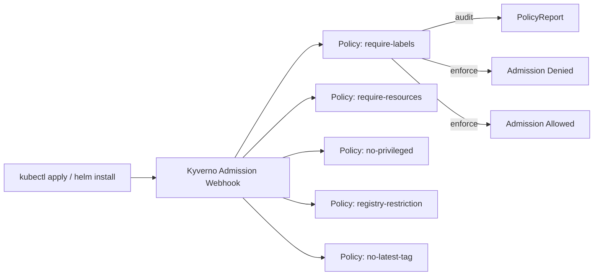

# Project 10 — Policy-as-Code with Kyverno

> 🟡 **Phase 2 — Advanced** | 👥 Pairs | ⏱ 4–5 hours

## Overview

Write a **production-ready Kyverno policy library** covering: required labels, resource limits enforcement, no privileged containers, image registry restrictions, and no `:latest` tags. Apply in **audit mode** first to understand blast radius, then switch to **enforce** mode. Generate and export policy reports.

**Why this matters at work:** Regulated environments (healthcare, finance, government) require proof that security controls are enforced automatically — not just documented. A Kyverno policy library is that proof. "We have a policy that prevents it" is a much stronger answer than "we trained people not to do it."

## Architecture



## Learning Objectives
- Understand Kyverno's admission webhook model
- Write validate, mutate, and generate policies
- Apply policies in audit mode and analyze reports
- Switch to enforcement mode safely
- Export and share policy reports as compliance evidence

## Prerequisites
- [ ] Kyverno installed (from Project 7, or install fresh)
- [ ] A test namespace with some existing workloads to audit

## Step 0 — Install Kyverno (if needed)

```bash
helm repo add kyverno https://kyverno.github.io/kyverno/
helm repo update

helm install kyverno kyverno/kyverno \
  --namespace kyverno \
  --create-namespace \
  --set replicaCount=1   # Single replica for dev/learning

kubectl rollout status deployment/kyverno -n kyverno
```

---

## Policy 1 — Require Standard Labels

Every workload must have `app`, `env`, and `owner` labels. Without these, dashboards and alerts can't filter by team or environment.

```yaml
# policy-require-labels.yaml
apiVersion: kyverno.io/v1
kind: ClusterPolicy
metadata:
  name: require-labels
  annotations:
    policies.kyverno.io/title: Require Standard Labels
    policies.kyverno.io/description: >
      All Pods must have app, env, and owner labels.
      These are required for cost attribution and alert routing.
spec:
  validationFailureAction: Audit
  background: true    # Also check existing resources
  rules:
    - name: check-required-labels
      match:
        any:
          - resources:
              kinds: [Pod]
      validate:
        message: "Pod must have labels: app, env, owner"
        pattern:
          metadata:
            labels:
              app: "?*"      # ?* = any non-empty string
              env: "?*"
              owner: "?*"
```

---

## Policy 2 — Require Resource Requests and Limits

Pods without resource requests/limits can starve other pods or trigger OOMKills on nodes.

```yaml
# policy-require-resources.yaml
apiVersion: kyverno.io/v1
kind: ClusterPolicy
metadata:
  name: require-resources
  annotations:
    policies.kyverno.io/title: Require Resource Requests and Limits
    policies.kyverno.io/description: >
      All containers must specify CPU and memory requests and limits.
      Without them, the scheduler can't make good placement decisions.
spec:
  validationFailureAction: Audit
  background: true
  rules:
    - name: check-resources
      match:
        any:
          - resources:
              kinds: [Pod]
      validate:
        message: "All containers must have CPU and memory requests and limits defined."
        foreach:
          - list: "request.object.spec.containers"
            deny:
              conditions:
                any:
                  - key: "{{ element.resources.requests.cpu }}"
                    operator: Equals
                    value: ""
                  - key: "{{ element.resources.requests.memory }}"
                    operator: Equals
                    value: ""
                  - key: "{{ element.resources.limits.cpu }}"
                    operator: Equals
                    value: ""
                  - key: "{{ element.resources.limits.memory }}"
                    operator: Equals
                    value: ""
```

---

## Policy 3 — No Privileged Containers

Privileged containers have root access to the host — a critical security risk.

```yaml
# policy-no-privileged.yaml
apiVersion: kyverno.io/v1
kind: ClusterPolicy
metadata:
  name: no-privileged-containers
  annotations:
    policies.kyverno.io/title: Disallow Privileged Containers
    policies.kyverno.io/description: >
      Privileged containers can escape the container boundary and access
      the host. This is prohibited except for explicitly exempted system namespaces.
spec:
  validationFailureAction: Audit
  background: true
  rules:
    - name: check-privileged
      match:
        any:
          - resources:
              kinds: [Pod]
      exclude:
        any:
          - resources:
              namespaces: [kube-system, kyverno, monitoring]  # System namespaces exempted
      validate:
        message: "Privileged containers are not allowed."
        pattern:
          spec:
            =(initContainers):
              - =(securityContext):
                  =(privileged): "false"
            containers:
              - =(securityContext):
                  =(privileged): "false"
```

---

## Policy 4 — Restrict Image Registries

Only allow images from approved registries. Prevents pulling from untrusted or public sources.

```yaml
# policy-registry-restriction.yaml
apiVersion: kyverno.io/v1
kind: ClusterPolicy
metadata:
  name: restrict-image-registries
  annotations:
    policies.kyverno.io/title: Restrict Image Registries
    policies.kyverno.io/description: >
      Images must come from approved registries only.
      This prevents supply chain attacks via untrusted public images.
spec:
  validationFailureAction: Audit
  background: true
  rules:
    - name: check-registry
      match:
        any:
          - resources:
              kinds: [Pod]
      exclude:
        any:
          - resources:
              namespaces: [kube-system, kyverno, argocd, monitoring]
      validate:
        message: "Images must be from an approved registry: docker.io/yourusername, ghcr.io/emage-tech, or gcr.io/google-containers"
        foreach:
          - list: "request.object.spec.containers"
            deny:
              conditions:
                all:
                  - key: "{{ element.image }}"
                    operator: NotIn
                    value:
                      - "docker.io/yourusername/*"
                      - "ghcr.io/emage-tech/*"
                      - "gcr.io/google-containers/*"
                      - "registry.k8s.io/*"
```

---

## Policy 5 — No Latest Tag

Images pinned to `:latest` are non-deterministic — you never know exactly what you deployed.

```yaml
# policy-no-latest.yaml
apiVersion: kyverno.io/v1
kind: ClusterPolicy
metadata:
  name: disallow-latest-tag
  annotations:
    policies.kyverno.io/title: Disallow Latest Tag
    policies.kyverno.io/description: >
      Using :latest makes deployments non-reproducible. Pin to a specific
      version tag or image digest.
spec:
  validationFailureAction: Audit
  background: true
  rules:
    - name: require-version-tag
      match:
        any:
          - resources:
              kinds: [Pod]
      validate:
        message: "Image tag ':latest' is not allowed. Use a specific version like :1.25.4 or a digest."
        foreach:
          - list: "request.object.spec.containers"
            deny:
              conditions:
                any:
                  - key: "{{ element.image }}"
                    operator: Equals
                    value: "*:latest"
                  - key: "{{ element.image }}"
                    operator: NotContains
                    value: ":"   # No tag at all also defaults to latest
```

---

## Step 6 — Apply All Policies in Audit Mode

```bash
kubectl apply -f policy-require-labels.yaml
kubectl apply -f policy-require-resources.yaml
kubectl apply -f policy-no-privileged.yaml
kubectl apply -f policy-registry-restriction.yaml
kubectl apply -f policy-no-latest.yaml

# Check policies are active
kubectl get clusterpolicies

# Deploy some test workloads that violate the policies
kubectl run nginx-test --image=nginx:latest --namespace=default
kubectl run good-app --image=nginx:1.25.4 \
  --labels="app=good-app,env=dev,owner=student" --namespace=default
```

---

## Step 7 — Review Policy Reports

```bash
# See violations detected in audit mode
kubectl get policyreport -A

# Detailed report for default namespace
kubectl describe policyreport -n default

# Count violations by policy
kubectl get policyreport -A -o json | python3 -c "
import json, sys
data = json.load(sys.stdin)
for item in data.get('items', []):
    ns = item['metadata']['namespace']
    for result in item.get('results', []):
        if result['result'] == 'fail':
            print(f\"{ns}: {result['policy']} - {result['resources'][0]['name']}\")
"
```

> 📸 **Expected:** Policy report shows violations for `nginx-test` (latest tag, no labels, no resources) but no violations for `good-app` (if you added labels and resources).

---

## Step 8 — Switch to Enforce Mode

After reviewing audit results and fixing legitimate workloads:

```bash
# Switch policies to Enforce one at a time (start with least disruptive)
kubectl patch clusterpolicy disallow-latest-tag \
  --type='json' \
  -p='[{"op":"replace","path":"/spec/validationFailureAction","value":"Enforce"}]'

# Test — this should now be BLOCKED
kubectl run blocked-test --image=nginx:latest
# Error from server: admission webhook denied the request: Image tag ':latest' is not allowed.

# Switch remaining policies
for policy in require-labels require-resources no-privileged-containers restrict-image-registries; do
  kubectl patch clusterpolicy $policy \
    --type='json' \
    -p='[{"op":"replace","path":"/spec/validationFailureAction","value":"Enforce"}]'
  echo "Enforcing: $policy"
done
```

---

## Bonus — Auto-Add Default Labels with Mutation Policy

```yaml
# policy-mutate-add-labels.yaml
apiVersion: kyverno.io/v1
kind: ClusterPolicy
metadata:
  name: add-default-labels
spec:
  rules:
    - name: add-managed-by-label
      match:
        any:
          - resources:
              kinds: [Pod]
      mutate:
        patchStrategicMerge:
          metadata:
            labels:
              managed-by: kyverno-mutated    # Auto-added to every pod
              cluster: cohort-cluster
```

---

## Validation Checklist
- [ ] All 5 policies created and showing `READY: True`
- [ ] Policy reports show expected violations in audit mode
- [ ] `disallow-latest-tag` in enforce mode blocks `nginx:latest`
- [ ] `require-labels` in enforce mode blocks pods without required labels
- [ ] Compliant pods (correct labels, pinned tags, resource limits) deploy successfully
- [ ] Policy reports can be exported: `kubectl get policyreport -A -o yaml > compliance-report.yaml`

## Troubleshooting

**All pod creations blocked after switching to Enforce**
Check if a policy is too broad (matching kube-system pods). Always use `exclude.namespaces` for system namespaces.

**Policy not matching existing pods**
Set `background: true` in the policy spec. Without it, only new resources are evaluated.

**Kyverno webhook timeout causing pod creation to hang**
Kyverno pods may be unhealthy. `kubectl get pods -n kyverno`. For non-critical policies, set `failurePolicy: Ignore`.

## Extension Challenges
1. Write a **generate policy** that automatically creates a NetworkPolicy in every new namespace
2. Configure **policy exceptions** using Kyverno's `PolicyException` resource for a specific workload
3. Export policy reports to a **Grafana dashboard** using the Kyverno metrics endpoint

## Resources
- [Kyverno Policies](https://kyverno.io/docs/writing-policies/)
- [Kyverno Policy Library](https://kyverno.io/policies/)
- [PolicyReports](https://kyverno.io/docs/policy-reports/)
