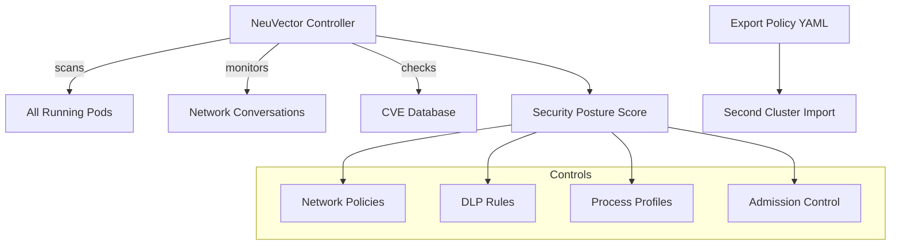

# Project 11 — NeuVector Security Hardening

> 🔴 **Phase 3 — Real World** | 👥 Team (2–3) | ⏱ 6–8 hours

## Overview

Start with a cluster that has a **~35% NeuVector security posture score** — most controls failing. Work systematically through NeuVector's dashboard to discover network conversations, write NetworkPolicies, configure DLP rules, block CVE-laden images, and push the score to **90%+**. Export the final policy set as YAML and import it to a second cluster — policy-as-code in action.

**Why this matters at work:** NeuVector is used in DoD, financial services, and healthcare. The "push a security score from 35% to 90%" narrative is a concrete, quantifiable achievement that stands out on a resume and in interviews. Most candidates say "I hardened security." You'll say "I improved NeuVector posture from 35% to 92% and documented every control."

## Architecture



## Learning Objectives
- Install NeuVector on a Kubernetes cluster
- Read and interpret the security posture dashboard
- Discover real network traffic flows using NeuVector's network map
- Write NetworkPolicies based on observed traffic (not guesswork)
- Configure DLP rules to detect sensitive data in transit
- Block CVE-impacted images via admission control
- Export and import policies across clusters

## Prerequisites
- [ ] Cluster with at least 4 nodes and 8GB RAM
- [ ] Helm 3 installed
- [ ] At least one namespace with running workloads to monitor
- [ ] Projects 1–4 deployed (gives you real traffic to discover)

## Step 1 — Install NeuVector

```bash
helm repo add neuvector https://neuvector.github.io/neuvector-helm/
helm repo update

kubectl create namespace neuvector

helm install neuvector neuvector/core \
  --namespace neuvector \
  --set manager.env.ssl=false \
  --set controller.replicas=1 \
  --set manager.svc.type=NodePort

kubectl rollout status deployment/neuvector-manager-pod -n neuvector
kubectl get pods -n neuvector
```

> 📸 **Expected:** NeuVector controller, manager, and enforcer pods all Running. Enforcers run as a DaemonSet — one per node.

```bash
# Get the manager UI port
kubectl get svc neuvector-manager-svc -n neuvector
# Note the NodePort for port 8443

# Access UI: https://<node-ip>:<nodeport>
# Default credentials: admin / admin
# Change immediately after first login
```

## Step 2 — Understand Your Starting Posture

Navigate to: **Dashboard → Security Risk Score**

> 📸 **Expected:** Score around 25–40%. You'll see categories: Network, Vulnerability, Compliance, each with sub-scores. Screenshot this — it's your "before" evidence.

Key areas typically failing at baseline:
- Network: Most pod-to-pod traffic is **Discover** mode (allowed, not enforced)
- Vulnerability: Images with unpatched CVEs
- Compliance: Missing process profiles, no DLP rules

## Step 3 — Network Discovery

**NeuVector → Network Activity**

NeuVector passively observes all network conversations for the first 48–72 hours in Discover mode. For this project, generate some traffic first:

```bash
# Generate traffic between your Project 1 workloads
for i in $(seq 1 50); do
  kubectl exec -n project-01 $(kubectl get pod -n project-01 -l app=api -o jsonpath='{.items[0].metadata.name}') \
    -- curl -s http://postgres-service:5432 > /dev/null
  sleep 1
done
```

In the NeuVector UI → Network Activity, you'll see a visual map of all connections. Each line represents observed traffic.

> 📸 **Expected:** A graph showing your API pods connecting to postgres. External ingress connections. Maybe unexpected connections (a pod reaching out to the internet it shouldn't be).

## Step 4 — Convert Discover to Monitor to Protect

NeuVector has three modes per group:
- **Discover**: Learn traffic patterns, don't enforce
- **Monitor**: Alert on violations, don't block
- **Protect**: Block violations

```bash
# Switch the default group to Monitor first
# NeuVector UI → Policy → Groups → Select "nv.project-01.project-01" → Switch to Monitor
# Review alerts for 10–15 minutes
# Then switch to Protect
```

For the API → Postgres connection, NeuVector will generate a NetworkPolicy allowing only that specific traffic and blocking everything else.

## Step 5 — Write Explicit NetworkPolicies

Export NeuVector's discovered policies as Kubernetes NetworkPolicy YAML:

**NeuVector UI → Policy → Network Rules → Export**

The exported rules will look like:
```yaml
apiVersion: networking.k8s.io/v1
kind: NetworkPolicy
metadata:
  name: nv.api-to-postgres
  namespace: project-01
spec:
  podSelector:
    matchLabels:
      app: postgres
  policyTypes:
    - Ingress
  ingress:
    - from:
        - podSelector:
            matchLabels:
              app: api
      ports:
        - protocol: TCP
          port: 5432
```

Apply these to your cluster and verify traffic still works:
```bash
kubectl apply -f neuvector-exported-policies.yaml
# Verify connectivity
kubectl exec -n project-01 -it $(kubectl get pod -n project-01 -l app=api -o jsonpath='{.items[0].metadata.name}') \
  -- curl -s http://postgres-service:5432
```

## Step 6 — Configure DLP Rules

DLP (Data Loss Prevention) detects sensitive patterns in network traffic.

**NeuVector UI → Policy → DLP Sensors → Add Sensor**

Create sensors for:
1. **Credit Card Numbers**: Pattern `\b4[0-9]{12}(?:[0-9]{3})?\b` (Visa)
2. **Social Security Numbers**: Pattern `\b\d{3}-\d{2}-\d{4}\b`
3. **API Keys**: Pattern `[Aa]pi[_-]?[Kk]ey['":\s]+[A-Za-z0-9]{20,}`

Apply the sensor to your application groups in Monitor mode first.

## Step 7 — Block CVE-Impacted Images

**NeuVector UI → Security Risks → Vulnerabilities**

You'll see a list of all container images and their CVEs, with CVSS scores.

**NeuVector UI → Policy → Admission Control → Add Rule**:
```
Action: Deny
Criteria: High CVE count > 5 OR Critical CVE count > 0
```

This prevents images with critical CVEs from being deployed:
```bash
# Test: try to deploy an old, vulnerable image
kubectl run vuln-test --image=node:12  # Old Node with many CVEs
# Expected: Admission denied by NeuVector policy
```

## Step 8 — Compliance Hardening

**NeuVector UI → Security Risks → Compliance**

Work through each failing control. Common fixes:
- Enable host process isolation in pod specs
- Add `securityContext.runAsNonRoot: true` to all containers
- Add `securityContext.readOnlyRootFilesystem: true`
- Remove `hostPath` volume mounts where not needed

```yaml
# Add to every container spec for compliance points
securityContext:
  runAsNonRoot: true
  runAsUser: 1000
  allowPrivilegeEscalation: false
  readOnlyRootFilesystem: true
  capabilities:
    drop: ["ALL"]
```

## Step 9 — Export and Import Policy

```bash
# Export all NeuVector policies (UI → Policy → Export All)
# This gives you a complete policy bundle as JSON/YAML

# Import to a second cluster
# Install NeuVector on cluster 2
# UI → Policy → Import → Upload the exported file
# All your NetworkPolicies, DLP rules, and admission controls apply instantly
```

> 📸 **Expected:** Second cluster immediately shows the same policy configuration. Security score on cluster 2 starts higher than cluster 1 did at baseline — because you imported proven policies.

## Reaching 90%+

Track progress in the dashboard. Typical score breakdown:
| Category | Starting | Target |
|----------|---------|--------|
| Network Policies | ~20% | 95%+ |
| Vulnerability | ~40% | 80%+ |
| Compliance | ~30% | 90%+ |
| DLP | 0% | 85%+ |

Document each change in a hardening log — you'll use this as interview evidence.

## Validation Checklist
- [ ] NeuVector score documented at start (screenshot)
- [ ] All application pods in Protect mode (not Discover)
- [ ] NetworkPolicies exported and applied to cluster
- [ ] DLP sensors active with at least 2 pattern rules
- [ ] Admission control blocks images with Critical CVEs
- [ ] Security score reached 90%+
- [ ] Score documented at end (screenshot)
- [ ] Policies exported and successfully imported to second cluster

## Troubleshooting

**NeuVector enforcer not starting on a node**
Check node taints: `kubectl describe node <node>`. NeuVector enforcers need to tolerate control-plane taints if running on those nodes.

**Switching to Protect mode blocks legitimate traffic**
Go back to Monitor mode. Check the network map for the blocked conversation. Add an explicit allow rule before re-enabling Protect.

**Score not improving after adding NetworkPolicies**
NeuVector measures what percentage of groups are in Protect mode, not just whether policies exist. Switch groups to Protect mode.

## Extension Challenges
1. Configure **runtime security** process profiles — whitelist exactly which binaries can run in each container
2. Integrate NeuVector with **SIEM** (Splunk or Elastic) by forwarding security events via syslog
3. Set up **NeuVector CI/CD scanning** — scan images in your GitHub Actions pipeline before they reach the cluster

## Resources
- [NeuVector Docs](https://open-docs.neuvector.com/)
- [NeuVector Helm Chart](https://github.com/neuvector/neuvector-helm)
- [NIST Container Security Guide](https://nvlpubs.nist.gov/nistpubs/SpecialPublications/NIST.SP.800-190.pdf)
