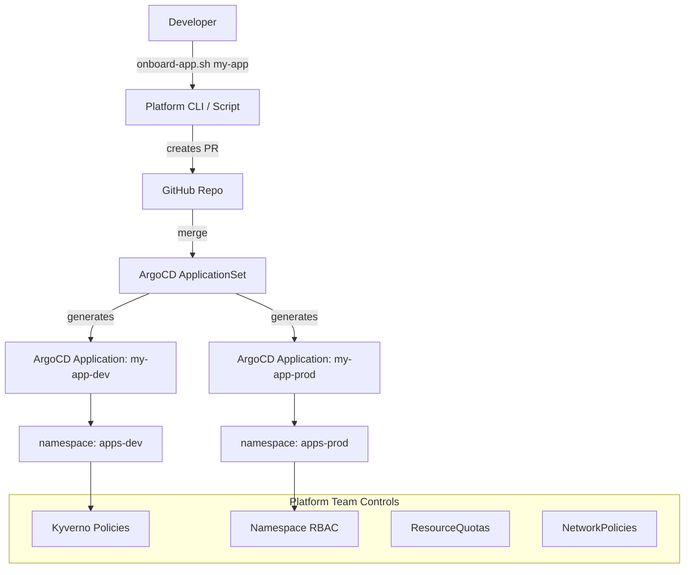

# Project 12 — Internal Developer Platform (IDP)

> 🔴 **Phase 3 — Real World** | 👥 Team (2–3) | ⏱ 6–8 hours

## Overview

Build a lightweight **Internal Developer Platform** where "developers" (simulated by your classmates) can self-service deploy applications without ever touching `kubectl` or YAML directly. The platform team (you) manages the infrastructure layer. App teams use a simple CLI wrapper or onboarding script to deploy.

**Why this matters at work:** Platform Engineering is the fastest-growing discipline in cloud-native. Companies like Spotify (Backstage), Netflix, and Airbnb all built IDPs to scale engineering without scaling operations headcount. This project demonstrates principal-engineer-level thinking — you're not just running Kubernetes, you're building the abstraction layer that others use on top of it.

## Architecture



## Learning Objectives
- Understand the Platform Engineering mental model (platform team vs app team)
- Use ArgoCD ApplicationSet to generate multiple apps from a template
- Build a CLI wrapper that abstracts kubectl from developers
- Implement guardrails (RBAC, quotas, policies) that auto-apply to new tenants
- Experience what "self-service infrastructure" actually means operationally

## Prerequisites
- [ ] Projects 3 (RBAC), 5 (ArgoCD), 6 (Helm), 10 (Kyverno) completed
- [ ] ArgoCD running in the cluster
- [ ] GitHub repo with your GitOps structure from Project 5

## The Mental Model

```
Platform Team owns:
  - The cluster
  - ArgoCD configuration
  - Namespace templates
  - RBAC policies
  - Kyverno guardrails
  - The ApplicationSet controller

App Teams own:
  - Their application code
  - Their Helm values file
  - Their GitHub repo
  
App Teams cannot:
  - Create namespaces manually
  - Modify cluster-level resources
  - Bypass Kyverno policies
  - Access other teams' namespaces
```

## Step 1 — Build the App Onboarding Template

Create a standardized Helm chart that every app uses:

```
platform/
├── app-template/          # Standard Helm chart all apps use
│   ├── Chart.yaml
│   ├── values.yaml        # Defaults (platform-managed)
│   └── templates/
│       ├── deployment.yaml
│       ├── service.yaml
│       ├── ingress.yaml
│       ├── hpa.yaml
│       ├── namespace.yaml
│       ├── rbac.yaml      # Auto-created for each app team
│       └── networkpolicy.yaml
├── apps/                  # One folder per app team
│   ├── team-alpha/
│   │   └── values.yaml    # App team's customizations
│   └── team-beta/
│       └── values.yaml
└── applicationset.yaml    # ArgoCD ApplicationSet that wires it all together
```

```yaml
# platform/app-template/values.yaml
app:
  name: ""              # Required: set by app team
  team: ""              # Required: team name for RBAC and labels
  image:
    repository: ""
    tag: "latest"
  port: 8080
  replicas: 1
  
resources:
  requests:
    cpu: 100m
    memory: 128Mi
  limits:
    cpu: 500m
    memory: 512Mi

ingress:
  enabled: false
  host: ""

autoscaling:
  enabled: false
  minReplicas: 1
  maxReplicas: 5
  targetCPU: 70
```

## Step 2 — The App Team Values File

This is ALL an app team needs to provide:

```yaml
# platform/apps/team-alpha/values.yaml
app:
  name: team-alpha-api
  team: alpha
  image:
    repository: ghcr.io/team-alpha/api
    tag: "2.1.0"
  port: 3000
  replicas: 2

ingress:
  enabled: true
  host: alpha-api.platform.example.com

autoscaling:
  enabled: true
  minReplicas: 2
  maxReplicas: 8
```

No YAML templating. No kubectl. No cluster access required. Just values.

## Step 3 — ArgoCD ApplicationSet

The ApplicationSet controller watches the `platform/apps/` folder and automatically creates one ArgoCD Application per subfolder:

```yaml
# platform/applicationset.yaml
apiVersion: argoproj.io/v1alpha1
kind: ApplicationSet
metadata:
  name: platform-apps
  namespace: argocd
spec:
  generators:
    - git:
        repoURL: https://github.com/YOUR_ORG/platform-repo.git
        revision: main
        directories:
          - path: platform/apps/*     # Each subdirectory = one team
  
  template:
    metadata:
      name: "{{path.basename}}"       # Folder name = app name
    spec:
      project: default
      source:
        repoURL: https://github.com/YOUR_ORG/platform-repo.git
        targetRevision: main
        path: platform/app-template   # Always use the shared template
        helm:
          valueFiles:
            - "../../apps/{{path.basename}}/values.yaml"  # Team's values
      destination:
        server: https://kubernetes.default.svc
        namespace: "apps-{{path.basename}}"   # Isolated namespace per team
      syncPolicy:
        automated:
          prune: true
          selfHeal: true
        syncOptions:
          - CreateNamespace=true
```

```bash
kubectl apply -f platform/applicationset.yaml

# Watch apps get created automatically
kubectl get applications -n argocd
```

> 📸 **Expected:** ArgoCD UI shows applications being created automatically as you add folders to `platform/apps/`. Each app gets its own namespace. No manual intervention from the platform team.

## Step 4 — The Onboarding CLI Script

This is what developers actually run:

```bash
#!/usr/bin/env bash
# platform/scripts/onboard-app.sh

set -e

APP_NAME=$1
TEAM=$2
IMAGE=$3
PORT=${4:-8080}

if [[ -z "$APP_NAME" || -z "$TEAM" || -z "$IMAGE" ]]; then
  echo "Usage: onboard-app.sh <app-name> <team> <image> [port]"
  exit 1
fi

PLATFORM_REPO="https://github.com/YOUR_ORG/platform-repo.git"
BRANCH="onboard/${APP_NAME}-$(date +%Y%m%d)"

echo "🚀 Onboarding app: $APP_NAME for team: $TEAM"

# Clone platform repo
TMPDIR=$(mktemp -d)
git clone $PLATFORM_REPO $TMPDIR
cd $TMPDIR

# Create branch
git checkout -b $BRANCH

# Generate values file
mkdir -p platform/apps/$APP_NAME
cat > platform/apps/$APP_NAME/values.yaml << YAML
app:
  name: $APP_NAME
  team: $TEAM
  image:
    repository: $(echo $IMAGE | cut -d: -f1)
    tag: "$(echo $IMAGE | cut -d: -f2)"
  port: $PORT
  replicas: 1
resources:
  requests:
    cpu: 100m
    memory: 128Mi
  limits:
    cpu: 500m
    memory: 512Mi
YAML

# Commit and push
git add platform/apps/$APP_NAME/
git commit -m "feat: onboard $APP_NAME for team $TEAM"
git push origin $BRANCH

echo ""
echo "✅ Done! A PR has been created:"
echo "   $PLATFORM_REPO/compare/$BRANCH"
echo ""
echo "Once the PR is approved and merged:"
echo "  - Namespace 'apps-$APP_NAME' will be created automatically"
echo "  - ArgoCD will deploy $IMAGE"
echo "  - Your team will have RBAC access to apps-$APP_NAME"
echo ""
echo "No kubectl access needed. 🎉"

rm -rf $TMPDIR
```

```bash
# Developer runs ONE command to onboard their app:
./onboard-app.sh my-api team-alpha ghcr.io/team-alpha/api:1.0.0 3000
```

## Step 5 — Auto-Apply Guardrails

The app template automatically creates these in every team's namespace:

```yaml
# platform/app-template/templates/rbac.yaml
apiVersion: rbac.authorization.k8s.io/v1
kind: Role
metadata:
  name: "{{ .Values.app.team }}-app-role"
  namespace: "apps-{{ .Values.app.name }}"
rules:
  - apiGroups: [""]
    resources: ["pods", "pods/log"]
    verbs: ["get", "list", "watch"]  # View-only: devs can see their pods
  - apiGroups: ["apps"]
    resources: ["deployments"]
    verbs: ["get", "list", "watch"]
  # Deliberately NO create/delete/update — changes go through Git
---
# platform/app-template/templates/networkpolicy.yaml
apiVersion: networking.k8s.io/v1
kind: NetworkPolicy
metadata:
  name: default-deny
  namespace: "apps-{{ .Values.app.name }}"
spec:
  podSelector: {}
  policyTypes: [Ingress, Egress]
---
apiVersion: networking.k8s.io/v1
kind: NetworkPolicy
metadata:
  name: allow-ingress-from-ingress-controller
  namespace: "apps-{{ .Values.app.name }}"
spec:
  podSelector: {}
  policyTypes: [Ingress]
  ingress:
    - from:
        - namespaceSelector:
            matchLabels:
              kubernetes.io/metadata.name: ingress-nginx
```

## Step 6 — Demo with Classmates

Split into Platform team (1 person) and App teams (remaining):

1. Platform team sets up the ApplicationSet
2. App team A runs `onboard-app.sh` → creates PR
3. Platform team reviews and merges PR
4. App team A watches their app deploy WITHOUT touching kubectl
5. App team A checks their pods: `kubectl get pods -n apps-team-alpha-api`

> 📸 **Expected:** App team can view their pods but cannot create, delete, or modify anything. Changes only happen through Git PRs. Platform team maintains full control while app teams are fully self-sufficient.

## Validation Checklist
- [ ] ApplicationSet creates a new ArgoCD Application when a folder is added to `platform/apps/`
- [ ] Namespace created automatically on first sync
- [ ] App team RBAC allows viewing but not modifying resources
- [ ] Default-deny NetworkPolicy applied to every new namespace
- [ ] Onboarding script creates a valid PR when run
- [ ] At least 2 different teams' apps running simultaneously without interfering

## Troubleshooting

**ApplicationSet not generating new apps**
Check the git generator is pointing to the right repo and path. `kubectl describe applicationset platform-apps -n argocd`

**App team can't see their pods**
Verify the RoleBinding subject matches their ServiceAccount or username. `kubectl auth can-i get pods --as system:serviceaccount:apps-team-alpha:default -n apps-team-alpha`

**Helm chart not finding team values file**
The relative path in `valueFiles` is tricky. Test with `helm template` locally before applying via ArgoCD.

## Extension Challenges
1. Add a **Backstage** service catalog frontend — developers browse apps and trigger deployments from a web UI
2. Implement **cost allocation** — add labels to every resource so you can track spend per team in your cloud provider
3. Build a **promotion workflow** — `promote-app.sh` that opens a PR to bump the image tag from dev to prod values

## Resources
- [ArgoCD ApplicationSet](https://argo-cd.readthedocs.io/en/stable/user-guide/application-set/)
- [Platform Engineering](https://platformengineering.org/blog/what-is-platform-engineering)
- [Backstage](https://backstage.io/)
