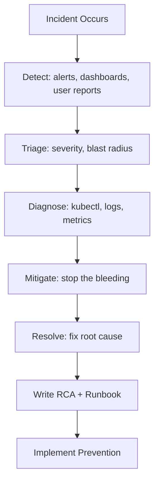

# Project 13 — Kubernetes Cluster Failure Runbook

> 🔴 **Phase 3 — Real World** | 👥 Team (2–3) | ⏱ 6–8 hours

## Overview

Simulate **5 real production outage scenarios**, diagnose each one, write a Root Cause Analysis (RCA), and document a runbook for every incident. The five scenarios: etcd degradation, node failure, OOMKilled pods, certificate expiry, and NetworkPolicy lockout. This is exactly what SRE roles require — and exactly what most bootcamp graduates have never practiced.

**Why this matters at work:** Every production Kubernetes cluster has incidents. Engineers who can stay calm, diagnose systematically, and document findings are worth their weight in gold. Your runbook from this project becomes a real portfolio artifact — something you can show and talk through in an SRE interview.

## Architecture



## Learning Objectives
- Systematically diagnose 5 common Kubernetes failure modes
- Practice calm, methodical incident response under pressure
- Write professional Root Cause Analyses (RCA)
- Document runbooks that a team member could follow at 2 AM
- Understand what monitoring/alerting would have caught each failure earlier

## Prerequisites
- [ ] Cluster admin access (these simulations require it)
- [ ] Project 8 observability stack preferred (to see alerts fire)
- [ ] Pair or team to simulate on-call rotation

## Runbook Template

Use this structure for every incident:

```markdown
# Runbook: [Incident Name]

## Summary
One paragraph: what happened, what broke, how long it lasted.

## Symptoms
- What users saw
- What monitoring showed
- What kubectl output looked like

## Root Cause
Precise technical explanation of why it happened.

## Detection
How was this detected? What alerted (or should have)?

## Remediation Steps
1. Immediate mitigation (stop the bleeding)
2. Root cause fix
3. Verification steps

## Prevention
What change prevents this from happening again?

## Timeline
| Time | Event |
|------|-------|
| T+0  | First alert fired |
| T+5m | On-call paged |
| ...  |       |

## Lessons Learned
3-5 bullet points of what the team learned.
```

---

## Scenario 1 — etcd Degradation

### Simulate

```bash
# Find etcd pods
kubectl get pods -n kube-system | grep etcd

# For kubeadm clusters: stop etcd on one node (SSH to control plane)
sudo systemctl stop etcd

# Alternative: fill etcd disk
kubectl run disk-filler --image=busybox --restart=Never -- \
  /bin/sh -c "dd if=/dev/zero of=/tmp/fill bs=1M count=10000"
```

### Symptoms You'll See

```bash
kubectl get nodes
# Error from server: etcdserver: request timed out

kubectl get pods
# The server is currently unable to handle the request (timeout)

# API server logs show:
# "etcdserver: failed to send out heartbeat on time"
```

### Diagnosis Commands

```bash
# Check etcd health (from control plane node)
ETCDCTL_API=3 etcdctl \
  --endpoints=https://127.0.0.1:2379 \
  --cacert=/etc/kubernetes/pki/etcd/ca.crt \
  --cert=/etc/kubernetes/pki/etcd/server.crt \
  --key=/etc/kubernetes/pki/etcd/server.key \
  endpoint health

# Check etcd disk usage
ETCDCTL_API=3 etcdctl \
  --endpoints=https://127.0.0.1:2379 \
  --cacert=/etc/kubernetes/pki/etcd/ca.crt \
  --cert=/etc/kubernetes/pki/etcd/server.crt \
  --key=/etc/kubernetes/pki/etcd/server.key \
  endpoint status

# Check for alarms
ETCDCTL_API=3 etcdctl alarm list ...
```

### Remediation

```bash
# If disk full: compact and defragment
ETCDCTL_API=3 etcdctl compact $(ETCDCTL_API=3 etcdctl endpoint status --write-out=json | jq '.[0].Status.header.revision')
ETCDCTL_API=3 etcdctl defrag

# Disarm alarms
ETCDCTL_API=3 etcdctl alarm disarm

# If etcd stopped: restart it
sudo systemctl start etcd
```

### Write Your RCA
Document: why etcd disk filled, what alert should have caught it (disk usage > 85%), and how to set up etcd backups.

---

## Scenario 2 — Node Failure

### Simulate

```bash
# Cordon a node (mark unschedulable)
kubectl cordon <node-name>

# Or in cloud: stop the VM through your cloud provider console
# For local clusters: stop the VM

# Watch pods become NotReady
kubectl get nodes -w
kubectl get pods -o wide -w
```

### Symptoms

```bash
kubectl get nodes
# NAME          STATUS     ROLES    AGE
# node-1        NotReady   <none>   2d

kubectl describe node node-1
# Conditions: Ready=False, KernelDeadlock=Unknown, NetworkUnavailable=Unknown
# Events: "Node node-1 status is now: NodeNotReady"
```

### Diagnosis Commands

```bash
# Which pods were on the failed node?
kubectl get pods -o wide --field-selector spec.nodeName=node-1

# Are they being rescheduled?
kubectl get pods -o wide -w
# Pods should move to other nodes after node-unreachable-pod-timeout (default: 5 min)

# Check if pods on other nodes are healthy
kubectl get pods -o wide | grep -v node-1

# Check node resource pressure
kubectl describe node <healthy-node> | grep -A5 "Conditions:"
```

### Remediation

```bash
# Option 1: Bring the node back online
# (fix the VM, restart the node)
kubectl uncordon <node-name>

# Option 2: Remove the node and let pods reschedule
kubectl drain <node-name> --ignore-daemonsets --delete-emptydir-data
kubectl delete node <node-name>

# Verify all pods rescheduled successfully
kubectl get pods -o wide | grep -v Running
```

### Write Your RCA
Note how long it took for pods to reschedule. What PodDisruptionBudget would have helped? What monitoring would have alerted faster?

---

## Scenario 3 — OOMKilled Pods at Scale

### Simulate

```bash
# Deploy a memory-leaking application
kubectl apply -f - <<EOF
apiVersion: apps/v1
kind: Deployment
metadata:
  name: memory-leak
spec:
  replicas: 3
  selector:
    matchLabels:
      app: memory-leak
  template:
    metadata:
      labels:
        app: memory-leak
    spec:
      containers:
        - name: leak
          image: polinux/stress
          command: ["stress"]
          args: ["--vm", "1", "--vm-bytes", "300M", "--vm-hang", "60"]
          resources:
            requests:
              memory: 64Mi
            limits:
              memory: 128Mi  # Will OOMKill at 128Mi while trying to allocate 300Mi
EOF

kubectl get pods -w
```

### Symptoms

```bash
kubectl get pods
# NAME                    READY   STATUS      RESTARTS
# memory-leak-xxx-yyy     0/1     OOMKilled   4 (CrashLoopBackOff)

kubectl describe pod memory-leak-xxx-yyy
# Last State: Terminated
#   Reason: OOMKilled
#   Exit Code: 137

# From metrics (if Project 8 observability is running):
# container_oom_events_total > 0
```

### Diagnosis Commands

```bash
# See restart counts
kubectl get pods -o wide

# Get OOM details
kubectl describe pod <pod> | grep -A10 "Last State"

# Check node-level OOM events
kubectl get events --field-selector reason=OOMKilling

# Check actual memory usage vs limits
kubectl top pods --containers
```

### Remediation

```bash
# Immediate: increase memory limit
kubectl set resources deployment/memory-leak --limits=memory=512Mi

# Or patch the deployment
kubectl patch deployment memory-leak --type='json' \
  -p='[{"op":"replace","path":"/spec/template/spec/containers/0/resources/limits/memory","value":"512Mi"}]'

# Verify pods recover
kubectl rollout status deployment/memory-leak
```

### Write Your RCA
What alert would have caught this before it became an incident? (Answer: alert on restart count > 3 or OOM events > 0). What's the right process for setting memory limits? (Profile the app first, set limits at 2x p99 memory usage.)

---

## Scenario 4 — Certificate Expiry

### Simulate (kubeadm clusters)

```bash
# Check certificate expiry dates
sudo kubeadm certs check-expiration

# Simulate expired cert: set system clock forward (carefully, in a test cluster)
# Or: copy a cert and change the expiry date manually (advanced)

# More practical: check what would break if a cert expired
# API server cert: kubectl stops working
# etcd cert: etcd cluster can't communicate
# kubelet cert: node goes NotReady
```

### Symptoms When a Cert Expires

```bash
kubectl get nodes
# Unable to connect to the server: x509: certificate has expired or is not yet valid

# kube-apiserver logs:
# "x509: certificate has expired or is not yet valid: current time 2026-04-15..."

# Ingress stops working:
# curl https://app.example.com
# curl: (60) SSL certificate problem: certificate has expired
```

### Diagnosis Commands

```bash
# Check all kubeadm-managed cert expiry dates
sudo kubeadm certs check-expiration

# Check ingress TLS cert
kubectl get secret -n ingress-nginx tls-secret -o jsonpath='{.data.tls\.crt}' | \
  base64 -d | openssl x509 -noout -dates

# Check all TLS secrets in a namespace
for secret in $(kubectl get secret -n default -o jsonpath='{.items[*].metadata.name}'); do
  kubectl get secret $secret -n default -o jsonpath='{.data.tls\.crt}' 2>/dev/null | \
    base64 -d 2>/dev/null | openssl x509 -noout -subject -dates 2>/dev/null
done
```

### Remediation

```bash
# Renew kubeadm certificates (run on control plane)
sudo kubeadm certs renew all

# Restart control plane components to pick up new certs
sudo systemctl restart kubelet

# Renew ingress TLS cert (if using cert-manager)
kubectl delete certificate <cert-name> -n ingress-nginx
# cert-manager will automatically re-issue

# Verify
sudo kubeadm certs check-expiration
```

### Write Your RCA
What monitoring would have caught this 30 days before expiry? (Alert: `x509_cert_expiry_seconds < 30*24*3600`). How does cert-manager prevent this entirely?

---

## Scenario 5 — NetworkPolicy Lockout

### Simulate

```bash
# Apply an overly aggressive NetworkPolicy that blocks everything
kubectl apply -f - <<EOF
apiVersion: networking.k8s.io/v1
kind: NetworkPolicy
metadata:
  name: accidental-lockout
  namespace: default
spec:
  podSelector: {}      # Selects ALL pods
  policyTypes:
    - Ingress
    - Egress
  # No ingress or egress rules = DENY ALL
EOF

# Verify lockout
kubectl exec -it <any-pod> -n default -- curl http://kubernetes.default.svc.cluster.local
# Expected: connection timeout (DNS is blocked too!)
```

### Symptoms

```bash
# Services suddenly unreachable
curl http://my-service  # timeout

# App logs show connection refused / timeout
kubectl logs <api-pod> | tail -20
# "dial tcp: connect: connection refused"

# DNS fails inside pods
kubectl exec -it <pod> -- nslookup kubernetes
# ;; connection timed out; no servers could be reached
```

### Diagnosis Commands

```bash
# List all NetworkPolicies
kubectl get networkpolicies -A

# See which policies affect a pod
kubectl describe pod <pod> | grep -A5 "Labels:"
# Then check which NetworkPolicies select those labels

# Test connectivity
kubectl exec -it <pod> -- wget -qO- --timeout=5 http://google.com
# timeout = egress blocked

# Check specific policy
kubectl describe networkpolicy accidental-lockout -n default
```

### Remediation

```bash
# Delete the offending policy
kubectl delete networkpolicy accidental-lockout -n default

# Verify connectivity restored
kubectl exec -it <pod> -- curl http://kubernetes.default.svc.cluster.local

# If you can't exec (because exec also requires network):
# Use kubectl debug to attach a fresh container to the node
kubectl debug node/<node-name> -it --image=busybox
```

### Write Your RCA
How do you safely test NetworkPolicies without causing lockout? (Answer: test in a dedicated test namespace first, or use `--dry-run` where possible. Also: never apply a default-deny-all without immediately following up with explicit allow rules in the same apply.)

---

## Full Runbook Template (filled example)

```markdown
# Runbook: OOMKilled Pod Cascade

## Summary
On 2026-04-15 at 06:32 CST, the memory-leak deployment began OOMKilling at a rate of 
1 restart per 90 seconds, causing 3 pods to enter CrashLoopBackOff. 
Service was degraded for 8 minutes until memory limits were increased.

## Symptoms
- Users reported HTTP 503 errors on the API
- PodCrashLooping alert fired in Slack at 06:33 CST
- `kubectl get pods` showed RESTARTS: 4+ on 3 pods

## Root Cause
Memory limits were set to 128Mi based on initial estimates. Actual memory usage 
under load was 280Mi. Limits were never updated after load testing results came in.

## Detection
Detected via PodCrashLooping Prometheus alert (Project 8). 
Without the alert, this would have been detected by user reports.

## Remediation Steps
1. Immediately: `kubectl set resources deployment/memory-leak --limits=memory=512Mi`
2. Verify pods stabilize: `kubectl rollout status deployment/memory-leak`
3. Update values.yaml in Git to persist the change

## Prevention
- Add memory profiling step to deployment checklist
- Set OOM event alert: container_oom_events_total > 0
- Use VPA in recommendation mode to suggest appropriate limits

## Lessons Learned
- Memory limits should be set based on p99 measured usage, not estimates
- OOM alerts should page on-call immediately, not wait for 5 minutes
- Resource limits should be in Git (values.yaml), not set imperatively
```

## Validation Checklist
- [ ] All 5 scenarios simulated successfully
- [ ] Each scenario has a completed RCA document
- [ ] Each RCA includes a prevention measure
- [ ] Runbook has enough detail that a team member could follow it alone at 2 AM
- [ ] Team debriefed after each scenario: what would we do differently?

## Extension Challenges
1. Set up **chaos engineering** with Chaos Monkey for Kubernetes (kube-monkey) to continuously simulate random pod failures
2. Create a **game day** — run all 5 scenarios back-to-back with a timer, simulating a real multi-incident day
3. Build a **post-incident review template** in Notion or Confluence and document all 5 incidents formally

## Resources
- [Kubernetes Debugging](https://kubernetes.io/docs/tasks/debug/)
- [etcd Operations](https://etcd.io/docs/v3.5/op-guide/)
- [Google SRE Book — Incident Management](https://sre.google/sre-book/managing-incidents/)
