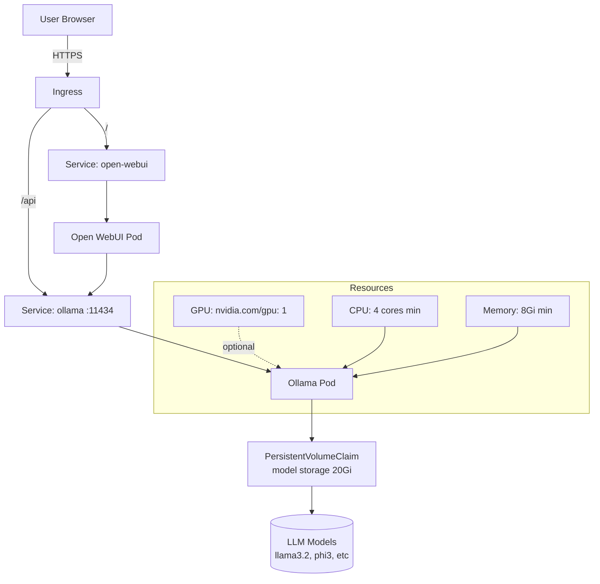

# Project 14 — AI Workload Deployment on Kubernetes

> 🔴 **Phase 3 — Real World** | 👥 Team (2–3) | ⏱ 5–7 hours

## Overview

Deploy a containerized **LLM inference endpoint** (Ollama) on Kubernetes. Configure CPU and GPU resource requests, expose the model via Ingress, add **Open WebUI** as a browser-based frontend, and use a PersistentVolumeClaim for model storage so models survive pod restarts. Query the model via API.

**Why this matters at work:** AI workloads on Kubernetes is one of the hottest areas in infrastructure right now. Companies are racing to deploy LLMs internally. The engineer who understands GPU resource requests, model persistence, and inference API patterns has a significant advantage. This project also shows you can learn new domains quickly — an important signal to employers.

## Architecture



## Learning Objectives
- Deploy a stateful AI workload using StatefulSet
- Configure GPU resource requests for accelerated inference
- Use PVCs for model storage and understand persistence trade-offs
- Expose AI APIs via Ingress with proper timeouts for long inference requests
- Wire Open WebUI as a frontend to a backend API service
- Query an LLM via REST API from inside and outside the cluster

## Prerequisites
- [ ] Cluster with at least 8GB RAM per node (LLMs are hungry)
- [ ] (Optional) NVIDIA GPU node with GPU operator installed
- [ ] StorageClass with dynamic provisioning
- [ ] Helm 3 installed

## Step 1 — Prepare GPU Support (Optional but Recommended)

If your cluster has NVIDIA GPUs:

```bash
# Install NVIDIA GPU Operator
helm repo add nvidia https://helm.ngc.nvidia.com/nvidia
helm repo update

helm install gpu-operator nvidia/gpu-operator \
  --namespace gpu-operator \
  --create-namespace \
  --set driver.enabled=true \
  --set toolkit.enabled=true

# Verify GPU is visible to Kubernetes
kubectl get nodes -o json | jq '.items[].status.capacity' | grep nvidia
# Should show: "nvidia.com/gpu": "1"
```

If no GPU — that's fine. Ollama runs on CPU, just slower.

## Step 2 — Create the Namespace and Storage

```yaml
# ai-namespace.yaml
apiVersion: v1
kind: Namespace
metadata:
  name: ai-workloads
  labels:
    purpose: ai-inference
---
apiVersion: v1
kind: PersistentVolumeClaim
metadata:
  name: ollama-models
  namespace: ai-workloads
spec:
  accessModes: [ReadWriteOnce]
  storageClassName: standard    # Use your cluster's StorageClass
  resources:
    requests:
      storage: 20Gi             # Models are large — llama3.2 is ~2GB, llama3:8b is ~5GB
```

```bash
kubectl apply -f ai-namespace.yaml
kubectl get pvc -n ai-workloads
```

> 📸 **Expected:** PVC shows `Bound` status with a PV provisioned automatically.

## Step 3 — Deploy Ollama

```yaml
# ollama-deployment.yaml
apiVersion: apps/v1
kind: StatefulSet    # StatefulSet for stable storage binding
metadata:
  name: ollama
  namespace: ai-workloads
  labels:
    app: ollama
spec:
  replicas: 1         # LLMs don't scale horizontally easily (model weights in memory)
  serviceName: ollama
  selector:
    matchLabels:
      app: ollama
  template:
    metadata:
      labels:
        app: ollama
    spec:
      containers:
        - name: ollama
          image: ollama/ollama:latest
          ports:
            - containerPort: 11434
              name: http
          
          # Environment
          env:
            - name: OLLAMA_MODELS
              value: /models       # Where to store downloaded models
            - name: OLLAMA_HOST
              value: "0.0.0.0"    # Listen on all interfaces
          
          # Resources — adjust based on which model you run
          resources:
            requests:
              cpu: "2"
              memory: 4Gi
            limits:
              cpu: "4"
              memory: 8Gi
            # GPU resources (uncomment if GPU is available)
            # limits:
            #   nvidia.com/gpu: "1"
          
          # Model storage volume
          volumeMounts:
            - name: models
              mountPath: /models
          
          # Readiness: Ollama is ready when it can respond to API calls
          readinessProbe:
            httpGet:
              path: /api/tags
              port: 11434
            initialDelaySeconds: 30   # Ollama takes time to start
            periodSeconds: 10
            failureThreshold: 6
          
          livenessProbe:
            httpGet:
              path: /api/tags
              port: 11434
            initialDelaySeconds: 60
            periodSeconds: 30
      
      volumes:
        - name: models
          persistentVolumeClaim:
            claimName: ollama-models
---
apiVersion: v1
kind: Service
metadata:
  name: ollama
  namespace: ai-workloads
spec:
  selector:
    app: ollama
  ports:
    - port: 11434
      targetPort: 11434
      name: http
\`\`\`

\`\`\`bash
kubectl apply -f ollama-deployment.yaml
kubectl rollout status statefulset/ollama -n ai-workloads

# Watch logs as Ollama starts
kubectl logs -f statefulset/ollama -n ai-workloads
```

> 📸 **Expected:** Ollama pod starts and shows `Listening on 0.0.0.0:11434`. Readiness probe passes after ~30 seconds.

## Step 4 — Pull a Model

```bash
# Port-forward to access Ollama from your laptop
kubectl port-forward svc/ollama -n ai-workloads 11434:11434 &

# Pull a small model (phi3 is only ~2GB — good for CPU)
curl http://localhost:11434/api/pull -d '{"name": "phi3"}'

# Watch the download progress in the logs
kubectl logs -f statefulset/ollama -n ai-workloads

# Verify model is available
curl http://localhost:11434/api/tags
```

> 📸 **Expected:** Model download shows progress. After completion, `/api/tags` returns a JSON list containing `phi3`. The model is stored in the PVC — surviving pod restarts.

## Step 5 — Query the Model via API

```bash
# Single query — test that inference works
curl http://localhost:11434/api/generate -d '{
  "model": "phi3",
  "prompt": "Explain Kubernetes in one sentence.",
  "stream": false
}'
```

> 📸 **Expected:** JSON response with a `response` field containing the model's answer. Note the response time — on CPU this might take 30–60 seconds for phi3. On GPU: under 5 seconds.

```bash
# Test from inside the cluster
kubectl run test-query --image=curlimages/curl --rm -it --restart=Never \
  -n ai-workloads -- curl -s http://ollama:11434/api/generate \
  -d '{"model":"phi3","prompt":"What is a Pod in Kubernetes?","stream":false}'
```

## Step 6 — Deploy Open WebUI Frontend

```yaml
# open-webui.yaml
apiVersion: apps/v1
kind: Deployment
metadata:
  name: open-webui
  namespace: ai-workloads
spec:
  replicas: 1
  selector:
    matchLabels:
      app: open-webui
  template:
    metadata:
      labels:
        app: open-webui
    spec:
      containers:
        - name: open-webui
          image: ghcr.io/open-webui/open-webui:main
          ports:
            - containerPort: 8080
          env:
            - name: OLLAMA_BASE_URL
              value: "http://ollama:11434"   # Internal DNS — no port-forward needed
            - name: WEBUI_AUTH
              value: "false"                  # Disable auth for dev/testing
          resources:
            requests:
              cpu: 500m
              memory: 512Mi
            limits:
              cpu: "1"
              memory: 1Gi
          volumeMounts:
            - name: webui-data
              mountPath: /app/backend/data
      volumes:
        - name: webui-data
          emptyDir: {}    # Non-persistent for simplicity; use PVC for production
---
apiVersion: v1
kind: Service
metadata:
  name: open-webui
  namespace: ai-workloads
spec:
  selector:
    app: open-webui
  ports:
    - port: 80
      targetPort: 8080
```

```bash
kubectl apply -f open-webui.yaml
kubectl rollout status deployment/open-webui -n ai-workloads
```

## Step 7 — Expose via Ingress

```yaml
# ai-ingress.yaml
apiVersion: networking.k8s.io/v1
kind: Ingress
metadata:
  name: ai-ingress
  namespace: ai-workloads
  annotations:
    nginx.ingress.kubernetes.io/proxy-read-timeout: "300"     # LLM inference can be slow
    nginx.ingress.kubernetes.io/proxy-send-timeout: "300"
    nginx.ingress.kubernetes.io/proxy-connect-timeout: "60"
spec:
  ingressClassName: nginx
  rules:
    - host: ai.local
      http:
        paths:
          - path: /api
            pathType: Prefix
            backend:
              service:
                name: ollama
                port:
                  number: 11434
          - path: /
            pathType: Prefix
            backend:
              service:
                name: open-webui
                port:
                  number: 80
```

```bash
kubectl apply -f ai-ingress.yaml

# Add to /etc/hosts for local testing
echo "$(kubectl get ingress ai-ingress -n ai-workloads -o jsonpath='{.status.loadBalancer.ingress[0].ip}') ai.local" | sudo tee -a /etc/hosts

# Open browser
open http://ai.local
```

> 📸 **Expected:** Open WebUI loads in the browser. Select `phi3` from the model dropdown. Type a message and get a response — this is a locally-running LLM served from your Kubernetes cluster!

## Step 8 — Test Model Persistence

```bash
# Delete the Ollama pod — model should survive in PVC
kubectl delete pod -l app=ollama -n ai-workloads

# Wait for pod to restart
kubectl get pods -n ai-workloads -w

# Verify model is still available (no re-download needed)
curl http://localhost:11434/api/tags
# phi3 should still be listed — model persisted in PVC!
```

## Validation Checklist
- [ ] Ollama pod running and readiness probe passing
- [ ] `phi3` (or another model) downloaded and queryable via API
- [ ] `/api/generate` returns a coherent response
- [ ] Open WebUI accessible and connected to Ollama
- [ ] Browser chat UI works — can send a message and receive response
- [ ] Pod deleted and restarted — model still available without re-downloading
- [ ] Ingress routes `/api` to Ollama and `/` to Open WebUI

## Troubleshooting

**Pod OOMKilled**
LLMs require significant RAM. `phi3` needs ~4GB during inference. Increase memory limits or use a smaller model like `tinyllama`.

**Inference timeout at Ingress**
Default nginx timeout is 60s. Add `nginx.ingress.kubernetes.io/proxy-read-timeout: "300"`. For CPU inference, set even higher.

**Open WebUI can't connect to Ollama**
Check `OLLAMA_BASE_URL` env var. From inside the cluster, use `http://ollama:11434` (Service DNS). Verify with: `kubectl exec -n ai-workloads -it <webui-pod> -- curl http://ollama:11434/api/tags`

**GPU not detected**
Check GPU operator is installed: `kubectl get pods -n gpu-operator`. Check node capacity: `kubectl describe node <gpu-node> | grep nvidia`

## Extension Challenges
1. Deploy **llama3.2** (larger, more capable model) and compare response quality and latency vs phi3
2. Configure **model caching with Redis** — cache common queries so repeat questions don't re-run inference
3. Add **authentication** to Open WebUI and wire it to your cluster's identity provider

## Resources
- [Ollama](https://ollama.ai/)
- [Open WebUI](https://github.com/open-webui/open-webui)
- [NVIDIA GPU Operator](https://docs.nvidia.com/datacenter/cloud-native/gpu-operator/latest/index.html)
- [Kubernetes for AI/ML](https://kubernetes.io/docs/tasks/manage-gpus/scheduling-gpus/)
