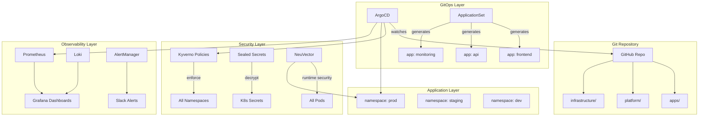

# Project 15 — Full Stack Capstone: Secure, Observable, GitOps-Driven Platform

> 🔴 **Phase 3 — Real World** | 👥 Team (2–3) | ⏱ 12–16 hours

## Overview

Build everything from scratch as if you've just joined a new company on Day 1 and been handed an empty Kubernetes cluster. Namespace strategy, RBAC, GitOps pipeline, Helm charts, Sealed Secrets, full observability stack, Kyverno policy library, and NeuVector security hardening — all wired together. This is your **portfolio piece**. The one you demo in interviews, put on your resume, and link from LinkedIn.

**Why this matters:** Every other project in this cohort built one layer of the stack. This project builds the whole stack — which is exactly what real platform engineers do. When an interviewer asks "can you walk me through something you built end-to-end?" — this is what you show them.

## Architecture



## What You'll Build

| Component | Tool | Project Reference |
|-----------|------|------------------|
| Namespace strategy | kubectl | Project 3 |
| RBAC | Roles, RoleBindings | Project 3 |
| GitOps pipeline | ArgoCD App of Apps | Project 5 |
| App packaging | Helm charts | Project 6 |
| Secret management | Sealed Secrets | Project 7 |
| Image signing | Cosign + Kyverno | Project 7 |
| Metrics + dashboards | Prometheus + Grafana | Project 8 |
| Log aggregation | Loki + Promtail | Project 8 |
| Alerting | AlertManager → Slack | Project 8 |
| Policy enforcement | Kyverno library | Project 10 |
| Runtime security | NeuVector | Project 11 |

---

## Phase 1 — Foundation (Day 1 Infrastructure)

### 1.1 — Namespace Strategy

Design before you build. Sketch your namespace hierarchy first:

```
cluster
├── system namespaces (kube-system, kyverno, argocd, monitoring, neuvector)
└── workload namespaces
    ├── dev        (loose policies, debug-friendly)
    ├── staging    (production-like, stricter)
    └── prod       (fully hardened, read-only for app teams)
```

```yaml
# infrastructure/namespaces.yaml
apiVersion: v1
kind: Namespace
metadata:
  name: dev
  labels:
    env: dev
    managed-by: platform-team
---
apiVersion: v1
kind: Namespace
metadata:
  name: staging
  labels:
    env: staging
    managed-by: platform-team
---
apiVersion: v1
kind: Namespace
metadata:
  name: prod
  labels:
    env: prod
    managed-by: platform-team
```

### 1.2 — RBAC Model

```yaml
# infrastructure/rbac.yaml

# Developers: read-only in prod, read-write in dev
apiVersion: rbac.authorization.k8s.io/v1
kind: Role
metadata:
  name: developer-dev
  namespace: dev
rules:
  - apiGroups: ["", "apps"]
    resources: ["pods", "deployments", "services", "configmaps"]
    verbs: ["get", "list", "watch", "create", "update", "patch", "delete"]
  - apiGroups: [""]
    resources: ["pods/log", "pods/exec"]
    verbs: ["get", "create"]
---
apiVersion: rbac.authorization.k8s.io/v1
kind: Role
metadata:
  name: developer-prod
  namespace: prod
rules:
  - apiGroups: ["", "apps"]
    resources: ["pods", "deployments", "services"]
    verbs: ["get", "list", "watch"]    # Read-only
  - apiGroups: [""]
    resources: ["pods/log"]
    verbs: ["get"]
```

### 1.3 — ResourceQuotas per Namespace

```yaml
# infrastructure/quotas.yaml
apiVersion: v1
kind: ResourceQuota
metadata:
  name: dev-quota
  namespace: dev
spec:
  hard:
    requests.cpu: "4"
    requests.memory: 8Gi
    limits.cpu: "8"
    limits.memory: 16Gi
    pods: "20"
    services: "10"
---
apiVersion: v1
kind: ResourceQuota
metadata:
  name: prod-quota
  namespace: prod
spec:
  hard:
    requests.cpu: "16"
    requests.memory: 32Gi
    limits.cpu: "32"
    limits.memory: 64Gi
    pods: "100"
```

---

## Phase 2 — GitOps Pipeline

### 2.1 — Install ArgoCD

```bash
kubectl create namespace argocd
kubectl apply -n argocd -f \
  https://raw.githubusercontent.com/argoproj/argo-cd/stable/manifests/install.yaml
kubectl rollout status deployment/argocd-server -n argocd
```

### 2.2 — Repo Structure

```
capstone-platform/
├── infrastructure/          # Cluster-level resources (namespaces, RBAC, quotas)
├── platform/
│   ├── argocd/              # ArgoCD config + root app
│   ├── monitoring/          # Prometheus + Grafana + Loki values
│   ├── security/            # Kyverno policies + Sealed Secrets controller
│   └── neuvector/           # NeuVector install
└── apps/
    ├── frontend/            # Helm values for frontend app
    ├── api/                 # Helm values for API
    └── app-template/        # Shared Helm chart
```

### 2.3 — Root ArgoCD App

```yaml
# platform/argocd/root-app.yaml
apiVersion: argoproj.io/v1alpha1
kind: Application
metadata:
  name: root
  namespace: argocd
spec:
  project: default
  source:
    repoURL: https://github.com/YOUR_ORG/capstone-platform.git
    targetRevision: main
    path: platform/argocd
  destination:
    server: https://kubernetes.default.svc
    namespace: argocd
  syncPolicy:
    automated:
      prune: true
      selfHeal: true
```

---

## Phase 3 — Security Layer

### 3.1 — Install Sealed Secrets Controller

```bash
helm install sealed-secrets sealed-secrets/sealed-secrets \
  --namespace kube-system \
  --set-string fullnameOverride=sealed-secrets-controller
```

Create and seal all app secrets before committing:
```bash
kubectl create secret generic app-secrets \
  --from-literal=DB_PASS=prod-password \
  --dry-run=client -o yaml | \
  kubeseal --format yaml > apps/api/sealed-secrets.yaml
```

### 3.2 — Kyverno Policy Suite

Deploy all policies from Project 10. For the capstone, use `Enforce` mode in prod, `Audit` in dev:

```yaml
# platform/security/kyverno-policies.yaml
# (Reference your Project 10 policies here)
# Key difference: use namespace-scoped policies for different strictness per env
apiVersion: kyverno.io/v1
kind: Policy            # Namespace-scoped (not ClusterPolicy)
metadata:
  name: require-labels
  namespace: prod
spec:
  validationFailureAction: Enforce   # Enforce in prod
  # ...same rules as Project 10...
---
apiVersion: kyverno.io/v1
kind: Policy
metadata:
  name: require-labels
  namespace: dev
spec:
  validationFailureAction: Audit     # Just warn in dev
```

### 3.3 — Image Signing Pipeline

Sign all images in your CI/CD pipeline before they reach the cluster:

```yaml
# .github/workflows/build-and-sign.yml
name: Build, Sign, Deploy
on:
  push:
    branches: [main]
jobs:
  build:
    runs-on: ubuntu-latest
    steps:
      - uses: actions/checkout@v4
      - name: Build and push
        run: |
          docker build -t ghcr.io/${{ github.repository }}/api:${{ github.sha }} ./api
          docker push ghcr.io/${{ github.repository }}/api:${{ github.sha }}
      
      - name: Sign with Cosign
        uses: sigstore/cosign-installer@v3
      - run: |
          cosign sign --key env://COSIGN_KEY \
            ghcr.io/${{ github.repository }}/api:${{ github.sha }}
        env:
          COSIGN_KEY: ${{ secrets.COSIGN_KEY }}
      
      - name: Update image tag in values.yaml
        run: |
          sed -i "s/tag: .*/tag: ${{ github.sha }}/" apps/api/values.yaml
          git config user.email "ci@emagegroup.net"
          git config user.name "CI Bot"
          git add apps/api/values.yaml
          git commit -m "ci: deploy api:${{ github.sha }}"
          git push
```

---

## Phase 4 — Observability Stack

Deploy from Project 8. For the capstone, add these capstone-specific dashboards:

### Custom Dashboard: Platform Health Overview

Panels to include:
1. **Namespace resource utilization** — CPU/memory by namespace
2. **Pod restart rate** — which pods are unstable
3. **Kyverno policy violations** — how many blocked deployments today
4. **ArgoCD sync status** — are all apps healthy?
5. **NeuVector security score** — current posture percentage
6. **Certificate expiry** — days until any TLS cert expires

```promql
# Panel: Pods in non-Running state
count by (namespace, phase) (
  kube_pod_status_phase{phase!="Running", phase!="Succeeded"}
)

# Panel: Namespace CPU utilization %
sum by (namespace) (
  rate(container_cpu_usage_seconds_total{container!=""}[5m])
) / sum by (namespace) (
  kube_namespace_labels * on (namespace) group_left()
  kube_pod_container_resource_limits{resource="cpu"}
)
```

### Alert: Platform-Level SLO

```yaml
# Alert: Any prod pod in CrashLoopBackOff
- alert: ProdPodCrashLooping
  expr: |
    rate(kube_pod_container_status_restarts_total{namespace="prod"}[5m]) * 60 * 5 > 1
  for: 2m
  labels:
    severity: critical
    team: platform
  annotations:
    summary: "PROD: Pod {{ $labels.pod }} crash looping"
```

---

## Phase 5 — Deploy Applications

Deploy the Project 1 app (Node.js + PostgreSQL) into the full platform:

```bash
# Deploy to dev first
helm install capstone-api ./apps/app-template \
  --namespace dev \
  -f apps/api/values-dev.yaml

# Verify through the full stack:
# 1. ArgoCD shows app as Synced and Healthy
# 2. Prometheus has metrics from the app
# 3. Loki has logs from the app
# 4. Kyverno didn't block anything (no policy violations)
# 5. NeuVector shows the app's network conversations

# Promote to prod via PR
# Change values-prod.yaml, open PR, get reviewed, merge
# ArgoCD auto-deploys
```

---

## Phase 6 — Security Hardening

Apply NeuVector to the whole platform:

```bash
# Run NeuVector in Discover mode for 24 hours
# Review all network conversations
# Switch to Monitor, review alerts
# Switch to Protect

# Target: 85%+ security posture score on the capstone cluster
```

---

## The Portfolio README

After completing the capstone, write a top-level README for your repo that covers:

```markdown
# Capstone Platform — [Your Name]

## What This Is
A production-grade Kubernetes platform built from the ground up, 
demonstrating the full cloud-native stack.

## Architecture
[Your Mermaid diagram]

## What's Running
- ArgoCD managing N applications via GitOps
- Prometheus + Grafana + Loki for full observability
- Kyverno enforcing N security policies  
- NeuVector runtime security at X% posture score
- Sealed Secrets for credential management
- Cosign image signing enforced on all deployments

## How to Deploy It
[Clear step-by-step instructions]

## Key Technical Decisions
- Chose Sealed Secrets over Vault because...
- Chose Kyverno over OPA/Gatekeeper because...
- Namespace-per-env vs namespace-per-team: we chose...

## What I Learned
[Honest reflection]

## What I'd Do Differently
[Shows professional maturity]
```

---

## Final Validation Checklist

### Infrastructure
- [ ] 3 namespaces (dev/staging/prod) with appropriate ResourceQuotas
- [ ] RBAC configured: developers read-only in prod, read-write in dev
- [ ] All changes managed through Git (no manual kubectl in prod)

### GitOps
- [ ] ArgoCD App of Apps managing all workloads
- [ ] ApplicationSet auto-generates apps for new team folders
- [ ] Self-healing: manual changes auto-reverted within 3 minutes
- [ ] PR-based promotion from dev → staging → prod

### Security
- [ ] Sealed Secrets: no plaintext credentials in Git
- [ ] Cosign: all images signed and verified by Kyverno
- [ ] Kyverno: Enforce in prod (labels, resources, no-latest, registry restriction)
- [ ] NeuVector: 85%+ security posture score
- [ ] NetworkPolicies: default-deny in prod with explicit allows

### Observability
- [ ] Prometheus scraping all namespaces and apps
- [ ] Grafana: platform health dashboard operational
- [ ] Loki: log aggregation from all pods
- [ ] AlertManager: alerts routing to Slack
- [ ] At least one alert has fired and been resolved (documented)

### Application
- [ ] At least one real app deployed through the full pipeline
- [ ] App deploys via PR merge, not manual kubectl
- [ ] App logs visible in Loki/Grafana
- [ ] App metrics visible in Prometheus

### Documentation
- [ ] Top-level README explains the architecture
- [ ] Architecture diagram (Mermaid)
- [ ] How-to-deploy instructions someone else could follow
- [ ] Technical decisions documented with reasoning

---

## Interview Talking Points

When asked "Tell me about something you built":

> "I built a production-grade Kubernetes platform from scratch as a capstone project. 
> The stack includes ArgoCD for GitOps — all changes go through pull requests and 
> self-heal automatically. Kyverno enforces security policies like required labels, 
> no latest image tags, and image signature verification via Cosign. Sealed Secrets 
> ensures no credentials ever touch Git in plaintext. The observability layer is 
> Prometheus, Grafana, and Loki, with AlertManager routing to Slack. And NeuVector 
> provides runtime security with a posture score we pushed from 35% to 88%.
>
> The most interesting challenge was the image signing pipeline — getting Cosign 
> integrated with GitHub Actions and then having Kyverno enforce verification at 
> admission time. It took several iterations to get the public key format right.
>
> I'd link you to the GitHub repo — it has a full README with the architecture 
> diagram and deployment instructions."

That's a 2-minute answer that demonstrates depth across GitOps, security, and observability. It's concrete, it's specific, and it has a GitHub link to prove it.

---

## Resources
- [Cloud Native Landscape](https://landscape.cncf.io/)
- [CNCF Trail Map](https://github.com/cncf/trailmap)
- [Platform Engineering](https://platformengineering.org/)
- [Google SRE Book](https://sre.google/sre-book/table-of-contents/)
- [Production Kubernetes](https://www.oreilly.com/library/view/production-kubernetes/9781492092292/)
