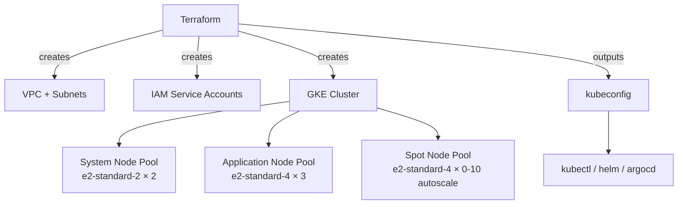

# Project 16 — Cluster Provisioning with Terraform

> 🔴 **Senior Track** | 👥 Team (2–3) | ⏱ 6–8 hours
> **Seniority Path:** This project marks the transition from *using* Kubernetes to *building* the infrastructure it runs on. Senior engineers provision their own clusters.

---

## Overview

Build a production-grade GKE (or EKS/AKS) Kubernetes cluster from scratch using **Terraform**. You will define every layer of infrastructure as code: VPC, subnets, firewall rules, IAM service accounts, node pools (including spot/preemptible), and cluster configuration. Destroy the cluster. Rebuild it in under 10 minutes. That repeatability is the point.

**Why this matters at work:** Every senior K8s role expects you to provision and destroy clusters without clicking the cloud console. "Infrastructure as Code" is not optional at senior level — it's the baseline. Interviewers frequently ask "walk me through how you'd stand up a new cluster from scratch."

## Architecture



## Learning Objectives
- Write Terraform modules for GKE/EKS/AKS
- Understand VPC design for Kubernetes (pod CIDR, service CIDR, node CIDR)
- Configure multiple node pools with different machine types and purposes
- Use spot/preemptible nodes to reduce cost by 60–80%
- Manage kubeconfig output from Terraform
- Practice `terraform plan`, `apply`, `destroy`, `import`

## Prerequisites
- [ ] Terraform installed: `brew install terraform`
- [ ] Cloud provider CLI (gcloud/aws/az) configured with credentials
- [ ] Project 3 (RBAC) and Project 5 (ArgoCD) completed

---

## Step 1 — Project Structure

```
terraform/
├── main.tf           # Root module — calls submodules
├── variables.tf      # Input variables
├── outputs.tf        # Outputs (cluster endpoint, kubeconfig)
├── versions.tf       # Terraform + provider version pins
├── terraform.tfvars  # Your values (git-ignored)
└── modules/
    ├── vpc/
    │   ├── main.tf
    │   ├── variables.tf
    │   └── outputs.tf
    └── gke/
        ├── main.tf
        ├── variables.tf
        └── outputs.tf
```

## Step 2 — versions.tf

```hcl
terraform {
  required_version = ">= 1.5.0"

  required_providers {
    google = {
      source  = "hashicorp/google"
      version = "~> 5.0"
    }
  }

  # Remote state — use GCS bucket (never store state locally for team projects)
  backend "gcs" {
    bucket = "your-terraform-state-bucket"
    prefix = "kubernetes-cohort/gke"
  }
}

provider "google" {
  project = var.project_id
  region  = var.region
}
```

## Step 3 — VPC Module

```hcl
# modules/vpc/main.tf
resource "google_compute_network" "vpc" {
  name                    = "${var.cluster_name}-vpc"
  auto_create_subnetworks = false   # We control our own subnets
}

resource "google_compute_subnetwork" "nodes" {
  name          = "${var.cluster_name}-nodes"
  ip_cidr_range = var.node_cidr        # e.g. 10.0.0.0/20 (4096 node IPs)
  region        = var.region
  network       = google_compute_network.vpc.id

  secondary_ip_range {
    range_name    = "pods"
    ip_cidr_range = var.pod_cidr       # e.g. 10.4.0.0/14 (262k pod IPs)
  }

  secondary_ip_range {
    range_name    = "services"
    ip_cidr_range = var.service_cidr   # e.g. 10.8.0.0/20 (4096 service IPs)
  }

  private_ip_google_access = true      # Nodes can reach Google APIs without public IP
}

# Firewall: allow nodes to talk to each other
resource "google_compute_firewall" "internal" {
  name    = "${var.cluster_name}-internal"
  network = google_compute_network.vpc.name

  allow {
    protocol = "tcp"
  }
  allow {
    protocol = "udp"
  }
  allow {
    protocol = "icmp"
  }

  source_ranges = [var.node_cidr, var.pod_cidr]
}
```

## Step 4 — GKE Cluster Module

```hcl
# modules/gke/main.tf

# Service account for nodes — least privilege
resource "google_service_account" "nodes" {
  account_id   = "${var.cluster_name}-nodes"
  display_name = "GKE Node Service Account"
}

resource "google_project_iam_member" "node_roles" {
  for_each = toset([
    "roles/logging.logWriter",
    "roles/monitoring.metricWriter",
    "roles/monitoring.viewer",
    "roles/storage.objectViewer",     # Pull images from GCR/Artifact Registry
  ])
  project = var.project_id
  role    = each.value
  member  = "serviceAccount:${google_service_account.nodes.email}"
}

resource "google_container_cluster" "primary" {
  name     = var.cluster_name
  location = var.zone   # Use region for regional (multi-zone) cluster

  # Remove the default node pool — we create our own
  remove_default_node_pool = true
  initial_node_count       = 1

  network    = var.network
  subnetwork = var.subnetwork

  networking_config {
    cluster_secondary_range_name  = "pods"
    services_secondary_range_name = "services"
  }

  # Workload Identity — pods get Google IAM identities (Project 7 prerequisite)
  workload_identity_config {
    workload_pool = "${var.project_id}.svc.id.goog"
  }

  # Private cluster — nodes have no public IPs
  private_cluster_config {
    enable_private_nodes    = true
    enable_private_endpoint = false
    master_ipv4_cidr_block  = "172.16.0.0/28"
  }

  master_authorized_networks_config {
    cidr_blocks {
      cidr_block   = "0.0.0.0/0"   # Restrict to your IP in production
      display_name = "all"
    }
  }
}

# System node pool — runs kube-system workloads
resource "google_container_node_pool" "system" {
  name       = "system"
  cluster    = google_container_cluster.primary.name
  location   = var.zone
  node_count = 2

  node_config {
    machine_type    = "e2-standard-2"
    service_account = google_service_account.nodes.email
    oauth_scopes    = ["https://www.googleapis.com/auth/cloud-platform"]

    labels = {
      pool = "system"
    }

    taint {
      key    = "CriticalAddonsOnly"
      value  = "true"
      effect = "NO_SCHEDULE"         # Only system pods schedule here
    }
  }
}

# Application node pool — runs your workloads
resource "google_container_node_pool" "apps" {
  name     = "apps"
  cluster  = google_container_cluster.primary.name
  location = var.zone

  autoscaling {
    min_node_count = 2
    max_node_count = 10
  }

  node_config {
    machine_type    = "e2-standard-4"
    service_account = google_service_account.nodes.email
    oauth_scopes    = ["https://www.googleapis.com/auth/cloud-platform"]
    labels          = { pool = "apps" }
  }

  management {
    auto_repair  = true
    auto_upgrade = true
  }
}

# Spot node pool — 60-80% cheaper, can be preempted
resource "google_container_node_pool" "spot" {
  name     = "spot"
  cluster  = google_container_cluster.primary.name
  location = var.zone

  autoscaling {
    min_node_count = 0
    max_node_count = 20
  }

  node_config {
    machine_type    = "e2-standard-4"
    service_account = google_service_account.nodes.email
    oauth_scopes    = ["https://www.googleapis.com/auth/cloud-platform"]
    spot            = true             # Preemptible/spot instances

    labels = { pool = "spot" }

    taint {
      key    = "cloud.google.com/gke-spot"
      value  = "true"
      effect = "NO_SCHEDULE"           # Only tolerated workloads land here
    }
  }
}
```

## Step 5 — Deploy and Connect

```bash
# Initialize (downloads providers)
terraform init

# Preview what will be created
terraform plan -var-file=terraform.tfvars

# Apply (takes ~8 minutes)
terraform apply -var-file=terraform.tfvars

# Connect kubectl
gcloud container clusters get-credentials $(terraform output -raw cluster_name) \
  --zone $(terraform output -raw zone) \
  --project $(terraform output -raw project_id)

kubectl get nodes -o wide
```

> 📸 **Expected:** 4 nodes (2 system + 2 app minimum). Spot pool at 0 until load triggers scale-up. All nodes Ready.

## Step 6 — Destroy and Rebuild

```bash
# Time this
time terraform destroy -var-file=terraform.tfvars -auto-approve

# Rebuild from zero
time terraform apply -var-file=terraform.tfvars -auto-approve
```

> 📸 **Expected:** Destroy in ~5 min. Rebuild in ~8 min. Full cluster, all node pools, networking — reproduced exactly from code.

## Step 7 — Schedule Spot-Tolerant Workloads

```yaml
# Deploy batch jobs to spot nodes (tolerate the spot taint)
spec:
  tolerations:
    - key: "cloud.google.com/gke-spot"
      operator: "Equal"
      value: "true"
      effect: "NoSchedule"
  nodeSelector:
    pool: spot
```

## Validation Checklist
- [ ] `terraform plan` shows expected resources before apply
- [ ] Cluster created with 3 node pools
- [ ] `kubectl get nodes` shows correct labels per pool
- [ ] System taint prevents app pods from landing on system nodes
- [ ] Spot nodes scale up under load, scale down when idle
- [ ] `terraform destroy` removes all resources cleanly (no orphans)
- [ ] Cluster rebuilt from scratch in under 10 minutes

## Troubleshooting

**`terraform apply` fails with permission denied** — Service account running Terraform needs `roles/container.admin` and `roles/compute.networkAdmin`.

**Nodes stuck in NotReady** — Check firewall rules. Pod-to-pod traffic must be allowed on the pod CIDR range.

**Spot nodes not scaling up** — Cluster autoscaler must be enabled. Check: `kubectl describe configmap cluster-autoscaler-status -n kube-system`

## Extension Challenges
1. Add a **Cloud SQL PostgreSQL instance** to Terraform and connect it to the cluster via Private Service Connect
2. Configure **Terraform Cloud** for remote state and collaborative apply with approval workflows
3. Add a **GKE Autopilot** cluster as a second environment and compare operational overhead vs Standard

## Resources
- [Terraform GKE Module](https://registry.terraform.io/modules/terraform-google-modules/kubernetes-engine/google)
- [GKE Best Practices](https://cloud.google.com/kubernetes-engine/docs/best-practices)
- [Terraform Docs](https://developer.hashicorp.com/terraform/docs)
- 📺 [TechWorld with Nana — Terraform Course](https://www.youtube.com/watch?v=7xngnjfIlK4)
- 📺 [Anton Putra — GKE with Terraform](https://www.youtube.com/watch?v=VCgvSNrALaI)
