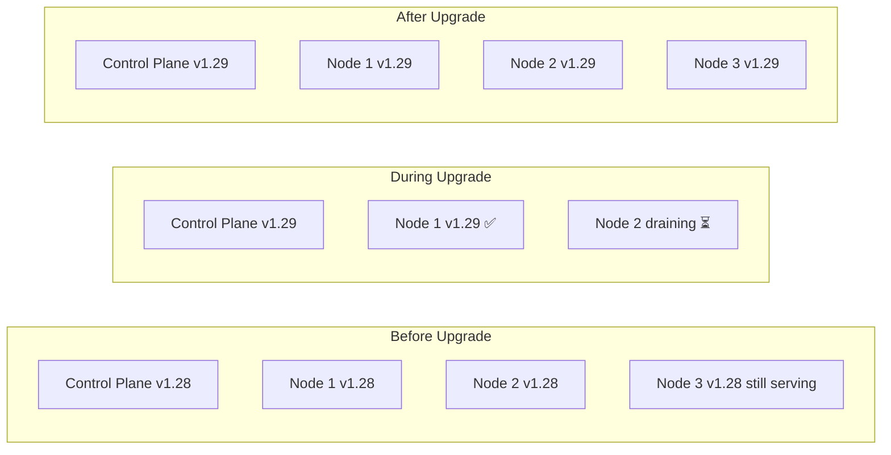

# Project 17 — Cluster Upgrades & Node Management

> 🔴 **Senior Track** | 👥 Team (2–3) | ⏱ 5–7 hours
> **Seniority Path:** Provisioning a cluster is one skill. Keeping it alive and upgraded in production — without dropping traffic — is another.

---

## Overview

Perform a full **Kubernetes version upgrade** with zero downtime: upgrade the control plane, then roll through node pools one node at a time using `cordon`, `drain`, and `uncordon`. Simulate the exact procedure used in production clusters. Then practice node troubleshooting — recover a NotReady node without losing workloads.

**Why this matters:** Cluster upgrades are required every few months (K8s supports N-2 minor versions). Doing them wrong means downtime. Every senior engineer has a war story about a bad upgrade — this project means yours happens in a lab, not production.

## Architecture



## Learning Objectives
- Understand Kubernetes version skew policy (control plane vs nodes)
- Safely cordon, drain, and uncordon nodes
- Perform in-place node upgrades (kubeadm) or rolling node replacements (cloud)
- Handle `PodDisruptionBudgets` that block draining
- Recover a NotReady node without data loss
- Write an upgrade runbook

## Prerequisites
- [ ] Working cluster with at least 3 nodes
- [ ] Workloads running (Projects 1 or 15 deployed)
- [ ] Project 4 completed (understand self-healing)

---

## Part A — Pre-Upgrade Checks

```bash
# 1. Check current versions
kubectl version
kubectl get nodes -o wide

# 2. Check what versions are available
# GKE:
gcloud container get-server-config --zone us-central1-a | grep validMasterVersions

# kubeadm:
kubeadm upgrade plan

# 3. Verify all nodes are healthy
kubectl get nodes
kubectl get pods -A | grep -v Running | grep -v Completed

# 4. Check PodDisruptionBudgets — these will block draining if not respected
kubectl get pdb -A

# 5. Backup etcd (kubeadm clusters)
ETCDCTL_API=3 etcdctl snapshot save /tmp/etcd-backup-$(date +%Y%m%d).db \
  --endpoints=https://127.0.0.1:2379 \
  --cacert=/etc/kubernetes/pki/etcd/ca.crt \
  --cert=/etc/kubernetes/pki/etcd/peer.crt \
  --key=/etc/kubernetes/pki/etcd/peer.key
```

> 📸 **Expected:** All nodes Ready. No pods in error state. etcd backup file created. PDB list shows nothing that would prevent eviction.

---

## Part B — Node Drain & Cordon

### The Vocabulary

```
cordon   = mark node as unschedulable (no new pods) but keep existing pods running
drain    = cordon + evict all existing pods (gracefully)
uncordon = mark node as schedulable again
```

### Simulate a Node Maintenance Window

```bash
# Pick a node to "maintain"
NODE=node-2

# Step 1: Cordon — no new pods land here
kubectl cordon $NODE

# Verify
kubectl get nodes
# node-2 shows SchedulingDisabled

# Step 2: Watch where running pods go
kubectl get pods -o wide -w &

# Step 3: Drain — evict all pods gracefully
kubectl drain $NODE \
  --ignore-daemonsets \        # DaemonSet pods can't be evicted
  --delete-emptydir-data \     # Allow eviction of pods using emptyDir
  --grace-period=30 \          # Give pods 30s to shut down
  --timeout=5m                 # Fail if takes longer than 5 min

# Watch pods move to other nodes
# After maintenance is done:
kubectl uncordon $NODE
```

> 📸 **Expected:** During drain, pods move to other nodes. node-2 shows 0 non-daemonset pods. After uncordon, new pods can schedule on node-2 again.

---

## Part C — Handling PodDisruptionBudgets

PDBs protect against too many replicas going down at once. They can block your drain.

```bash
# This drain might hang if a PDB says minAvailable: 1 and you only have 1 replica
kubectl drain node-2 --ignore-daemonsets --delete-emptydir-data
# Error: Cannot evict pod "my-app-xxx": PDB "my-app-pdb" is blocking eviction

# Debug: see which PDB is blocking
kubectl get pdb -A
kubectl describe pdb my-app-pdb

# Option 1: Scale up the deployment first (add a replica), then drain
kubectl scale deployment my-app --replicas=3
kubectl drain node-2 --ignore-daemonsets --delete-emptydir-data

# Option 2: Override the PDB (only in emergencies)
kubectl drain node-2 --ignore-daemonsets --delete-emptydir-data --disable-eviction=true
# WARNING: bypasses PDB — use only when absolutely necessary
```

---

## Part D — Performing the Upgrade

### GKE (Cloud-managed control plane)

```bash
# Step 1: Upgrade control plane (GKE does this automatically or via CLI)
gcloud container clusters upgrade CLUSTER_NAME \
  --master \
  --cluster-version=1.29 \
  --zone=us-central1-a

# Monitor upgrade
gcloud container operations list | head -5
kubectl get nodes   # Control plane upgrades are transparent

# Step 2: Upgrade node pool (rolling — one node at a time)
gcloud container clusters upgrade CLUSTER_NAME \
  --node-pool=apps \
  --cluster-version=1.29 \
  --zone=us-central1-a

# Watch nodes upgrade one by one
kubectl get nodes -w
```

### kubeadm (self-managed)

```bash
# On control plane node:
# Step 1: Upgrade kubeadm
apt-mark unhold kubeadm && apt-get install -y kubeadm=1.29.0-00 && apt-mark hold kubeadm

# Step 2: Preview upgrade
kubeadm upgrade plan

# Step 3: Apply upgrade
kubeadm upgrade apply v1.29.0

# Step 4: Upgrade kubelet and kubectl on control plane
apt-mark unhold kubelet kubectl
apt-get install -y kubelet=1.29.0-00 kubectl=1.29.0-00
apt-mark hold kubelet kubectl
systemctl daemon-reload && systemctl restart kubelet

# Step 5: For each worker node (SSH to each):
# Drain from control plane first
kubectl drain node-X --ignore-daemonsets --delete-emptydir-data

# On the worker node:
apt-mark unhold kubeadm kubelet kubectl
apt-get install -y kubeadm=1.29.0-00 kubelet=1.29.0-00 kubectl=1.29.0-00
apt-mark hold kubeadm kubelet kubectl
kubeadm upgrade node
systemctl daemon-reload && systemctl restart kubelet

# Back on control plane:
kubectl uncordon node-X

# Repeat for all workers
```

> 📸 **Expected:** `kubectl get nodes` shows all nodes at v1.29.x. Zero pod restarts during upgrade (if PDBs are configured). `kubectl version` confirms matching client/server versions.

---

## Part E — Recover a NotReady Node

```bash
# Simulate a node going NotReady (stop kubelet)
# SSH to a worker node:
sudo systemctl stop kubelet

# On control plane — watch the node go NotReady
kubectl get nodes -w
# After ~40s: node-X status = NotReady

# Pods on that node after ~5 min:
kubectl get pods -o wide | grep node-X
# Status changes to Terminating (being rescheduled)

# Fix: restart kubelet
sudo systemctl start kubelet

# Node comes back
kubectl get nodes -w
# node-X becomes Ready again
# Rescheduled pods might terminate since originals came back

# If node can't be recovered (hardware failure):
kubectl delete node node-X
# Node removed from cluster, pods permanently rescheduled
```

---

## Upgrade Runbook Template

Document this for every upgrade:

```markdown
# Upgrade Runbook: v1.28 → v1.29

## Pre-Upgrade Checklist
- [ ] etcd backup completed: /path/to/backup
- [ ] All nodes healthy: `kubectl get nodes`
- [ ] No pods in error: `kubectl get pods -A | grep -v Running`
- [ ] PDBs reviewed and won't block draining
- [ ] Maintenance window communicated to stakeholders
- [ ] Rollback plan documented (downgrade path)

## Upgrade Steps
1. Upgrade control plane — ETA: 10 min
2. Cordon + drain node-1 — ETA: 5 min
3. Upgrade node-1 — ETA: 5 min
4. Uncordon node-1 — ETA: 1 min
5. Repeat for nodes 2-N

## Verification
- [ ] `kubectl version` shows new version
- [ ] All nodes Ready
- [ ] All pods Running
- [ ] Application health check passes

## Rollback Plan
For GKE: cannot downgrade — must restore from etcd backup + reprovision
For kubeadm: restore etcd snapshot, reinstall old kubelet version
```

## Validation Checklist
- [ ] Node successfully cordoned and drained with zero downtime
- [ ] Pods rescheduled to other nodes during drain
- [ ] Node upgraded and uncordoned
- [ ] PDB blocking behaviour understood and handled
- [ ] NotReady node recovered
- [ ] Upgrade runbook written and complete

## Troubleshooting

**Drain hangs forever** — A pod has no `terminationGracePeriodSeconds` or a PDB is blocking. `kubectl describe pod <stuck-pod>` and `kubectl get pdb -A`.

**Node won't come back Ready after upgrade** — kubelet failed to start. SSH to node: `journalctl -u kubelet -f` for logs.

**Pods not rescheduling after node goes NotReady** — `kube-controller-manager` waits `pod-eviction-timeout` (default 5 min) before evicting. Add `--pod-eviction-timeout=30s` for faster response in dev.

## Extension Challenges
1. Write a **bash script** that automates the full rolling node upgrade (drain → upgrade → uncordon) for all nodes sequentially
2. Test upgrading with **PodDisruptionBudgets on every deployment** to prove zero dropped requests during upgrade
3. Practice a **failed upgrade recovery** — deliberately corrupt the kubeadm upgrade and restore from etcd backup

## Resources
- [K8s Version Skew Policy](https://kubernetes.io/docs/setup/release/version-skew-policy/)
- [kubeadm Upgrade Guide](https://kubernetes.io/docs/tasks/administer-cluster/kubeadm/kubeadm-upgrade/)
- [Safely Drain a Node](https://kubernetes.io/docs/tasks/administer-cluster/safely-drain-node/)
- 📺 [TechWorld with Nana — K8s Cluster Maintenance](https://www.youtube.com/watch?v=ykCJOlKMcmc)
