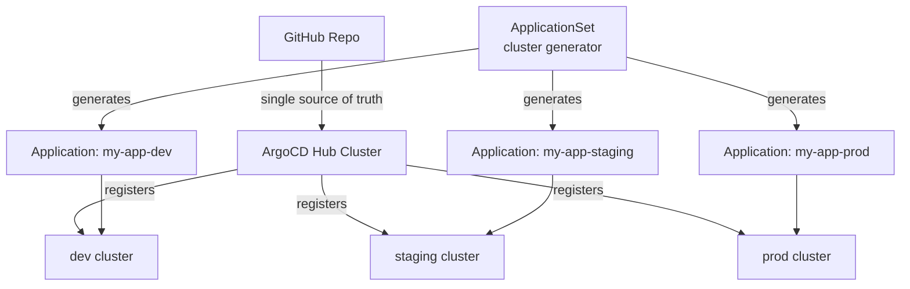

# Project 18 — Multi-Cluster Management with ArgoCD

> 🔴 **Senior Track** | 👥 Team (2–3) | ⏱ 5–6 hours
> **Seniority Path:** Managing one cluster is table stakes. Senior platform engineers manage fleets. This is how.

---

## Overview

Register **3 clusters** (dev, staging, prod) into a single ArgoCD instance. Use **ApplicationSets** with cluster generators to deploy applications across all clusters from one repo. Implement cluster-aware configuration — same app, different values per cluster. Manage cross-cluster secrets and context switching.

**Why this matters:** Production engineering at scale means tens of clusters across regions, environments, and business units. One ArgoCD hub managing all of them is the standard pattern. This is how platform teams at Spotify, Airbnb, and any major cloud-native company operate.

## Architecture



## Learning Objectives
- Register external clusters into ArgoCD
- Use ApplicationSet cluster generators
- Implement cluster-aware Helm values
- Use `argocd cluster` commands for fleet management
- Understand the hub-spoke vs shared control plane patterns
- Manage kubeconfig for multiple clusters with kubectx

---

## Step 1 — Register Clusters in ArgoCD

```bash
# Log in to ArgoCD
argocd login <argocd-server> --username admin --password <pass>

# List currently registered clusters
argocd cluster list

# Add dev cluster (run from a context that has admin access to that cluster)
kubectx dev-cluster
argocd cluster add dev-cluster \
  --name dev \
  --label env=dev \
  --label region=us-central1

# Add staging
kubectx staging-cluster
argocd cluster add staging-cluster \
  --name staging \
  --label env=staging \
  --label region=us-central1

# Add prod
kubectx prod-cluster
argocd cluster add prod-cluster \
  --name prod \
  --label env=prod \
  --label region=us-east1

# Verify all 3 registered
argocd cluster list
```

> 📸 **Expected:** `argocd cluster list` shows 4 entries — the hub cluster (in-cluster) plus dev, staging, prod. Each shows Server, Name, Version, Status (Successful).

---

## Step 2 — Cluster Labels in Secrets

ArgoCD stores cluster credentials as Secrets. Labels on those secrets drive the ApplicationSet generator.

```bash
# See the cluster secrets
kubectl get secrets -n argocd -l argocd.argoproj.io/secret-type=cluster

# Inspect one
kubectl get secret -n argocd \
  $(kubectl get secret -n argocd -l argocd.argoproj.io/secret-type=cluster -o jsonpath='{.items[0].metadata.name}') \
  -o jsonpath='{.metadata.labels}' | python3 -m json.tool
```

---

## Step 3 — ApplicationSet with Cluster Generator

```yaml
# multi-cluster-appset.yaml
apiVersion: argoproj.io/v1alpha1
kind: ApplicationSet
metadata:
  name: my-app-all-clusters
  namespace: argocd
spec:
  generators:
    - clusters:
        selector:
          matchLabels:
            argocd.argoproj.io/secret-type: cluster
        # Only target clusters with an env label
        values:
          revision: main

  template:
    metadata:
      name: "my-app-{{name}}"          # e.g. my-app-dev, my-app-prod
      labels:
        env: "{{metadata.labels.env}}"
    spec:
      project: default
      source:
        repoURL: https://github.com/YOUR_ORG/platform-repo.git
        targetRevision: "{{values.revision}}"
        path: apps/my-app
        helm:
          valueFiles:
            # Cluster-specific values file
            - "values-{{metadata.labels.env}}.yaml"
      destination:
        server: "{{server}}"           # The cluster's API endpoint
        namespace: my-app
      syncPolicy:
        automated:
          prune: true
          selfHeal: true
        syncOptions:
          - CreateNamespace=true
```

```bash
kubectl apply -f multi-cluster-appset.yaml

# Watch apps being generated
kubectl get applications -n argocd -w
# my-app-dev, my-app-staging, my-app-prod all appear
```

> 📸 **Expected:** ArgoCD UI shows 3 applications, each targeting a different cluster. Each is Synced and Healthy with cluster-appropriate values.

---

## Step 4 — Cluster-Aware Values

```yaml
# apps/my-app/values-dev.yaml
replicaCount: 1
resources:
  requests: {cpu: 100m, memory: 128Mi}
  limits: {cpu: 500m, memory: 256Mi}
ingress:
  host: my-app.dev.internal
database:
  replicas: 1
  storageSize: 5Gi
```

```yaml
# apps/my-app/values-prod.yaml
replicaCount: 5
resources:
  requests: {cpu: 500m, memory: 512Mi}
  limits: {cpu: "2", memory: 2Gi}
ingress:
  host: my-app.company.com
database:
  replicas: 3
  storageSize: 100Gi
```

---

## Step 5 — Context Switching with kubectx

```bash
# List all contexts
kubectx

# Switch to prod cluster
kubectx prod-cluster

# Verify you're on the right cluster
kubectl config current-context
kubectl cluster-info

# Switch back to hub
kubectx hub-cluster

# Use kubens to switch namespaces quickly
kubens argocd
kubectl get applications
```

---

## Step 6 — Promote Across Clusters via Git

The GitOps promotion flow across clusters:

```bash
# Promote from dev to staging:
# 1. Test in dev
# 2. Create PR: bump image tag in values-staging.yaml
git checkout -b promote/my-app-v2-to-staging
sed -i 's/tag: "1.0.0"/tag: "2.0.0"/' apps/my-app/values-staging.yaml
git commit -am "promote: my-app v2.0.0 to staging"
git push origin promote/my-app-v2-to-staging
# 3. Open PR, get reviewed, merge
# 4. ArgoCD detects change, syncs staging cluster
# 5. Verify in staging
# 6. Repeat for prod
```

---

## Step 7 — Monitor the Fleet

```bash
# Overall fleet health
argocd app list

# Check a specific cluster's apps
argocd app list --label env=prod

# Get detailed status
argocd app get my-app-prod

# Force sync all apps on a cluster
argocd app sync -l env=staging

# Check which clusters are healthy
argocd cluster stats
```

## Validation Checklist
- [ ] All 3 clusters registered in ArgoCD (`argocd cluster list`)
- [ ] ApplicationSet generates one Application per cluster
- [ ] Each application uses cluster-specific values (different replicas, resources)
- [ ] Change to `values-dev.yaml` → only dev cluster syncs
- [ ] Promotion flow: merge PR → ArgoCD auto-deploys to target cluster
- [ ] `kubectx` switching works cleanly between clusters

## Troubleshooting

**Cluster registration fails** — The kubeconfig context must have cluster-admin access. Check: `kubectl auth can-i '*' '*' --all-namespaces`

**ApplicationSet not generating apps for all clusters** — Check `matchLabels` in the generator. Labels must exist on the cluster Secret in the argocd namespace.

**Cross-cluster auth fails after token expiry** — ArgoCD cluster credentials use service account tokens. Rotate with: `argocd cluster rotate-auth <cluster-name>`

## Extension Challenges
1. Implement **Progressive Delivery across clusters** — canary to dev, 10% to staging, 100% to prod using ArgoCD Rollouts
2. Set up **ArgoCD Image Updater** to automatically bump image tags when a new image is pushed to the registry
3. Configure **cluster-level Prometheus federation** — scrape metrics from all 3 clusters into a central Grafana

## Resources
- [ArgoCD Cluster Management](https://argo-cd.readthedocs.io/en/stable/operator-manual/declarative-setup/#clusters)
- [ApplicationSet Cluster Generator](https://argocd-applicationset.readthedocs.io/en/stable/Generators-Cluster/)
- [kubectx/kubens](https://github.com/ahmetb/kubectx)
- 📺 [ArgoCD Multi-Cluster Setup — Viktor Farcic](https://www.youtube.com/watch?v=HGOfDFoEqNg)
