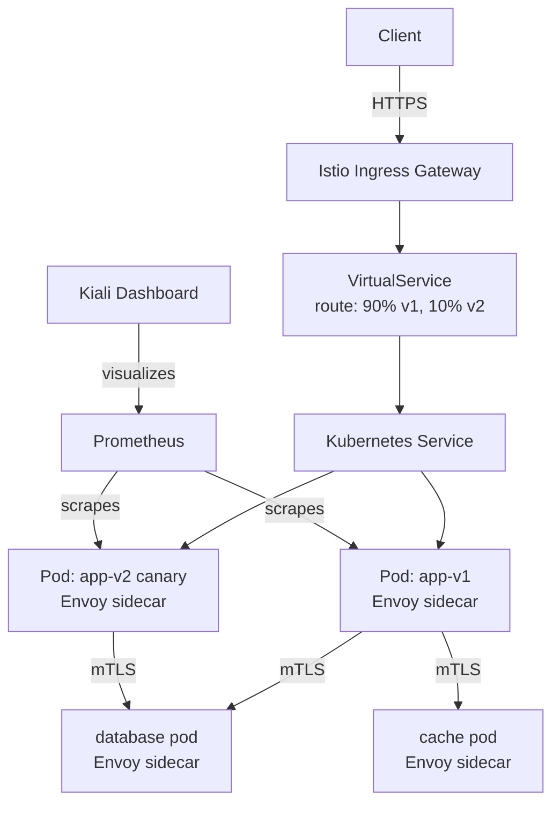

# Project 19 — Istio Service Mesh Deep Dive

> 🔴 **Senior Track** | 👥 Team (2–3) | ⏱ 7–9 hours
> **Seniority Path:** The class labs introduce Istio. This project goes deep — mTLS, circuit breakers, fault injection, canary traffic splitting. This is what senior engineers mean when they say "we have a service mesh."

---

## Overview

Deploy Istio on your cluster and implement the full production feature set: **mutual TLS** between all services (zero-trust pod-to-pod encryption), **traffic splitting** for canary deployments without ArgoCD Rollouts, **circuit breakers** to stop cascading failures, **retries and timeouts** for resilience, and **fault injection** to test how your app behaves when dependencies fail.

**Why this matters:** Service mesh is on almost every senior K8s job description. Interviewers ask about mTLS, traffic management, and observability regularly. Most candidates can install Istio — few can explain what PeerAuthentication, DestinationRule, and VirtualService each do and why.

## Architecture



## Learning Objectives
- Install Istio using istioctl
- Understand the sidecar injection model
- Configure mutual TLS (mTLS) with PeerAuthentication
- Write VirtualService and DestinationRule for traffic management
- Implement canary traffic splitting (weight-based routing)
- Configure circuit breakers and connection pool limits
- Use fault injection to test resilience
- Observe traffic with Kiali

---

## Step 1 — Install Istio

```bash
# Download istioctl
curl -L https://istio.io/downloadIstio | sh -
export PATH=$PWD/istio-*/bin:$PATH

# Install with demo profile (includes Kiali, Jaeger, Grafana, Prometheus)
istioctl install --set profile=demo -y

# Verify installation
kubectl get pods -n istio-system
istioctl verify-install

# Enable sidecar injection for your namespace
kubectl label namespace default istio-injection=enabled

# Verify label
kubectl get namespace default --show-labels
```

> 📸 **Expected:** istiod, istio-ingressgateway, istio-egressgateway all Running. `istio-injection=enabled` label on namespace.

---

## Step 2 — Deploy the Test App

```yaml
# bookinfo.yaml — Istio's canonical demo app
# Or deploy your own multi-service app from Project 1

# Deploy Istio's bookinfo sample
kubectl apply -f https://raw.githubusercontent.com/istio/istio/release-1.20/samples/bookinfo/platform/kube/bookinfo.yaml

# Verify sidecars injected (2/2 containers in each pod)
kubectl get pods
# NAME                    READY   STATUS
# productpage-xxx         2/2     Running   ← 2/2 = app + Envoy sidecar
# details-xxx             2/2     Running
# reviews-v1-xxx          2/2     Running
# reviews-v2-xxx          2/2     Running
# reviews-v3-xxx          2/2     Running
```

---

## Step 3 — Mutual TLS (Zero-Trust Pod Communication)

By default, Istio runs in PERMISSIVE mode — accepts both plaintext and mTLS. Switch to STRICT.

```yaml
# peer-auth-strict.yaml
apiVersion: security.istio.io/v1beta1
kind: PeerAuthentication
metadata:
  name: default
  namespace: default
spec:
  mtls:
    mode: STRICT    # Reject ALL plaintext traffic between pods
```

```bash
kubectl apply -f peer-auth-strict.yaml

# Test: try to reach a service without a sidecar (no mTLS cert)
kubectl run test --image=curlimages/curl --rm -it --restart=Never -- \
  curl http://productpage:9080/productpage
# Should fail — pod has no sidecar, can't present mTLS cert

# Verify mTLS is working from a sidecar-injected pod
kubectl exec -it $(kubectl get pod -l app=ratings -o jsonpath='{.items[0].metadata.name}') \
  -c ratings -- curl http://productpage:9080/productpage
# Should succeed — sidecar handles mTLS automatically
```

> 📸 **Expected:** Direct curl from un-injected pod fails. Curl from injected pod succeeds. All pod-to-pod traffic is now encrypted and authenticated.

---

## Step 4 — Traffic Splitting (Canary)

Route 90% of traffic to reviews-v1 and 10% to reviews-v3.

```yaml
# destination-rule.yaml
apiVersion: networking.istio.io/v1alpha3
kind: DestinationRule
metadata:
  name: reviews
spec:
  host: reviews
  subsets:
    - name: v1
      labels:
        version: v1
    - name: v2
      labels:
        version: v2
    - name: v3
      labels:
        version: v3
---
# virtual-service-canary.yaml
apiVersion: networking.istio.io/v1alpha3
kind: VirtualService
metadata:
  name: reviews
spec:
  hosts:
    - reviews
  http:
    - route:
        - destination:
            host: reviews
            subset: v1
          weight: 90
        - destination:
            host: reviews
            subset: v3
          weight: 10     # 10% of traffic to v3 (canary)
```

```bash
kubectl apply -f destination-rule.yaml
kubectl apply -f virtual-service-canary.yaml

# Generate traffic and watch distribution
for i in $(seq 1 100); do
  kubectl exec -it $(kubectl get pod -l app=productpage -o jsonpath='{.items[0].metadata.name}') \
    -c productpage -- curl -s http://reviews:9080/reviews/1 | grep -o '"color": "[^"]*"'
done | sort | uniq -c
# ~90 hits to v1, ~10 hits to v3
```

---

## Step 5 — Circuit Breaker

Prevent cascading failures by limiting connections to an unhealthy service.

```yaml
# circuit-breaker.yaml
apiVersion: networking.istio.io/v1alpha3
kind: DestinationRule
metadata:
  name: reviews-circuit-breaker
spec:
  host: reviews
  trafficPolicy:
    connectionPool:
      tcp:
        maxConnections: 10        # Max concurrent TCP connections
      http:
        http1MaxPendingRequests: 5  # Queue max 5 requests before rejecting
        maxRequestsPerConnection: 2
    outlierDetection:
      consecutive5xxErrors: 3     # Eject host after 3 consecutive 5xx errors
      interval: 10s               # Check every 10 seconds
      baseEjectionTime: 30s       # Eject for 30 seconds
      maxEjectionPercent: 50      # Never eject more than 50% of hosts
```

```bash
kubectl apply -f circuit-breaker.yaml

# Test: overwhelm the service
kubectl run fortio --image=fortio/fortio --rm -it --restart=Never -- \
  load -c 20 -qps 1000 -n 500 http://reviews:9080/reviews/1
# Watch circuit breaker trip — some requests get 503 (overflow), protected downstream
```

---

## Step 6 — Retries and Timeouts

```yaml
# virtual-service-resilience.yaml
apiVersion: networking.istio.io/v1alpha3
kind: VirtualService
metadata:
  name: reviews
spec:
  hosts:
    - reviews
  http:
    - timeout: 3s                 # Fail fast — don't wait more than 3s
      retries:
        attempts: 3               # Retry up to 3 times
        perTryTimeout: 1s         # Each attempt must respond in 1s
        retryOn: 5xx,reset,connect-failure,retriable-4xx
      route:
        - destination:
            host: reviews
            subset: v1
```

---

## Step 7 — Fault Injection

Test how your app handles downstream failures — WITHOUT actually breaking the downstream service.

```yaml
# fault-injection.yaml — inject a 5-second delay for 50% of requests to ratings
apiVersion: networking.istio.io/v1alpha3
kind: VirtualService
metadata:
  name: ratings
spec:
  hosts:
    - ratings
  http:
    - fault:
        delay:
          percentage:
            value: 50.0           # 50% of requests get delayed
          fixedDelay: 5s
      route:
        - destination:
            host: ratings
            subset: v1
```

```bash
kubectl apply -f fault-injection.yaml

# Access the app — about 50% of page loads will be slow
# Check if your timeout (3s) fires before the 5s delay resolves
curl -o /dev/null -s -w "Total: %{time_total}s\n" http://<ingress-ip>/productpage
```

> 📸 **Expected:** ~50% of requests time out at 3s. The other 50% complete normally. This proves your timeout config is working correctly.

---

## Step 8 — Kiali Dashboard (Traffic Visualization)

```bash
kubectl port-forward svc/kiali -n istio-system 20001:20001 &
# Open http://localhost:20001
# Login: admin/admin
```

Navigate to Graph → select default namespace → show traffic flow.

> 📸 **Expected:** Live animated graph showing traffic flowing between productpage → reviews → ratings/details. Line thickness = traffic volume. Color = error rate (green/yellow/red). You can see the 90/10 split visually.

---

## Validation Checklist
- [ ] All pods show 2/2 (app + sidecar) after injection enabled
- [ ] STRICT mTLS rejects plaintext pod-to-pod traffic
- [ ] 90/10 traffic split verified by counting responses
- [ ] Circuit breaker trips under load (503s visible in Fortio output)
- [ ] Timeout fires before the 5s fault injection delay
- [ ] Kiali shows live traffic graph with correct weights
- [ ] `istioctl analyze` reports no configuration issues

## Troubleshooting

**Pods stuck in CrashLoopBackOff after enabling injection** — sidecar init container needs `NET_ADMIN` capability. Check if a Kyverno policy is blocking privileged containers.

**mTLS causing connection refused** — A pod without a sidecar is trying to reach a STRICT mTLS service. Either inject the pod or use a PeerAuthentication exception for that specific port.

**Kiali showing unknown traffic** — Telemetry addons (Prometheus/Grafana) must be installed. `kubectl get pods -n istio-system | grep -E 'prometheus|grafana|kiali'`

## Extension Challenges
1. Implement **JWT authentication** with RequestAuthentication — only requests with a valid JWT token can reach the productpage
2. Configure **Istio egress control** — block all outbound traffic except to explicitly allowed external services
3. Set up **distributed tracing with Jaeger** — trace a single user request across all microservices and see where latency lives

## Resources
- [Istio Docs](https://istio.io/latest/docs/)
- [Istio Traffic Management](https://istio.io/latest/docs/concepts/traffic-management/)
- [Kiali](https://kiali.io/)
- 📺 [Istio Service Mesh Explained — TechWorld with Nana](https://www.youtube.com/watch?v=voAyroDb6xk)
- 📺 [Istio in Production — Google Cloud Next](https://www.youtube.com/watch?v=7cINRP0BFY8)
- 📖 [Istio in Action (Manning)](https://www.manning.com/books/istio-in-action)
