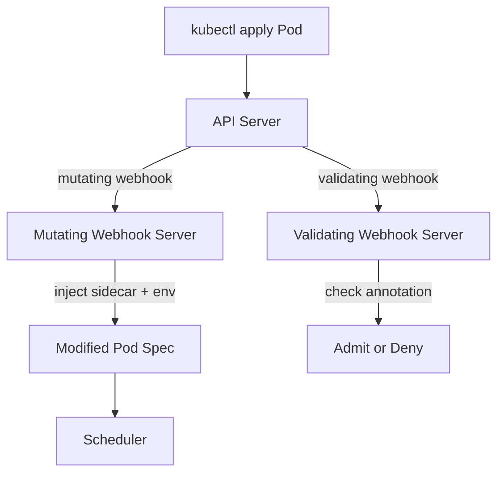

# Project 21 — Build a Custom Admission Webhook

> 🔴 **Senior Track** | 👥 Team (2–3) | ⏱ 6–8 hours
> **Seniority Path:** Admission webhooks are how Istio, Datadog, and Kyverno inject their agents. Writing one means you understand Kubernetes from the inside.

---

## Overview

Write a **validating** and **mutating admission webhook** from scratch in Python. The mutating webhook automatically injects an environment variable and a sidecar container into every Pod created in a labeled namespace. The validating webhook enforces a custom business rule — no Pod may be created without a specific annotation that CI/CD stamps on every image build. This is exactly how Istio, Datadog, and Vault inject their agents.

**Why this matters at work:** Every company running Kubernetes at scale eventually writes a custom admission webhook — to enforce internal standards, inject secrets, or add audit trails that no off-the-shelf tool handles. This project proves you can build that capability.

## Architecture



## Learning Objectives
- Write an HTTP webhook server that handles AdmissionReview requests
- Implement both MutatingWebhookConfiguration and ValidatingWebhookConfiguration
- Understand base64-encoded patch operations in mutating responses
- Generate and configure TLS certificates for the webhook server
- Test webhooks locally with kind before deploying

## Prerequisites
- [ ] Python 3.9+ installed
- [ ] Project 10 (Kyverno) completed — understand admission webhooks conceptually
- [ ] OpenSSL for generating TLS certificates

---

## Key Steps

### Step 1 — Write the Webhook Server

```python
# webhook.py
from flask import Flask, request, jsonify
import base64, json, logging

app = Flask(__name__)

@app.route('/mutate', methods=['POST'])
def mutate():
    """Mutating webhook: inject ENV var and sidecar into every Pod."""
    admission_review = request.get_json()
    uid = admission_review['request']['uid']
    
    # JSON Patch to add env var to first container
    patch = [
        {
            "op": "add",
            "path": "/spec/containers/0/env/-",
            "value": {"name": "INJECTED_BY", "value": "emagetech-webhook"}
        }
    ]
    
    patch_b64 = base64.b64encode(json.dumps(patch).encode()).decode()
    
    return jsonify({
        "apiVersion": "admission.k8s.io/v1",
        "kind": "AdmissionReview",
        "response": {
            "uid": uid,
            "allowed": True,
            "patchType": "JSONPatch",
            "patch": patch_b64
        }
    })

@app.route('/validate', methods=['POST'])
def validate():
    """Validating webhook: require build-id annotation."""
    admission_review = request.get_json()
    uid = admission_review['request']['uid']
    obj = admission_review['request']['object']
    
    annotations = obj.get('metadata', {}).get('annotations', {})
    has_build_id = 'emagetech.io/build-id' in annotations
    
    return jsonify({
        "apiVersion": "admission.k8s.io/v1",
        "kind": "AdmissionReview",
        "response": {
            "uid": uid,
            "allowed": has_build_id,
            "status": {
                "message": "Missing required annotation: emagetech.io/build-id"
            } if not has_build_id else {}
        }
    })

if __name__ == '__main__':
    app.run(host='0.0.0.0', port=8443,
            ssl_context=('/certs/tls.crt', '/certs/tls.key'))
```

### Step 2 — Generate TLS Certificate

```bash
# Webhooks MUST use HTTPS — generate a self-signed cert
openssl req -x509 -newkey rsa:4096 -keyout tls.key -out tls.crt   -days 365 -nodes   -subj "/CN=webhook.default.svc"   -addext "subjectAltName=DNS:webhook.default.svc,DNS:webhook.default.svc.cluster.local"

# Store as a Secret
kubectl create secret tls webhook-tls --cert=tls.crt --key=tls.key

# Get the CA bundle for the webhook config
CA_BUNDLE=$(cat tls.crt | base64 | tr -d '\n')
```

### Step 3 — Register the Webhook

```yaml
# webhook-config.yaml
apiVersion: admissionregistration.k8s.io/v1
kind: MutatingWebhookConfiguration
metadata:
  name: emagetech-mutating
webhooks:
  - name: mutate.emagetech.io
    clientConfig:
      service:
        name: webhook
        namespace: default
        path: /mutate
      caBundle: <CA_BUNDLE_HERE>
    rules:
      - apiGroups: [""]
        apiVersions: ["v1"]
        resources: ["pods"]
        operations: ["CREATE"]
    namespaceSelector:
      matchLabels:
        webhook-injection: enabled
    admissionReviewVersions: ["v1"]
    sideEffects: None
    failurePolicy: Ignore   # Don't block pods if webhook is down
```

### Step 4 — Test It

```bash
# Label a namespace for injection
kubectl label namespace test-ns webhook-injection=enabled

# Deploy a pod (without the annotation first)
kubectl run test-pod --image=nginx:1.25 -n test-ns
# Should be BLOCKED by validating webhook

# Deploy with the required annotation
kubectl run test-pod --image=nginx:1.25 -n test-ns   --annotations="emagetech.io/build-id=build-20260415-001"
# Should be ADMITTED

# Check that ENV was injected
kubectl exec test-pod -n test-ns -- env | grep INJECTED_BY
# INJECTED_BY=emagetech-webhook
```

---

## Validation Checklist
- [ ] Webhook server running and TLS-configured
- [ ] MutatingWebhookConfiguration registered
- [ ] ValidatingWebhookConfiguration registered
- [ ] Pod without annotation is BLOCKED
- [ ] Pod with annotation is ADMITTED
- [ ] ENV var injected: `kubectl exec <pod> -- env | grep INJECTED_BY`
- [ ] Webhook failure policy set to Ignore (doesn't block pods if webhook is down)

## Resources
- [Admission Webhooks](https://kubernetes.io/docs/reference/access-authn-authz/extensible-admission-controllers/)
- [kopf](https://kopf.readthedocs.io/)
- 📺 [Writing a Kubernetes Admission Webhook — CNCF](https://www.youtube.com/watch?v=_EyM5-o0WSE)
