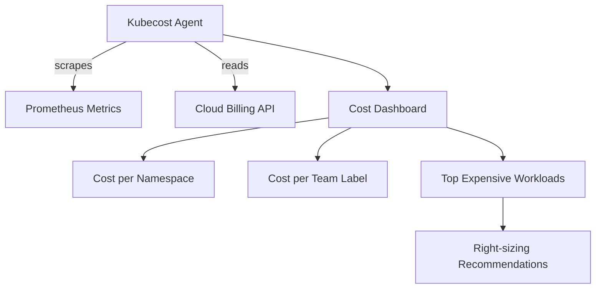

# Project 22 — Kubernetes Cost Optimization (FinOps)

> 🔴 **Senior Track** | 👥 Team (2–3) | ⏱ 5–6 hours
> **Seniority Path:** Cloud bills are a business-level concern. The engineer who speaks cost fluently gets promoted.

---

## Overview

Install **Kubecost** (or OpenCost), identify your top 5 most expensive workloads, right-size them using VPA recommendations, configure spot nodes for batch workloads, and document the projected monthly savings. Present a FinOps report showing cost per namespace, cost per team, and optimization recommendations.

**Why this matters at work:** In 2025, Kubernetes infrastructure costs are the second-largest line item at most cloud-native companies (after headcount). Engineers who understand and reduce cloud spend are highly valued — especially in the current cost-conscious market.

## Architecture



## Learning Objectives
- Install and configure Kubecost for multi-namespace cost visibility
- Read and interpret cost allocation reports
- Use VPA recommendations to right-size CPU and memory requests
- Configure spot node taints and tolerations for cost reduction
- Write a FinOps report with quantified savings projections

## Prerequisites
- [ ] Projects 1–4 deployed (workloads to measure costs against)
- [ ] Cloud provider billing API access
- [ ] metrics-server installed

---

## Key Steps

### Step 1 — Install Kubecost

```bash
helm repo add kubecost https://kubecost.github.io/cost-analyzer/
helm install kubecost kubecost/cost-analyzer   --namespace kubecost --create-namespace   --set kubecostToken="YOUR_TOKEN"   --set global.prometheus.enabled=false   --set global.prometheus.fqdn=http://kube-prometheus-stack-prometheus.monitoring:9090

kubectl rollout status deployment/kubecost-cost-analyzer -n kubecost

kubectl port-forward svc/kubecost-cost-analyzer -n kubecost 9090:9090 &
# Open http://localhost:9090
```

### Step 2 — Identify Top 5 Most Expensive Workloads

In the Kubecost UI:
- **Cost Allocation → Namespace** — see spend by namespace
- **Cost Allocation → Deployment** — identify top 5 most expensive workloads
- **Savings → Right-sizing** — get VPA-based recommendations

Document findings in a table:
```markdown
| Workload | Namespace | Current Monthly Cost | Recommended | Projected Saving |
|---------|-----------|---------------------|-------------|-----------------|
| api-v2  | prod      | $45/month           | Reduce CPU  | $18/month (40%) |
```

### Step 3 — Right-Size Workloads

```bash
# Install VPA in recommendation mode
kubectl apply -f https://github.com/kubernetes/autoscaler/releases/latest/download/vertical-pod-autoscaler.yaml

# Apply VPA to a deployment
kubectl apply -f - <<EOF
apiVersion: autoscaling.k8s.io/v1
kind: VerticalPodAutoscaler
metadata:
  name: api-vpa
spec:
  targetRef:
    apiVersion: apps/v1
    kind: Deployment
    name: api
  updatePolicy:
    updateMode: "Off"    # Recommendation only — don't auto-update
EOF

# After 24h, check recommendations
kubectl describe vpa api-vpa
# Look for: Lower Bound, Target, Upper Bound for CPU and memory
```

### Step 4 — Configure Spot Nodes for Cost Reduction

```yaml
# Annotate batch workloads to use spot nodes (60-80% cheaper)
spec:
  tolerations:
    - key: "cloud.google.com/gke-spot"
      operator: "Equal"
      value: "true"
      effect: "NoSchedule"
  nodeSelector:
    cloud.google.com/gke-spot: "true"
```

### Step 5 — Write Your FinOps Report

```markdown
# FinOps Report — April 2026

## Current Monthly Spend: $XXX

## Top 5 Most Expensive Workloads
[table from Step 2]

## Optimization Actions Taken
1. Right-sized api-v2: CPU 1000m→250m, Memory 2Gi→512Mi → saves $18/mo
2. Moved nightly-backup cronjob to spot nodes → saves $12/mo
3. [etc]

## Projected Monthly Savings: $XX (XX% reduction)
## Payback Period: immediate
```

---

## Validation Checklist
- [ ] Kubecost UI accessible and showing cost data
- [ ] Top 5 most expensive workloads identified with costs
- [ ] VPA recommendations reviewed for at least 3 workloads
- [ ] At least one workload right-sized based on data
- [ ] Spot node pool configured for batch workloads
- [ ] FinOps report written with projected savings

## Resources
- [Kubecost Docs](https://docs.kubecost.com/)
- [OpenCost](https://www.opencost.io/)
- 📺 [Kubernetes Cost Optimization — CNCF](https://www.youtube.com/watch?v=XDiNY3b5_oM)
- 📖 [Cloud FinOps (O'Reilly)](https://www.oreilly.com/library/view/cloud-finops/9781492054610/)
