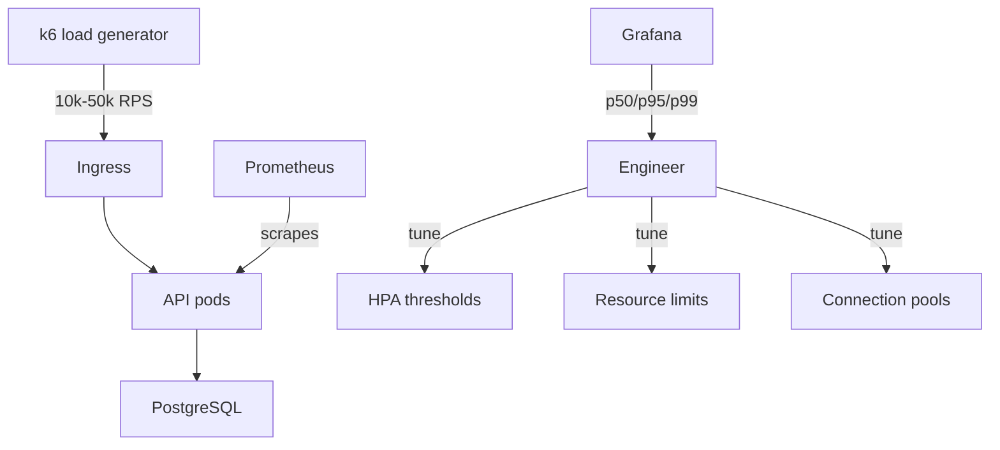

# Project 23 — Performance Engineering & Load Testing at Scale

> 🔴 **Senior Track** | 👥 Team (2–3) | ⏱ 5–7 hours
> **Seniority Path:** Senior engineers profile and tune applications under real load. Guessing at resource limits is junior behaviour.

---

## Overview

Use **k6** to generate 10,000–50,000 requests per second against your multi-tier application from Project 1. Profile bottlenecks using `kubectl top`, Grafana dashboards, and flame graphs. Tune HPA thresholds, resource limits, connection pool sizes, and replica counts based on real p50/p95/p99 latency data — not guesses. Show quantified before/after results.

**Why this matters at work:** "It's slow in production" is one of the most common and most frustrating incidents. Engineers who can reproduce load conditions, identify bottlenecks with data, and tune systematically are the ones who get paged and trusted.

## Architecture



## Learning Objectives
- Write k6 test scripts with realistic load patterns (ramp-up, steady state, spike)
- Read and interpret p50/p95/p99 latency metrics
- Use kubectl top and Grafana to identify bottlenecks under load
- Tune HPA thresholds based on measured data
- Right-size resource requests/limits based on profiling

## Prerequisites
- [ ] Project 1 or 15 deployed (app to test against)
- [ ] Project 8 observability stack running (to see metrics during test)
- [ ] k6 installed: brew install k6

---

## Key Steps

### Step 1 — Write a k6 Load Test Script

```javascript
// load-test.js
import http from 'k6/http';
import { check, sleep } from 'k6';
import { Counter, Trend } from 'k6/metrics';

const errorCount = new Counter('errors');
const responseTime = new Trend('response_time');

export const options = {
  stages: [
    { duration: '2m',  target: 100  },  // Ramp up to 100 VUs
    { duration: '5m',  target: 1000 },  // Ramp up to 1000 VUs
    { duration: '10m', target: 1000 },  // Stay at 1000 VUs (steady state)
    { duration: '2m',  target: 5000 },  // Spike to 5000 VUs
    { duration: '5m',  target: 5000 },  // Hold the spike
    { duration: '2m',  target: 0    },  // Ramp down
  ],
  thresholds: {
    'http_req_duration': ['p(95)<500'],  // 95% of requests under 500ms
    'http_req_failed':   ['rate<0.01'],  // Less than 1% errors
  },
};

export default function () {
  const BASE = 'http://api.project01.local';

  // Test the main endpoint
  const res = http.get(`${BASE}/items`);
  
  check(res, {
    'status is 200':       (r) => r.status === 200,
    'response under 500ms': (r) => r.timings.duration < 500,
  }) || errorCount.add(1);

  responseTime.add(res.timings.duration);
  sleep(0.1);  // 10 req/s per VU * 1000 VUs = 10,000 RPS at steady state
}
```

### Step 2 — Run the Test

```bash
# Run locally against the cluster
k6 run --out influxdb=http://localhost:8086/k6 load-test.js

# Or output to cloud dashboard
k6 run --out cloud load-test.js

# Real-time stats during run:
# ✓ status is 200..................: 99.87%
# ✓ response under 500ms...........: 94.12%
# http_req_duration p(95)=487ms p(99)=1.2s
```

### Step 3 — Identify Bottlenecks

```bash
# During the load test, watch in parallel:

# Pod CPU/memory
kubectl top pods --containers -n project-01 --sort-by=cpu

# HPA activity
kubectl get hpa -n project-01 -w

# PostgreSQL connections
kubectl exec -n project-01 postgres-0 --   psql -U postgres -c "SELECT count(*) FROM pg_stat_activity;"

# API pod logs for slow queries
kubectl logs -f -n project-01 -l app=api | grep -E "slow|timeout|error"
```

### Step 4 — Tune and Re-test

```bash
# Finding: HPA not scaling fast enough
# Fix: lower stabilization window
kubectl patch hpa api-hpa --type='json'   -p='[{"op":"replace","path":"/spec/behavior/scaleUp/stabilizationWindowSeconds","value":30}]'

# Finding: PostgreSQL connection pool exhausted
# Fix: add pgbouncer or increase max_connections

# Finding: CPU throttling (limits too low)
# Fix: increase limits based on actual measured usage
kubectl set resources deployment/api   --requests=cpu=200m,memory=256Mi   --limits=cpu=1000m,memory=512Mi -n project-01

# Re-run load test — compare p95 latency before/after
```

> 📸 **Expected:** Before: p95=800ms, error rate=2%. After tuning: p95=320ms, error rate=0.1%. Document the improvement with Grafana screenshots.

---

## Validation Checklist
- [ ] k6 script runs successfully to 1000+ VUs
- [ ] Grafana shows real-time metrics during load test
- [ ] Bottleneck identified (CPU/memory/DB connections)
- [ ] At least one tuning change applied
- [ ] Before/after p95 latency documented
- [ ] Error rate below 1% after tuning

## Resources
- [k6 Docs](https://k6.io/docs/)
- [Gatling](https://gatling.io/)
- 📺 [Load Testing with k6 — k6 YouTube](https://www.youtube.com/watch?v=5OgQuem9IFs)
- 📖 [Systems Performance (Brendan Gregg)](http://www.brendangregg.com/systems-performance-2nd-edition-book.html)
