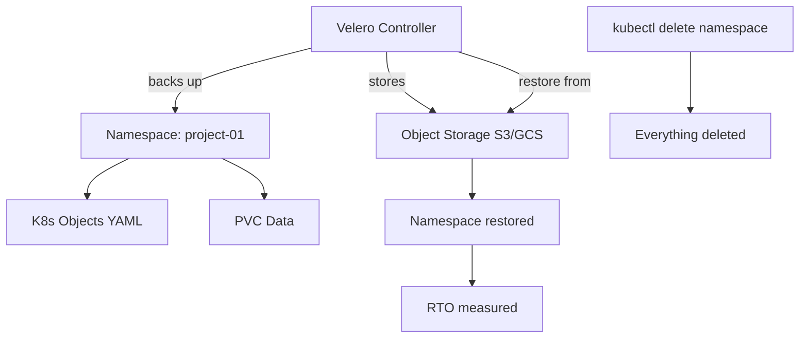

# Project 24 — Backup, Restore & Disaster Recovery with Velero

> 🔴 **Senior Track** | 👥 Team (2–3) | ⏱ 5–6 hours
> **Seniority Path:** DR is a checkbox on every enterprise compliance audit. If you haven't practiced restoring from backup, you don't have a backup.

---

## Overview

Configure **Velero** to back up an entire namespace — PVCs and all Kubernetes objects — to cloud object storage (GCS/S3). Simulate a disaster by deleting the namespace entirely. Restore from backup and measure your RTO (Recovery Time Objective) and RPO (Recovery Point Objective). Write a DR runbook that a team member could follow at 2 AM.

**Why this matters at work:** Disaster recovery is the most underrated skill in infrastructure. Most teams don't test their backups until they need them. By the time you need them, it's too late to find out they don't work.

## Architecture



## Learning Objectives
- Install Velero with cloud provider plugin (GCS/S3)
- Create scheduled and on-demand backups
- Simulate a full namespace disaster (accidental deletion)
- Restore from backup and verify data integrity
- Measure and document RTO and RPO
- Write a DR runbook

## Prerequisites
- [ ] Cloud object storage bucket created (GCS or S3)
- [ ] Cloud provider credentials configured
- [ ] Projects 1 or 15 deployed with PVCs (something worth backing up)

---

## Key Steps

### Step 1 — Install Velero

```bash
# Install Velero CLI
brew install velero  # Mac
# Linux: download from https://github.com/vmware-tanzu/velero/releases

# Install Velero with GCS backend
velero install   --provider gcp   --plugins velero/velero-plugin-for-gcp:v1.9.0   --bucket your-velero-backup-bucket   --secret-file ./credentials-velero   --backup-location-config serviceAccount=velero@PROJECT.iam.gserviceaccount.com

kubectl get pods -n velero
```

### Step 2 — Create a Backup

```bash
# Back up a specific namespace (everything: pods, deployments, PVCs, secrets)
velero backup create project-01-backup   --include-namespaces project-01   --wait

# Check backup status
velero backup describe project-01-backup
velero backup logs project-01-backup

# List backups
velero backup get
```

> 📸 **Expected:** Backup shows Phase=Completed. All resources and PVC snapshots captured.

### Step 3 — Simulate Disaster

```bash
# DISASTER: accidentally delete the entire namespace
kubectl delete namespace project-01

# Verify everything is gone
kubectl get all -n project-01
# Error: namespace not found

# Services are now DOWN
curl http://api.project01.local/items
# Connection refused
```

### Step 4 — Restore and Measure RTO

```bash
# Start timer
START=$(date +%s)

# Restore from backup
velero restore create --from-backup project-01-backup --wait

# Check restore status
velero restore describe project-01-backup-<timestamp>

# Verify everything came back
kubectl get pods -n project-01
kubectl get pvc -n project-01

# Verify data is intact
curl http://api.project01.local/items
# Items should be back!

END=$(date +%s)
echo "RTO: $((END - START)) seconds"
```

> 📸 **Expected:** Full namespace restored with data intact. RTO should be under 5 minutes for a small namespace.

### Step 5 — Configure Scheduled Backups

```bash
velero schedule create daily-backup   --schedule="0 1 * * *"   --include-namespaces project-01,prod   --ttl 720h    # Keep backups for 30 days

velero schedule get
```

### Step 6 — Write the DR Runbook

```markdown
# DR Runbook: Full Namespace Restore

## Trigger Conditions
- Namespace accidentally deleted
- Mass deployment misconfiguration
- Ransomware / data corruption event

## RTO Target: 10 minutes
## RPO Target: 24 hours (daily backups)

## Steps
1. Confirm disaster scope: `kubectl get namespaces`
2. Identify most recent backup: `velero backup get`
3. Start restore: `velero restore create --from-backup <name> --wait`
4. Monitor: `velero restore describe <restore-name>`
5. Verify: `kubectl get pods -n <namespace>`
6. Test application: curl health endpoint
7. Declare recovery complete

## Contacts
- On-call: check PagerDuty
- Escalation: admin@emagegroup.net
```

---

## Validation Checklist
- [ ] Velero installed and backup location configured
- [ ] On-demand backup created and completed
- [ ] Namespace deleted (disaster simulated)
- [ ] Restore completed successfully
- [ ] Data verified intact after restore
- [ ] RTO measured and documented
- [ ] Scheduled daily backup configured
- [ ] DR runbook written

## Resources
- [Velero Docs](https://velero.io/docs/)
- [Velero GCP Plugin](https://github.com/vmware-tanzu/velero-plugin-for-gcp)
- 📺 [Disaster Recovery with Velero](https://www.youtube.com/watch?v=C9hzrexaIDA)
