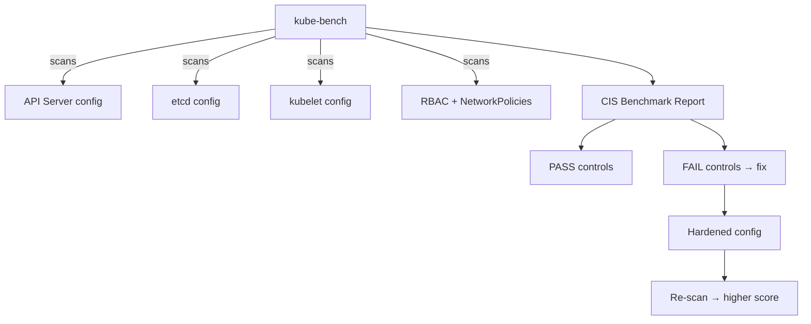

# Project 25 — CIS Benchmark Hardening with kube-bench

> 🔴 **Senior Track** | 👥 Team (2–3) | ⏱ 5–7 hours
> **Seniority Path:** CIS benchmarking is required for regulated industries (healthcare, finance, government). Running kube-bench and fixing the findings is a named responsibility on many senior JDs.

---

## Overview

Run **kube-bench** against your cluster and get a baseline CIS Kubernetes Benchmark score. Work systematically through every failing control — API server flags, etcd file permissions, kubelet hardening, audit logging, network policy requirements — and document the fix for each. Rerun kube-bench to show measurable improvement. This is exactly what a security auditor does before your company signs an enterprise contract.

**Why this matters at work:** CIS Kubernetes Benchmark compliance is required for FedRAMP, DoD IL-2/4/5, SOC2 Type II, and many enterprise customer security reviews. Knowing how to run and remediate kube-bench findings is a named skill in job descriptions for government and financial services roles.

## Architecture



## Learning Objectives
- Run kube-bench and interpret the CIS benchmark report
- Harden the Kubernetes API server configuration flags
- Fix etcd file permission issues
- Configure kubelet security settings
- Enable and configure audit logging
- Document every fix in a hardening runbook

## Prerequisites
- [ ] Cluster admin access (kube-bench needs to read config files)
- [ ] SSH access to control plane node (for kubeadm/self-managed clusters)
- [ ] Project 3 RBAC configured

---

## Key Steps

### Step 1 — Run kube-bench

```bash
# Run on a control plane node
kubectl apply -f https://raw.githubusercontent.com/aquasecurity/kube-bench/main/job-master.yaml
kubectl logs job/kube-bench-master

# Run on a worker node
kubectl apply -f https://raw.githubusercontent.com/aquasecurity/kube-bench/main/job-node.yaml
kubectl logs job/kube-bench-node

# Run all checks at once
kubectl apply -f https://raw.githubusercontent.com/aquasecurity/kube-bench/main/job.yaml
kubectl logs job/kube-bench
```

### Step 2 — Understand the Output

```
[INFO] 1 Control Plane Security Configuration
[INFO] 1.1 Control Plane Node Configuration Files
[PASS] 1.1.1 Ensure that the API server pod specification file permissions are set to 600 or more restrictive
[FAIL] 1.1.2 Ensure that the API server pod specification file ownership is set to root:root
[WARN] 1.1.11 Ensure that the etcd data directory permissions are set to 700 or more restrictive
```

**PASS** = control is satisfied
**FAIL** = must fix (failed audit)
**WARN** = manual check required

### Step 3 — Fix Common Failures

```bash
# Fix 1.1.2: API server file ownership
# SSH to control plane:
sudo chown root:root /etc/kubernetes/manifests/kube-apiserver.yaml

# Fix 1.2.1: API server anonymous auth disabled
# Edit /etc/kubernetes/manifests/kube-apiserver.yaml:
# Add: - --anonymous-auth=false

# Fix 1.2.6: API server audit logging
cat > /etc/kubernetes/audit-policy.yaml << EOF
apiVersion: audit.k8s.io/v1
kind: Policy
rules:
  - level: RequestResponse
    resources:
      - group: ""
        resources: ["secrets"]
  - level: Metadata
    resources:
      - group: ""
        resources: ["pods"]
  - level: None
    users: ["system:kube-proxy"]
EOF

# Add to kube-apiserver.yaml:
# - --audit-log-path=/var/log/kubernetes/audit.log
# - --audit-policy-file=/etc/kubernetes/audit-policy.yaml
# - --audit-log-maxage=30
# - --audit-log-maxbackup=10

# Fix 4.2.1: kubelet anonymous auth disabled
# Edit /var/lib/kubelet/config.yaml:
# authentication:
#   anonymous:
#     enabled: false

sudo systemctl restart kubelet
```

### Step 4 — Re-run and Compare

```bash
kubectl delete job kube-bench
kubectl apply -f https://raw.githubusercontent.com/aquasecurity/kube-bench/main/job.yaml
kubectl logs job/kube-bench | grep -E "PASS|FAIL|WARN" | sort | uniq -c

# Document improvement:
# Before: 28 PASS, 15 FAIL, 12 WARN
# After:  39 PASS, 4 FAIL, 12 WARN
```

> 📸 **Expected:** Measurable improvement in PASS count. Document every fix with before/after screenshots.

---

## Validation Checklist
- [ ] kube-bench ran successfully on control plane and workers
- [ ] Baseline score documented (screenshot)
- [ ] At least 5 FAIL controls remediated
- [ ] Audit logging enabled
- [ ] kubelet anonymous auth disabled
- [ ] Re-ran kube-bench showing improvement
- [ ] Hardening runbook documenting every fix

## Resources
- [kube-bench](https://github.com/aquasecurity/kube-bench)
- [CIS Kubernetes Benchmark](https://www.cisecurity.org/benchmark/kubernetes)
- 📺 [Kubernetes Security Hardening — CNCF](https://www.youtube.com/watch?v=oBf5lrmquYI)
- 📖 [Hacking Kubernetes (O'Reilly)](https://www.oreilly.com/library/view/hacking-kubernetes/9781492081722/)
