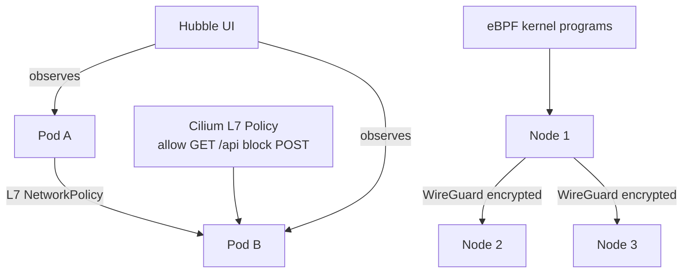

# Project 26 — eBPF Networking with Cilium

> 🔴 **Senior Track** | 👥 Team (2–3) | ⏱ 6–8 hours
> **Seniority Path:** eBPF is the direction the entire networking and observability stack is moving. Cilium knowledge is now a senior differentiator.

---

## Overview

Replace your cluster CNI with **Cilium** and implement Layer 7 NetworkPolicies (allow HTTP GET but block POST), enable **Hubble** for real-time network observability (see every connection and every drop with a GUI), and enable transparent WireGuard encryption between nodes. Observe eBPF-powered performance advantages vs iptables-based CNIs.

**Why this matters at work:** Cilium is now the default CNI for GKE Autopilot, Amazon EKS, and many enterprise clusters. eBPF networking knowledge is moving from 'nice to have' to 'expected' for senior networking and security engineers.

## Architecture



## Learning Objectives
- Replace a cluster CNI with Cilium
- Write L7 NetworkPolicies (HTTP method and path-based rules)
- Use Hubble UI to visualize live network flows
- Enable WireGuard transparent encryption between nodes
- Compare eBPF vs iptables performance under load

## Prerequisites
- [ ] A cluster where you control the CNI (kubeadm or cloud cluster with CNI override)
- [ ] Cluster admin access
- [ ] Project 17 (node management) helpful background

---

## Key Steps

### Step 1 — Install Cilium (Replace Existing CNI)

```bash
# Add Cilium Helm repo
helm repo add cilium https://helm.cilium.io/
helm repo update

# Install Cilium (replaces kube-proxy too, for max eBPF benefit)
helm install cilium cilium/cilium   --namespace kube-system   --set kubeProxyReplacement=strict   --set k8sServiceHost=<API_SERVER_IP>   --set k8sServicePort=6443   --set hubble.relay.enabled=true   --set hubble.ui.enabled=true

kubectl rollout status daemonset/cilium -n kube-system
cilium status   # cilium CLI tool
```

### Step 2 — L7 NetworkPolicy (HTTP Method-Based)

Standard Kubernetes NetworkPolicies operate at L4 (IP + port). Cilium goes deeper.

```yaml
# cilium-l7-policy.yaml
apiVersion: cilium.io/v2
kind: CiliumNetworkPolicy
metadata:
  name: api-l7-policy
  namespace: project-01
spec:
  endpointSelector:
    matchLabels:
      app: api
  ingress:
    - fromEndpoints:
        - matchLabels:
            app: frontend
      toPorts:
        - ports:
            - port: "3000"
              protocol: TCP
          rules:
            http:
              - method: "GET"
                path: "/items"        # Allow GET /items
              - method: "GET"
                path: "/health"       # Allow GET /health
              # POST, PUT, DELETE all blocked automatically
```

```bash
kubectl apply -f cilium-l7-policy.yaml

# Test: GET allowed
kubectl exec -n project-01 frontend-pod -- curl http://api-service:3000/items
# 200 OK ✅

# Test: POST blocked
kubectl exec -n project-01 frontend-pod -- curl -X POST http://api-service:3000/items -d '{}'
# Access denied 403 ✅
```

### Step 3 — Hubble Observability

```bash
# Port-forward Hubble UI
kubectl port-forward svc/hubble-ui -n kube-system 12000:80 &
# Open http://localhost:12000

# Or use CLI
hubble observe --namespace project-01
# See every network flow: src, dst, verdict (forwarded/dropped), L7 HTTP details
```

> 📸 **Expected:** Hubble UI shows a live animated graph of all connections. Dropped connections (from NetworkPolicy) show in red. L7 HTTP flows show method and path.

### Step 4 — Enable WireGuard Encryption

```bash
# Enable transparent WireGuard encryption between all nodes
helm upgrade cilium cilium/cilium   --namespace kube-system   --reuse-values   --set encryption.enabled=true   --set encryption.type=wireguard

# Verify encryption is active
cilium encrypt status
# Encryption: Wireguard
# Keys in use: 1
```

---

## Validation Checklist
- [ ] Cilium installed and all nodes healthy: `cilium status`
- [ ] L7 NetworkPolicy blocking HTTP POST but allowing GET
- [ ] Hubble UI showing live network flows
- [ ] Dropped connections visible in Hubble
- [ ] WireGuard encryption enabled: `cilium encrypt status`

## Resources
- [Cilium Docs](https://docs.cilium.io/)
- [Hubble](https://github.com/cilium/hubble)
- 📺 [Cilium & eBPF Deep Dive — KubeCon](https://www.youtube.com/watch?v=Tq4K3klcqWU)
- 📺 [eBPF Explained — Liz Rice](https://www.youtube.com/watch?v=0p987hCplbk)
