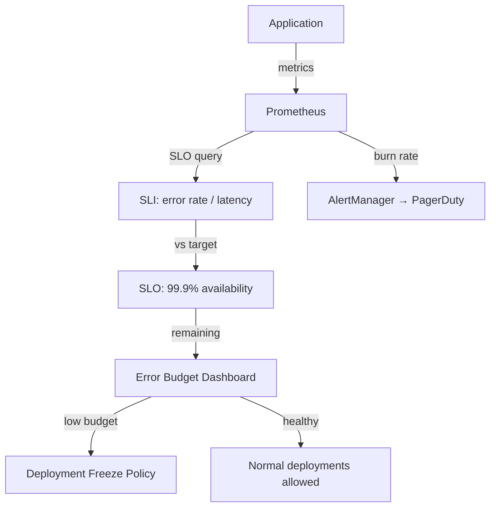

# Project 27 — SLOs, Error Budgets & Toil Reduction

> 🔴 **Senior Track** | 👥 Team (2–3) | ⏱ 5–6 hours
> **Seniority Path:** SLOs and error budgets are how SRE teams make data-driven decisions about reliability vs velocity. This is the practice that makes on-call sustainable.

---

## Overview

Define meaningful **SLOs** (Service Level Objectives) for your Project 15 capstone application — availability, latency, and error rate. Implement them in Prometheus using burn rate alerts. Build an error budget dashboard in Grafana. Configure a deployment freeze when the error budget is near exhaustion. This is the foundational SRE practice that Google, Netflix, and Cloudflare all use.

**Why this matters at work:** SLOs change the conversation from 'is it up?' to 'are we reliable enough, and how much reliability can we trade for velocity?' This is the SRE mindset shift that makes engineering organizations function at scale.

## Architecture



## Learning Objectives
- Define SLIs (what to measure) and SLOs (what target to hit)
- Implement SLO-based alerting using burn rate (faster than threshold alerts)
- Build an error budget dashboard in Grafana
- Implement a deployment freeze when budget is near exhaustion
- Conduct a quarterly SLO review and adjust targets

## Prerequisites
- [ ] Project 8 observability stack (Prometheus + Grafana) running
- [ ] Project 1 or 15 app deployed with /metrics endpoint
- [ ] AlertManager configured

---

## Key Steps

### Step 1 — Define SLIs and SLOs

```markdown
# SLO Document: Project 15 Capstone Platform

## API Service SLOs

### Availability SLO
- SLI: % of HTTP requests that return 2xx or 3xx status
- SLO: 99.9% over a 30-day rolling window (allows ~43 min downtime/month)
- Error budget: 0.1% = 43.2 minutes/month

### Latency SLO
- SLI: % of requests with latency < 500ms
- SLO: 95% of requests under 500ms
- Measured on: GET /items endpoint

### Throughput SLO
- SLI: Requests per second sustained
- SLO: System handles 500 RPS without latency SLO breach
```

### Step 2 — Implement SLO Queries in Prometheus

```yaml
# slo-rules.yaml
apiVersion: monitoring.coreos.com/v1
kind: PrometheusRule
metadata:
  name: slo-rules
  namespace: monitoring
  labels:
    release: kube-prometheus-stack
spec:
  groups:
    - name: slo.availability
      interval: 30s
      rules:
        # Rolling 30-day error rate
        - record: slo:http_availability:ratio_rate30d
          expr: |
            sum(rate(http_requests_total{status!~"5.."}[30d]))
            / sum(rate(http_requests_total[30d]))

        # Error budget consumed
        - record: slo:error_budget_remaining
          expr: |
            1 - (
              (1 - slo:http_availability:ratio_rate30d) / (1 - 0.999)
            )

        # Burn rate alert: burning budget 14x faster than sustainable
        - alert: ErrorBudgetBurningFast
          expr: |
            (
              sum(rate(http_requests_total{status=~"5.."}[1h]))
              / sum(rate(http_requests_total[1h]))
            ) > (14 * 0.001)
          for: 5m
          labels:
            severity: critical
          annotations:
            summary: "Error budget burning at 14x rate"
            description: "At this rate, the monthly error budget will be exhausted in {{ $value | humanizeDuration }}"
```

### Step 3 — Error Budget Dashboard in Grafana

Create panels for:
1. **Error budget remaining** — gauge showing % left this month
2. **Burn rate (1h vs 6h)** — are we accelerating or stabilizing?
3. **Historical SLO attainment** — last 30 days, day by day
4. **Availability this month** — the single number that matters

### Step 4 — Deployment Freeze Policy

```yaml
# Kyverno policy: block deployments when error budget < 10%
apiVersion: kyverno.io/v1
kind: ClusterPolicy
metadata:
  name: error-budget-freeze
spec:
  validationFailureAction: Enforce
  rules:
    - name: check-error-budget
      match:
        any:
          - resources:
              kinds: [Deployment]
              namespaces: [prod]
      preconditions:
        all:
          - key: "{{ request.operation }}"
            operator: Equals
            value: UPDATE
      validate:
        message: "Error budget below 10% — deployments frozen. Fix reliability first."
        deny:
          conditions:
            all:
              - key: "{{ lookup('https://prometheus/api/v1/query?query=slo:error_budget_remaining') }}"
                operator: LessThan
                value: "0.1"
```

---

## Validation Checklist
- [ ] SLO document written with SLIs and targets
- [ ] Prometheus recording rules computing SLO metrics
- [ ] Error budget remaining metric visible
- [ ] Burn rate alert fires during simulated incident
- [ ] Error budget dashboard in Grafana
- [ ] Deployment freeze policy tested

## Resources
- [Google SRE Book — SLOs](https://sre.google/sre-book/service-level-objectives/)
- [Sloth SLO Generator](https://sloth.dev/)
- 📺 [SLOs in Practice — SREcon](https://www.youtube.com/watch?v=tEylFyxbDLE)
- 📖 [Implementing Service Level Objectives (O'Reilly)](https://www.oreilly.com/library/view/implementing-service-level/9781492076803/)
