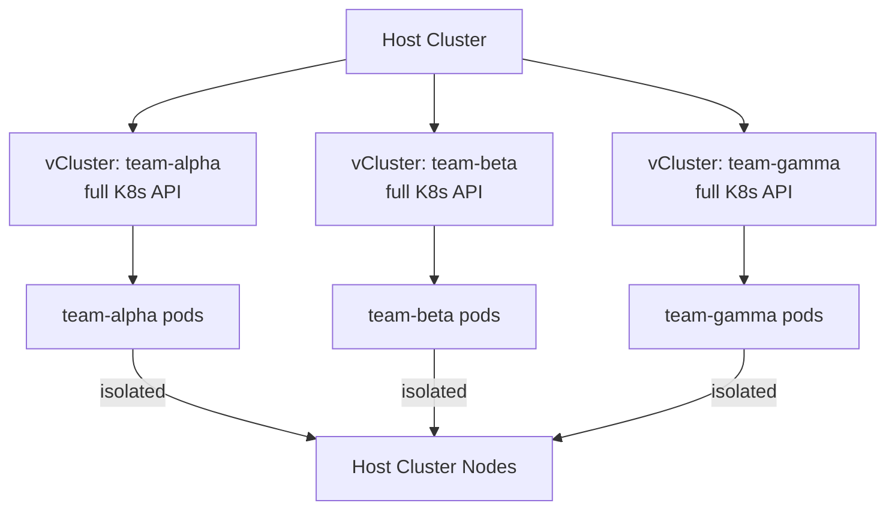

# Project 28 — vCluster: Virtual Kubernetes Clusters

> 🔴 **Senior Track** | 👥 Team (2–3) | ⏱ 5–7 hours
> **Seniority Path:** vCluster enables full Kubernetes API isolation per tenant at a fraction of the cost of separate clusters. It is being adopted at scale.

---

## Overview

Use **vCluster** to provision 3 isolated virtual Kubernetes clusters inside a single physical cluster. Each vCluster has its own API server, controller manager, and etcd — running as pods in the host cluster. Students experience full Kubernetes API isolation without paying for 3 real clusters. Configure workload isolation, resource quotas per vCluster, and network policies between them.

**Why this matters at work:** vCluster solves the multi-tenancy problem that plagues platform teams — giving every team full Kubernetes API access without the cost or blast radius of separate clusters. It is being evaluated or adopted at Grafana Labs, Loft, and dozens of enterprise platform teams.

## Architecture



## Learning Objectives
- Install vCluster CLI and create virtual clusters
- Understand how vCluster maps workloads to the host cluster
- Configure resource quotas per vCluster
- Set up network isolation between virtual clusters
- Compare operational overhead of vCluster vs separate physical clusters

## Prerequisites
- [ ] vCluster CLI installed: brew install loft-sh/tap/vcluster
- [ ] Host cluster with sufficient resources (4+ CPU, 8GB RAM)
- [ ] kubectl and helm installed

---

## Key Steps

### Step 1 — Install vCluster CLI

```bash
# Mac
brew install loft-sh/tap/vcluster

# Linux
curl -L -o vcluster "https://github.com/loft-sh/vcluster/releases/latest/download/vcluster-linux-amd64"
sudo install -c -m 0755 vcluster /usr/local/bin

vcluster version
```

### Step 2 — Create Virtual Clusters

```bash
# Create 3 virtual clusters — one per team
vcluster create team-alpha --namespace vcluster-team-alpha
vcluster create team-beta  --namespace vcluster-team-beta
vcluster create team-gamma --namespace vcluster-team-gamma

# List vClusters
vcluster list
```

> 📸 **Expected:** 3 vClusters listed, all Running. In the host cluster, each vCluster runs as pods: API server + controller manager + etcd + syncer.

### Step 3 — Connect and Use a vCluster

```bash
# Connect to team-alpha's vCluster (updates kubeconfig)
vcluster connect team-alpha --namespace vcluster-team-alpha

# You now have kubectl access to team-alpha's virtual cluster
kubectl get nodes      # Shows virtual nodes (mapped to host nodes)
kubectl get namespaces # Only namespaces within team-alpha's vCluster

# Deploy something into team-alpha
kubectl create deployment nginx --image=nginx:1.25 --replicas=2
kubectl get pods   # Shows in vCluster

# In the HOST cluster: these pods actually run in vcluster-team-alpha namespace
kubectl get pods -n vcluster-team-alpha --context host-cluster
```

### Step 4 — Apply Resource Quotas per vCluster

```yaml
# Limit what team-alpha can consume on the host
apiVersion: v1
kind: ResourceQuota
metadata:
  name: team-alpha-quota
  namespace: vcluster-team-alpha   # Applied on HOST cluster namespace
spec:
  hard:
    requests.cpu: "4"
    requests.memory: 8Gi
    limits.cpu: "8"
    limits.memory: 16Gi
    count/pods: "20"
```

### Step 5 — Network Isolation Between vClusters

```yaml
# Block traffic between team-alpha and team-beta namespaces on the host
apiVersion: networking.k8s.io/v1
kind: NetworkPolicy
metadata:
  name: isolate-vclusters
  namespace: vcluster-team-alpha
spec:
  podSelector: {}
  policyTypes: [Ingress, Egress]
  ingress:
    - from:
        - namespaceSelector:
            matchLabels:
              kubernetes.io/metadata.name: vcluster-team-alpha
  egress:
    - to:
        - namespaceSelector:
            matchLabels:
              kubernetes.io/metadata.name: vcluster-team-alpha
```

### Step 6 — Disconnect and Compare

```bash
# Disconnect from vCluster (return to host context)
vcluster disconnect

# Compare: what's the operational overhead vs a real cluster?
# - vCluster API server: ~200MB RAM
# - vCluster controller: ~100MB RAM
# - Total overhead per vCluster: ~500MB RAM
# - 10 vClusters: ~5GB RAM overhead = much cheaper than 10 real clusters

# Delete a vCluster (all resources inside are destroyed)
vcluster delete team-alpha --namespace vcluster-team-alpha
```

---

## Validation Checklist
- [ ] 3 vClusters created and Running
- [ ] Each vCluster has isolated kubectl context
- [ ] Deploying to team-alpha doesn't appear in team-beta
- [ ] ResourceQuota applied per vCluster namespace
- [ ] NetworkPolicy isolating vCluster namespaces
- [ ] vCluster deleted cleanly: `vcluster delete`

## Resources
- [vCluster Docs](https://www.vcluster.com/docs/)
- [Loft](https://loft.sh/)
- 📺 [vCluster Introduction — Loft](https://www.youtube.com/watch?v=JqBjpvp268Y)
