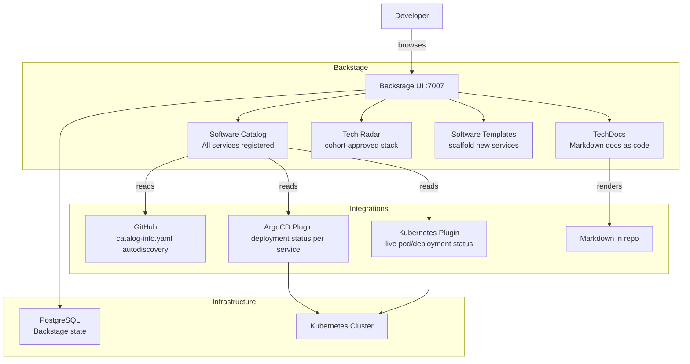

# Project 29 — Backstage Internal Developer Portal (IDP)

> 🔴 **Senior Track** | 👥 Team (2–3) | ⏱ 8–10 hours
> **Seniority Path:** Backstage is the fastest-growing platform engineering tool in the CNCF ecosystem. Building one from scratch signals principal-engineer-level thinking — you're not running Kubernetes, you're building the abstraction layer your whole engineering org uses on top of it.

---

## Overview

Deploy **Spotify's Backstage** — the industry-standard Internal Developer Portal — on Kubernetes. Configure the Software Catalog to register all your cohort services, integrate with your GitHub repo for automatic component discovery, connect it to your ArgoCD instance for deployment visibility, wire up Kubernetes plugin for live cluster status, and build a custom Tech Radar showing your cohort's approved technology stack.

**Why this matters at work:** Backstage is now used by Spotify, Netflix, Airbnb, American Airlines, Zalando, and thousands of other companies. The CNCF Backstage project has over 23,000 GitHub stars. Platform engineer job descriptions increasingly list Backstage experience explicitly. Building and operating a production Backstage instance is a genuine differentiator that less than 5% of Kubernetes engineers have hands-on experience with.

## Architecture



## Learning Objectives
- Install and configure Backstage on Kubernetes using Helm
- Register services in the Software Catalog using `catalog-info.yaml`
- Configure GitHub integration for automatic catalog discovery
- Install and configure the ArgoCD and Kubernetes plugins
- Write a custom Tech Radar configuration
- Create a Software Template that scaffolds a new service
- Understand why IDPs reduce cognitive load and platform team toil

## Prerequisites
- [ ] Projects 5 (ArgoCD), 12 (IDP concepts), 15 (Capstone) completed
- [ ] GitHub repo with services deployed
- [ ] PostgreSQL available (can use the one from Project 1)
- [ ] Node.js 18+ installed locally for Backstage app development
- [ ] A GitHub OAuth App created (for GitHub integration)

---

## Step 1 — Create a GitHub OAuth App

Backstage needs GitHub OAuth for authentication and repository access.

```
1. Go to: GitHub → Settings → Developer Settings → OAuth Apps → New OAuth App
2. Application name: Cohort Backstage
3. Homepage URL: http://localhost:7007
4. Authorization callback URL: http://localhost:7007/api/auth/github/handler/frame
5. Click Register — note the Client ID and Client Secret
```

---

## Step 2 — Create the Backstage App

```bash
# Install Backstage CLI
npm install -g @backstage/cli

# Create a new Backstage app
npx @backstage/create-app@latest --skip-install
# Name: cohort-backstage
# Database: PostgreSQL

cd cohort-backstage
npm install
```

---

## Step 3 — Configure app-config.yaml

```yaml
# app-config.yaml
app:
  title: Emagetech Kubernetes Cohort Portal
  baseUrl: http://localhost:7007

organization:
  name: Emagetech

backend:
  baseUrl: http://localhost:7007
  listen:
    port: 7007
  database:
    client: pg
    connection:
      host: ${POSTGRES_HOST}
      port: ${POSTGRES_PORT}
      user: ${POSTGRES_USER}
      password: ${POSTGRES_PASSWORD}
      database: backstage

integrations:
  github:
    - host: github.com
      token: ${GITHUB_TOKEN}    # Personal access token with repo scope

auth:
  providers:
    github:
      development:
        clientId: ${GITHUB_CLIENT_ID}
        clientSecret: ${GITHUB_CLIENT_SECRET}

catalog:
  import:
    entityFilename: catalog-info.yaml
  rules:
    - allow: [Component, System, API, Group, User, Resource, Location]
  locations:
    # Auto-discover all catalog-info.yaml files in the cohort repo
    - type: github-discovery
      target: https://github.com/emage-tech/kubernetes-january-2026-cohort

    # Manual registration of your capstone platform
    - type: url
      target: https://raw.githubusercontent.com/emage-tech/kubernetes-january-2026-cohort/main/catalog-info.yaml

techdocs:
  builder: local
  generator:
    runIn: local
  publisher:
    type: local

kubernetes:
  serviceLocatorMethod:
    type: multiTenant
  clusterLocatorMethods:
    - type: config
      clusters:
        - url: ${K8S_API_URL}
          name: cohort-cluster
          authProvider: serviceAccount
          serviceAccountToken: ${K8S_SA_TOKEN}
          caData: ${K8S_CA_DATA}
          skipTLSVerify: false

argocd:
  username: admin
  password: ${ARGOCD_PASSWORD}
  appLocatorMethods:
    - type: config
      instances:
        - name: cohort-argocd
          url: https://argocd.cohort.local
```

---

## Step 4 — Register Your Services in the Catalog

Create a `catalog-info.yaml` at the root of the cohort repo and in each project folder:

```yaml
# catalog-info.yaml (root — the platform itself)
apiVersion: backstage.io/v1alpha1
kind: System
metadata:
  name: cohort-platform
  title: Emagetech Kubernetes Cohort Platform
  description: Full-stack Kubernetes platform built by the January 2026 cohort
  tags:
    - kubernetes
    - gitops
    - platform-engineering
  links:
    - url: https://github.com/emage-tech/kubernetes-january-2026-cohort
      title: GitHub Repository
      icon: github
    - url: https://argocd.cohort.local
      title: ArgoCD Dashboard
      icon: dashboard
spec:
  owner: group:cohort-team
  domain: platform
```

```yaml
# projects/01-containerize-multi-tier-app/catalog-info.yaml
apiVersion: backstage.io/v1alpha1
kind: Component
metadata:
  name: cohort-api
  title: Cohort API Service
  description: Node.js + PostgreSQL multi-tier application (Project 1)
  tags:
    - nodejs
    - postgresql
    - kubernetes
  annotations:
    github.com/project-slug: emage-tech/kubernetes-january-2026-cohort
    backstage.io/kubernetes-id: api              # Links to K8s deployment
    argocd/app-name: my-app-dev                  # Links to ArgoCD app
    backstage.io/techdocs-ref: dir:.             # Docs from this folder's README
spec:
  type: service
  lifecycle: production
  owner: group:cohort-team
  system: cohort-platform
  providesApis:
    - cohort-api-v1
---
apiVersion: backstage.io/v1alpha1
kind: API
metadata:
  name: cohort-api-v1
  title: Cohort REST API v1
  description: REST API for the multi-tier demo application
spec:
  type: openapi
  lifecycle: production
  owner: group:cohort-team
  definition: |
    openapi: "3.0.0"
    info:
      title: Cohort API
      version: "1.0.0"
    paths:
      /items:
        get:
          summary: List all items
          responses:
            '200':
              description: Array of items
      /health:
        get:
          summary: Health check
          responses:
            '200':
              description: OK
```

---

## Step 5 — Install Backstage Plugins

```bash
# ArgoCD plugin
yarn --cwd packages/app add @roadiehq/backstage-plugin-argo-cd
yarn --cwd packages/backend add @roadiehq/backstage-plugin-argo-cd-backend

# Kubernetes plugin (shows live pod status in service page)
yarn --cwd packages/app add @backstage/plugin-kubernetes
yarn --cwd packages/backend add @backstage/plugin-kubernetes-backend

# GitHub Actions plugin (shows CI/CD runs)
yarn --cwd packages/app add @backstage/plugin-github-actions
```

Add plugins to `packages/app/src/components/catalog/EntityPage.tsx`:

```typescript
// Add ArgoCD card to service pages
import { EntityArgoCDHistoryCard } from '@roadiehq/backstage-plugin-argo-cd';

// Add Kubernetes tab
import { EntityKubernetesContent } from '@backstage/plugin-kubernetes';

// In the serviceEntityPage:
const serviceEntityPage = (
  <EntityLayout>
    <EntityLayout.Route path="/" title="Overview">
      <Grid container spacing={3}>
        <Grid item md={6}>
          <EntityAboutCard variant="gridItem" />
        </Grid>
        <Grid item md={6}>
          <EntityArgoCDHistoryCard />   {/* ArgoCD deployment history */}
        </Grid>
      </Grid>
    </EntityLayout.Route>

    <EntityLayout.Route path="/kubernetes" title="Kubernetes">
      <EntityKubernetesContent />       {/* Live pod status */}
    </EntityLayout.Route>

    <EntityLayout.Route path="/ci-cd" title="CI/CD">
      <EntityGithubActionsContent />    {/* GitHub Actions runs */}
    </EntityLayout.Route>
  </EntityLayout>
);
```

---

## Step 6 — Build the Tech Radar

Create your cohort's approved technology stack as a Tech Radar:

```typescript
// packages/app/src/components/home/TechRadar.tsx
import { TechRadarLoaderResponse, TechRadarEntry } from '@backstage/plugin-tech-radar';

export const cohortTechRadar: TechRadarLoaderResponse = {
  quadrants: [
    { id: 'orchestration', name: 'Container Orchestration' },
    { id: 'gitops',        name: 'GitOps & Delivery' },
    { id: 'security',      name: 'Security' },
    { id: 'observability', name: 'Observability' },
  ],
  rings: [
    { id: 'adopt',  name: 'ADOPT',  color: '#5cb85c' },  // Recommended
    { id: 'trial',  name: 'TRIAL',  color: '#f0ad4e' },  // Worth trying
    { id: 'assess', name: 'ASSESS', color: '#5bc0de' },  // Evaluate
    { id: 'hold',   name: 'HOLD',   color: '#d9534f' },  // Avoid for now
  ],
  entries: [
    // ADOPT
    { id: 'kubernetes',   title: 'Kubernetes',      quadrant: 'orchestration', ring: 'adopt', moved: 0 },
    { id: 'argocd',       title: 'ArgoCD',           quadrant: 'gitops',        ring: 'adopt', moved: 0 },
    { id: 'helm',         title: 'Helm',             quadrant: 'gitops',        ring: 'adopt', moved: 0 },
    { id: 'kyverno',      title: 'Kyverno',          quadrant: 'security',      ring: 'adopt', moved: 0 },
    { id: 'prometheus',   title: 'Prometheus',       quadrant: 'observability', ring: 'adopt', moved: 0 },
    { id: 'grafana',      title: 'Grafana',          quadrant: 'observability', ring: 'adopt', moved: 0 },
    // TRIAL
    { id: 'cilium',       title: 'Cilium',           quadrant: 'orchestration', ring: 'trial', moved: 1 },
    { id: 'istio',        title: 'Istio',            quadrant: 'orchestration', ring: 'trial', moved: 0 },
    { id: 'neuvector',    title: 'NeuVector',        quadrant: 'security',      ring: 'trial', moved: 1 },
    { id: 'loki',         title: 'Loki',             quadrant: 'observability', ring: 'trial', moved: 0 },
    // ASSESS
    { id: 'flux',         title: 'Flux',             quadrant: 'gitops',        ring: 'assess', moved: 0 },
    { id: 'vcluster',     title: 'vCluster',         quadrant: 'orchestration', ring: 'assess', moved: 1 },
    { id: 'otel',         title: 'OpenTelemetry',    quadrant: 'observability', ring: 'assess', moved: 1 },
    // HOLD
    { id: 'jenkins',      title: 'Jenkins',          quadrant: 'gitops',        ring: 'hold',   moved: -1 },
    { id: 'dockerswarm',  title: 'Docker Swarm',     quadrant: 'orchestration', ring: 'hold',   moved: 0 },
  ] as TechRadarEntry[],
};
```

---

## Step 7 — Deploy to Kubernetes

```dockerfile
# Dockerfile
FROM node:18-alpine AS build
WORKDIR /app
COPY package*.json ./
COPY packages/app/package.json packages/app/
COPY packages/backend/package.json packages/backend/
RUN yarn install --frozen-lockfile
COPY . .
RUN yarn tsc
RUN yarn build:all

FROM node:18-alpine
WORKDIR /app
COPY --from=build /app/packages/backend/dist ./
COPY --from=build /app/node_modules ./node_modules
ENV NODE_ENV production
EXPOSE 7007
CMD ["node", "packages/backend", "--config", "app-config.yaml"]
```

```yaml
# k8s/backstage.yaml
apiVersion: apps/v1
kind: Deployment
metadata:
  name: backstage
  namespace: backstage
spec:
  replicas: 1
  selector:
    matchLabels:
      app: backstage
  template:
    metadata:
      labels:
        app: backstage
    spec:
      containers:
        - name: backstage
          image: yourusername/cohort-backstage:1.0.0
          ports:
            - containerPort: 7007
          env:
            - name: POSTGRES_HOST
              value: postgres-service.project-01
            - name: POSTGRES_PORT
              value: "5432"
            - name: POSTGRES_USER
              valueFrom:
                secretKeyRef: {name: backstage-secrets, key: pg-user}
            - name: POSTGRES_PASSWORD
              valueFrom:
                secretKeyRef: {name: backstage-secrets, key: pg-pass}
            - name: GITHUB_TOKEN
              valueFrom:
                secretKeyRef: {name: backstage-secrets, key: github-token}
            - name: GITHUB_CLIENT_ID
              valueFrom:
                secretKeyRef: {name: backstage-secrets, key: github-client-id}
            - name: GITHUB_CLIENT_SECRET
              valueFrom:
                secretKeyRef: {name: backstage-secrets, key: github-client-secret}
          resources:
            requests: {cpu: 250m, memory: 512Mi}
            limits: {cpu: "1", memory: 1Gi}
---
apiVersion: v1
kind: Service
metadata:
  name: backstage
  namespace: backstage
spec:
  selector:
    app: backstage
  ports:
    - port: 80
      targetPort: 7007
```

---

## Step 8 — Add a Software Template

Software Templates let developers scaffold new services from Backstage without touching YAML.

```yaml
# templates/new-service/template.yaml
apiVersion: scaffolder.backstage.io/v1beta3
kind: Template
metadata:
  name: kubernetes-service
  title: New Kubernetes Service
  description: Scaffold a new Node.js service with Dockerfile, Helm chart, and ArgoCD app
  tags:
    - nodejs
    - kubernetes
    - recommended
spec:
  owner: group:platform-team
  type: service

  parameters:
    - title: Service Details
      required: [name, description, owner]
      properties:
        name:
          title: Service Name
          type: string
          pattern: '^[a-z][a-z0-9-]*$'
        description:
          title: Description
          type: string
        owner:
          title: Owner Team
          type: string
          ui:field: OwnerPicker
          ui:options:
            allowedKinds: [Group]
        port:
          title: Port
          type: integer
          default: 3000

  steps:
    - id: fetch
      name: Fetch template
      action: fetch:template
      input:
        url: ./skeleton
        values:
          name: ${{ parameters.name }}
          description: ${{ parameters.description }}
          owner: ${{ parameters.owner }}
          port: ${{ parameters.port }}

    - id: publish
      name: Create GitHub repo
      action: publish:github
      input:
        repoUrl: github.com?repo=${{ parameters.name }}&owner=emage-tech
        description: ${{ parameters.description }}

    - id: register
      name: Register in Backstage catalog
      action: catalog:register
      input:
        repoContentsUrl: ${{ steps['publish'].output.repoContentsUrl }}
        catalogInfoPath: /catalog-info.yaml

  output:
    links:
      - title: Repository
        url: ${{ steps['publish'].output.remoteUrl }}
      - title: Open in Backstage
        icon: catalog
        entityRef: ${{ steps['register'].output.entityRef }}
```

> 📸 **Expected:** In the Backstage UI → Create → "New Kubernetes Service" template appears. Fill in the form, click Create — GitHub repo is created, Dockerfile and Helm chart are scaffolded, service appears in the catalog automatically. **A developer created a production-ready service without touching YAML or kubectl.**

---

## Validation Checklist
- [ ] Backstage UI accessible at `http://localhost:7007` (local) or Ingress URL
- [ ] Software Catalog shows all registered components from the cohort repo
- [ ] GitHub integration: `catalog-info.yaml` files auto-discovered
- [ ] ArgoCD plugin: deployment history visible on each service page
- [ ] Kubernetes plugin: live pod status visible on each service page
- [ ] Tech Radar populated with cohort-approved stack
- [ ] Software Template scaffolds a new service end-to-end
- [ ] TechDocs renders README.md as documentation for each service

## Troubleshooting

**Catalog not discovering GitHub repos** — GitHub token needs `repo` scope. Check: `Settings → Developer Settings → Personal Access Tokens → check scopes`.

**Kubernetes plugin showing no data** — The ServiceAccount token must have `get`, `list`, `watch` on pods, deployments, and services. Check: `kubectl auth can-i list pods --as system:serviceaccount:backstage:backstage-sa`

**ArgoCD plugin showing "Could not fetch ArgoCD data"** — Verify `ARGOCD_PASSWORD` env var and that the ArgoCD URL is reachable from the Backstage pod. Test: `kubectl exec -n backstage <backstage-pod> -- curl https://argocd.cohort.local/api/v1/applications -k`

**PostgreSQL connection refused** — Backstage needs PostgreSQL. Check the `POSTGRES_HOST` — use the Kubernetes Service DNS name, not localhost.

## Extension Challenges
1. Add the **PagerDuty plugin** to show on-call schedule and recent incidents per service
2. Build a custom **home page** with a daily K8s tip widget and cohort leaderboard integration
3. Deploy Backstage behind **OAuth with GitHub** so only cohort members can log in

## Resources
- [Backstage Docs](https://backstage.io/docs)
- [Backstage on Kubernetes](https://backstage.io/docs/deployment/kubernetes)
- [Software Catalog](https://backstage.io/docs/features/software-catalog/)
- [Plugin Marketplace](https://backstage.io/plugins)
- 📺 [Backstage Deep Dive — CNCF KubeCon](https://www.youtube.com/watch?v=85TQEpNCaU0)
- 📺 [Building an IDP with Backstage — PlatformCon](https://www.youtube.com/watch?v=rRHlGVqQMEU)
- 📖 [Humanitec Platform Engineering Whitepaper](https://humanitec.com/whitepapers/platform-engineering-whitepaper)
